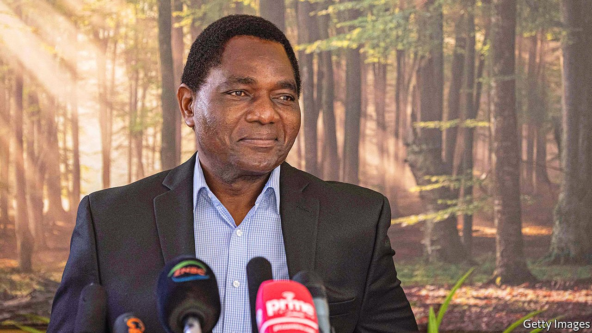

###### Sixth time lucky

# The task facing Zambia’s new president, Hakainde Hichilema 

##### He inherits an economy on the brink 

 

> Aug 19th 2021 

OVER THE past four years new presidents in southern Africa have taken office amid masses of hype. Emmerson Mnangagwa said Zimbabwe would be open for business. João Lourenço vowed to diversify Angola’s oil-dependent economy. Cyril Ramaphosa pledged a “new dawn” in South Africa after years of graft. They have all disappointed.

So there are grounds for caution about the triumph of Hakainde Hichilema (pictured), who on August 16th was declared the winner of Zambia’s presidential election. But there are also reasons to be optimistic about the former businessman, who failed in five previous attempts at winning the presidency. This time he gained 58% of the vote, enough to render moot efforts to rig the poll by the outgoing president, Edgar Lungu. Unlike most presidents in southern Africa, Mr Hichilema is not a product of a decadent post-colonial ruling party. He is more a liberal than a liberationist. And he has a plan.


“At the core of my politics”, says Mr Hichilema, “is a belief that Zambia has the potential to become a successful middle-income country.” Today the country has a GDP per person of less than $1,000, or one-eighth that of next-door Botswana. Under Mr Lungu corruption exploded while living standards fell.

Improving them first requires getting Zambia out of a macroeconomic hole. Public debt as a share of GDP rose from 66% to 113% while Mr Lungu was in charge. The government stopped paying many foreign creditors. Fiscal incontinence meant less money was spent on services for the poor. It also contributed to a weakening of the currency. Since most food is imported, the decline in the kwacha led to higher prices.

Mr Hichilema’s government will turn to the IMF for help. It will pledge reforms as part of a formal programme which will bring with it a cheap loan. An agreement with the fund should also pave the way for a deal on restructuring Zambia’s external debts under a scheme known as the Common Framework introduced in April by the G20 group of countries.

The framework is a response to changing times. When African countries had debts forgiven in the 2000s, these were mostly to rich countries or multilateral institutions. Today African countries owe more money to Chinese state banks and private bondholders in the West. Before the creditors accept new terms, they need to be convinced that they will be treated equally; that the hard-up government will not rob Peter to pay Pang, or vice versa.

Zambia may therefore be a test of whether the framework can help poor countries. (It is also being used in Chad and Ethiopia.) During the Lungu era, Western-based investment funds, which hold about 40% of Zambia’s external debt, felt that they were being treated badly compared with Chinese lenders, which account for about 30%. Though an agreement will depend on China’s willingness to co-operate, Western bondholders are optimistic that Mr Hichilema will strike a deal which treats everyone equally.

The president-elect also wants to revive mining. Zambia is Africa’s second-largest copper producer. Prices for the metal are high, hovering around levels last seen during the commodities boom of the 2000s and early 2010s. But previous governments’ policies of expropriation and high taxes meant there have been no new large mining projects for a decade. Mr Hichilema wants to change that by lowering taxes and protecting property rights.

The danger, as ever when a pragmatist replaces a populist, is that cleaning up the mess takes time and can cause short-term hardship. Zambians are cheered by Mr Hichilema’s promise to respect human rights after Mr Lungu’s abuses. But they cannot eat civil liberties. So there is a role for rich countries to play in offering aid and nudging debt talks along. Otherwise Western diplomats celebrating Mr Hichilema’s victory may find that his popularity swoons.

Zambia has long been a pioneer for African democracy. In 1991 and 2011 it voted out an incumbent president. In doing so again, it has given the continent another lesson in democracy. It now falls to Mr Hichilema to show how to run a country. ■

