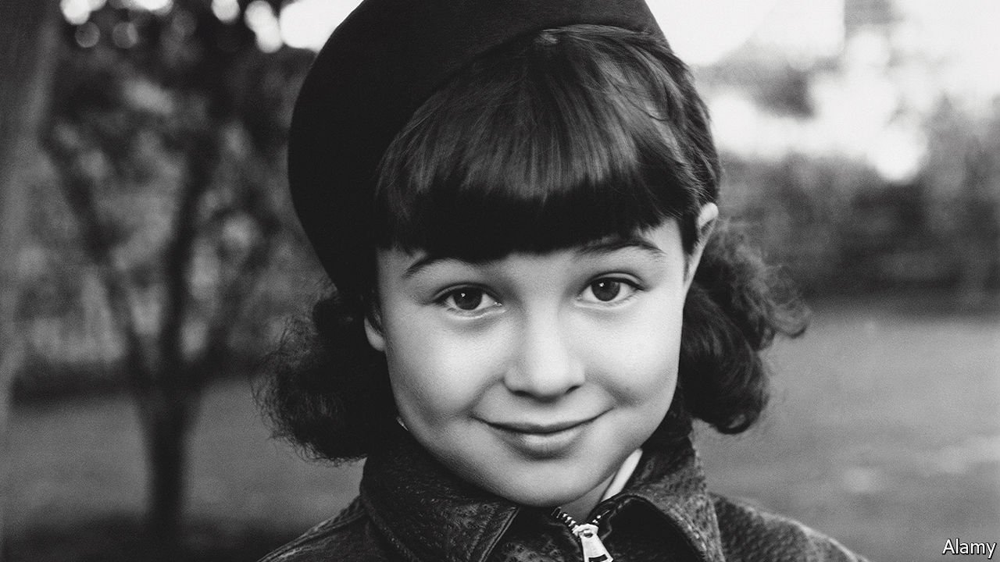

###### America’s favourite problem child

# Obituary: Jane Withers was the antidote to cuteness 

##### The Hollywood child star died on August 7th, aged 95 

 

> Aug 21st 2021 

FOR ANY small girl of energy and spirit, to be asked to be ladylike is insufferable. To sit up straight, be demure, wear gloves and speak only when spoken to is pure torture. Fortunately, that was not a difficulty Jane Withers faced. From the age of six she was paid to do things other children were usually spanked for, and she was very good at it. She was sassy, loud, awkward and answered back. She could blow out her cheeks like a puffer fish until her eyes disappeared almost into her head. She could caper like a cow-poke, in raggedy cut-off trousers, and preferred a battered straw hat to a flowery bonnet any day. If provoked she could throw a punch at any boy, or at least give him a good pummelling of fists on his stupid chest. She was not afraid to fall into muck and feathers, and could organise a pretty good brawl.

Her films had titles like “Arizona Wildcat”, “The Holy Terror”, “Rascals” and ”Always in Trouble”. She played characters called Ginger, Pepper, Corky and Peg Gurgle, usually orphans, who were forced into unwise adoptions, over-fancy schools, criminals’ hideouts or desert islands, but would spunkily take charge and, after a struggle, come up beaming. These nuisance-girls were also excellent sleuths and menders of grown-up sadness, and her films (if they didn’t end in an actual spanking, which she didn’t mind a bit) often left not a dry eye in the house.


Her most memorable moment, when she was eight, was to steal a whole picture from Shirley Temple, the nation’s favourite moppet. In “Bright Eyes” in 1934, as creepy-mean Joy Smythe, she ran her over with a tricycle and again with a baby buggy. When Shirley found one of Joy’s cloth dolls in the trash and rescued it with soothing words, she snatched it back, ripped off its head and skipped away singing. She was the very antidote to cuteness: a clumsy child with a dark Dutch bob, a biggish nose and tailor-sharp collars, who had stood out like a sore thumb at interviews among the Shirley lookalikes in their curls. She got the role partly for her imitation of the machinegun Joy Smythe wanted for Christmas, and she played her so convincingly that Shirley’s mother forbade them even to say hello on set.

She worried that people would hate her for being so nasty to Shirley, but the opposite happened. She became wildly popular, twice making the top-ten box-office-star list, even though these were B-movies and low-budget. Shirley was perfect, but Jane was imperfect, like most little girls. Hundreds of dolls and teddy bears arrived in the mail—so many, that she started a collection which eventually filled a whole warehouse. President Franklin Roosevelt sent her flowers, and Eleanor Roosevelt hand-delivered another bear. Shops were filled with Jane Withers shoes, socks, hairbows, hats, dresses and paper dolls. Like many child stars, she made far more from the merchandise than from her 38 films. There were Jane Withers mystery books, too, in which her sleuthing won the day. She might not be as classy and pretty as Nancy Drew, the top girl-detective of the age, but like her she could ride a horse, ice-skate, speak French and tie baddies in knots. And, better than her, she could mimic anyone, though Darryl Zanuck, the head of 20th Century Fox, forbade her to take off Shirley in any public place.

The other pleasant surprise she gave the studio, besides her pulling power, was that away from filming she was so well behaved. Tomboy ways were there for sure, with her menagerie of horses, baby alligators, turtles, dogs and hens, and with the motorbikes she rode at the family’s summer cabin. She would pipe up boldly at writers’ conferences if she thought her script was not what a child would say. (Words she liked to say were “Swell!”, and “You bet your boots!” and, when cross, “Oh, pooh.”) But she threw no tantrums. If she liked the look of a role she went for it politely, and said thank you. Her mother, who had intended her to be an actress even in the womb, and had got her into Atlanta radio shows, with top hat and cane, at the age of three, had kept her from being spoilt. She was given a strict allowance of $5 a week, rising to $10. For every two dolls she was sent, one had to be given to a needy child. Her father put her earnings—$2,500 a week at the peak—into California land and safe investments, insisting that they should live only on the money he brought home. He brought home plenty, providing their house on Sunset Boulevard with a swimming pool, badminton court and giant playroom, and later, when she was a teenager, a beauty salon and a soda fountain.

All this, she believed totally, was God’s doing. Her parents, strict Presbyterians, taught Bible classes and Sunday school, and in both Atlanta and Hollywood orphan children were invited on Sunday afternoons to have fun at their house. Throughout her life she took any troubles directly to the Lord. He worked things out. She never had an agent, because she and her mother and God did all the planning. And He saw to it that she had an absolute ball.

Of course, the Hollywood bit didn’t last. She grew in all the wrong places, and got so sick of playing child parts in pigtails that at 15 she wrote her own story, “Small Town Deb”, in which a gawky teenage girl was at last allowed to be herself. She starred in the film, but it was clear that her fans still had trouble with her growing-up. In 1947 at 21 she retired, making little of note afterwards except “Giant”, with Liz Taylor and Rock Hudson, in 1956. God made sure, though, that life wasn’t dull. A growing family kept her busy, with television slots and a pile of charity work.

And Josephine the Plumber. From 1963 to 1974 she was on America’s TV screens, in the longest-running ad till then, advertising Comet Cleanser. It was a useful part-time job, but also a direct reprise of her sparky tomboy self. As Josephine, she wore a white cap and overalls and flourished Super Comet with Chlorinol over every sink, scrubbing furiously to prove it cleaned away stains other leading cleansers couldn’t. She was a caring sort, but no happy housewife: slamming her van doors, posing with hands on hips, cuffing a boy on the head, and winking broadly. Shirley Temple would have recognised her and trembled in a minute. Though they were now, of course, the very best of friends. ■

