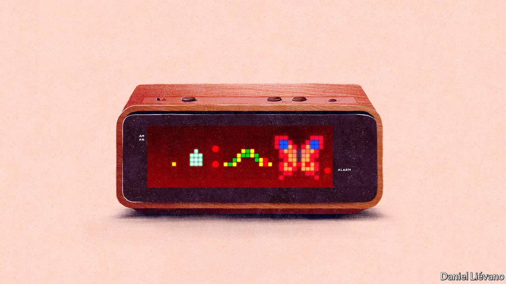
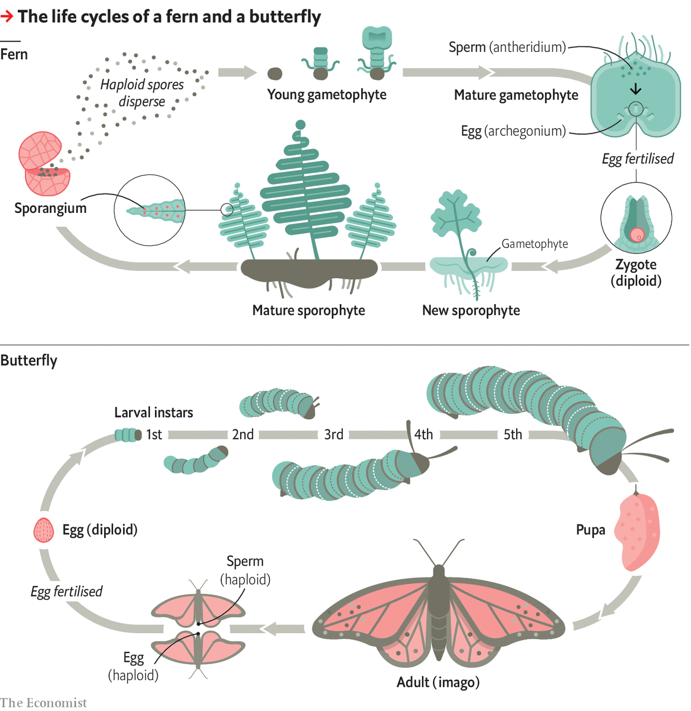

###### Biology brief

# Making your way in the world 

##### An individual’s life story is a dance to the music of time 

 

> Aug 21st 2021 

THE ORGANS of a body are a spatial division of labour, one created by different genes being turned on in different cells. The same process serves to give individual lives a division of labour over time. Complex algae, animals, fungi and plants all have predictable life histories which separate out three basic aspects of development—the creation of an autonomous individual, growth and reproduction—and run them sequentially.

In some creatures, including humans, the move from one phase to the next has an obvious continuity. Fertilised eggs turn into fetuses, which become babies, who grow into two different sorts of adult, which, between them, can then produce new fertilised eggs. In other animals things are more clearly punctuated. The embryo growing inside a butterfly egg turns into a series of leaf-munching and moulting caterpillars, called instars. The last of these cocoons itself in a pupa before emerging, winged and fluttering, as an imago with a completely new set of organs. Plants have two separate life histories, which alternate from generation to generation—though this is rarely obvious to human observers.


A lot of the complexity here is to do with sex. The fission of a bacterium; the budding of a yeast cell; the vegetative growth of a tree pushing up suckers: each of these yields progeny genetically identical to the progenitor and each other. Sex is clearly the start of something new: a novel individual with a novel genetic blueprint and a selfish Darwinian imperative that can put it at odds with even its siblings. Asexual individuals often link up into wider structures—bacterial biofilms, coral heads or aspen forests, for example. Sexual individuals almost never do this.

In sexual reproduction, each parent contributes only a half genome. In asexual reproduction the whole genome can get passed on. In terms of the “selfish gene” account of biology, a strategy which passes on all the genes seems intrinsically more appealing than one in which half of them get left behind. Sex must therefore convey benefits worth dumping half a genome for.

The current belief is that these stem from the mixing of genes. By producing genetically novel individuals, sex poses a problem for parasites and pathogens and provides flexibility in changing circumstances. Those advantages compensate for its inefficiency. Caenorhabditis elegans, a nematode worm much favoured in biology laboratories, reproduces asexually in benign environments but starts creating some males when things get more challenging, in order to mix things up a bit. That said, mysteries abide—for instance, bdelloid rotifers, which seem to have been exclusively asexual for 25m years.

Once fertilised, an animal egg grows into an embryo, or something equivalent to one. An embryo’s role is to lay the groundwork for subsequent developments. It produces what, in Silicon Valley, might be termed a minimum viable product. When a human embryo is born as a baby, it already contains almost all of the organs which that individual will ever possess.

This comes about first by the repeated division of the initial, fertilised egg into many cells that have the potential to become any part of the body. Then, around the 16th day of development, the embryo folds in on itself in a process called gastrulation. This sees the body plan begin to take on a physical form, defining the head and the tail (for human embryos do, indeed, have tails), the left and the right, the inner and the outer.

After gastrulation, more and more cell lines have their future possibilities pared down as molecular switches disable some genes and promote the activity of others. Each cell line is thus guided along a path that leads to its specialisation as part of an organ. A few laggards, called stem cells, drop out of this journey. Their role is to generate, throughout an individual’s life, replacements for cells that have died. But many specialised cells, particularly in the muscles and the nervous system, do go on to last a lifetime.

Other species have similar tales to tell, but not identical ones. For example, a butterfly embryo develops not only the organs needed in order to be a caterpillar, but also starter packs, called imaginal discs, for the organs that will be needed in adulthood.

For most plants, things are more complex because there are two, radically different, types of body. This again is a division of labour, one in which mating and dispersal have been separated.

Cells in gametophytes, the mating body type, have a single complement of chromosomes—a state known as being “haploid”, which is also seen in the eggs and sperm of animals. It is the process of creating haploid cells that sees half of each parent’s genome scrapped in sexual reproduction. Unlike eggs and sperm, though, these haploid cells can grow and differentiate themselves, creating the gametophyte body.

Once it has grown sufficiently a gametophyte will produce eggs and sperm, which meet and mate, pooling their chromosomes to create “diploid” individuals that grow into a body-type called a sporophyte. Sporophytes produce haploid spores, which they often seek to distribute as widely as possible—a valuable strategy for a stationary creature.

 


In mosses, the larger of the two forms is the gametophyte. In ferns, it is the sporophyte, though the gametophyte is still visible to the naked eye. In flowering plants things have gone further still, with the gametophyte stage essentially being absorbed into the sporophyte. The gametophytes of an oak, for example, are microscopic addenda to the sporophyte body: the pollen grains born by its male catkins and the embryo sacs in its female flowers.

In flowering plants like oaks, progeny-dispersal is achieved not through haploid spores but instead by the fertilised embryo sacs creating embryo-containing seeds—which, in oaks, are called acorns. The embryo in an acorn lacks precursors of many adult organs. Leaves are grown later, as required, from stem cells known as meristems. But it is equipped with an incipient root and stem, and also has two food-storing leaves, called cotyledons.

Once an embryo is out of its womb, its eggshell or its seed, its main aim is to grow. In children, larvae, saplings and even the young gametophytes and sporophytes of ferns, physiological resources are focused on developing the size and competencies that will be needed to prosper in the mating game and subsequent child rearing—even if that role is limited to cramming protein into an acorn.

For many creatures, the growth stage is at first blush similar to the adult, but just smaller. The onset of puberty, striking as it is for a human to undergo, has little effect on the overall body plan. But for some, notably among the insects, it can be startlingly different. The specialised eating machine which is a caterpillar or a maggot, for example, allows energy to be stored through the use of an ecological niche the adult could not gain access to.

For an adult to reproduce, and thus pass on its genes, it must first find a mate. Sometimes the finding is done directly by the sperm—fern’s sperm swim from the antheridia in which they form, through films of water, in search of the egg-bearing archegonia of other gametophytes. Sometimes it is done by the adults, through courtship rituals or competitions. Many flowering plants exploit a go-between in the form of a pollinating insect, bat or bird.

Temporary kings

An oak bears its first acorns two or three decades after it has germinated, and may keep doing so for centuries. A human, after puberty, can look forward to decades of subsequent life. Many adulthoods, however, are brief. An extreme example is the mayfly, the imagos of which cannot feed themselves and exist only to mate and, if female, lay their fertilised eggs back in the water from which they have just emerged.

In animals, adults of long-lived species often look after their offspring and sometimes, to some degree, those of others as well. It makes sense to collaborate with a close relative in child rearing because their children will carry some of your genes, but it can also make sense if the adults are not related, especially in situations where favours are reciprocated. It is thought that this social aspect of child rearing may explain why in a few species—humans and killer whales are notable examples—adults may live quite some time after they stop being capable of reproduction.

Long or short, though, all lives go the same way. Onward transmission of the body’s genes achieved (or not), the individual itself matters not a jot to evolution. This explains why individuals grow not just old, but decrepit. They have evolved to be thrown away.

Inevitable mortality means that bodily repairs and maintenance need not be perfect, particularly if the physiological resources needed for them could be put to better use in mating and reproduction. Damage to a body’s cells therefore gradually accumulates with age.

For animals, the transition from life to death, even when not administered by a predator, is rapid. The interdependence of an animal’s organs means some failures—in particular, failure of the circulatory system—are almost instantly fatal. A large plant, by contrast, may die slowly, for it has no vital organs. Die, however, it will. But its progeny may live on, to cross-fertilise once more with others of their kind. Biologists call such sets of interfertile organisms “species”. The slipperiness of that seemingly simple concept is dealt with in the next Biology brief. ■

In this series on the levels of life

1 

2 

3 

4 The story of a life*

5 What is a species, anyway?

6 Finding living planets

