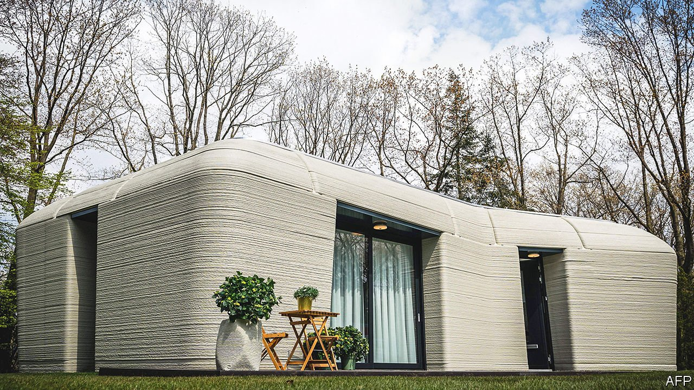

###### Construction techniques

# The rise of 3D-printed houses 

##### Your next home could be a printout 

 

> Aug 18th 2021 

A BATCH OF new houses across California is selling unusually fast. In the past two months, 82 have been snapped up, and the waiting list is 1,000 long. That demand should, though, soon be satisfied—for, while it can take weeks to put up a conventional bricks-and-mortar dwelling, Palari Homes and Mighty Buildings, the collaborators behind these houses, are able to erect one in less than 24 hours. They can do it so rapidly because their products are assembled from components prefabricated in a factory. This is not, in itself, a new idea. But the components involved are made in an unusual way: they are printed.

Three-dimensional (3D) printing has been around since the early 1980s, but is now gathering steam. It is already employed to make things ranging from orthopaedic implants to components for aircraft. The details vary according to the products and processes involved, but the underlying principle is the same. A layer of material is laid down and somehow fixed in place. Then another is put on top of it. Then another. Then another. By varying the shape, and sometimes the composition of each layer, objects can be crafted that would be difficult or impossible to produce with conventional techniques. On top of this, unlike conventional manufacturing processes, no material is wasted.


Just press “print”

In the case of Palari Homes and Mighty Buildings, the printers are rather larger than those required for artificial knees and wing tips, and the materials somewhat cruder. But the principle is the same. Nozzles extrude a paste (in this case a composite) which is then cured and hardened by ultraviolet light. That allows Mighty Buildings to print parts such as eaves and ceilings without the need for supporting moulds—as well as simpler things like walls. These are then put together on site and attached to a permanent foundation by Palari Homes’ construction workers.

Not only does 3D-printing allow greater versatility and faster construction, it also promises lower cost and in a more environmentally friendly approach than is possible at present. That may make it a useful answer to two challenges now facing the world: a shortage of housing and climate change. About 1.6bn people—more than 20% of Earth’s population—lack adequate accommodation. And the construction industry is responsible for 11% of the world’s man-made carbon-dioxide emissions. Yet the industry’s carbon footprint shows no signs of shrinking.

Automation brings huge cost savings. Mighty Buildings says computerising 80% of its printing process means the firm needs only 5% of the labour that would otherwise be involved. It has also doubled the speed of production. This is welcome news, the construction industry having struggled for years to . Over the past two decades this has grown at only a third of the rate of productivity in the world economy as a whole, according to McKinsey, a consultancy. Digitalisation has been slower than in nearly any other trade. The industry is also plagued, in many places, by shortages of skilled labour. And that is expected to get worse. In America, for example, around 40% of those employed in construction are expected to retire within a decade.

The environmental benefits come in several ways, but an important one is that there is less need to move lots of heavy stuff about. Palari Homes, for instance, estimates that prefabricating its products reduces the number of lorry journeys involved in building a house sufficiently to slash two tonnes off the amount of carbon dioxide emitted per home.

Palari Homes and Mighty Buildings are not, moreover, alone in their endeavours. Similar projects are being started up all over the place. The vast majority print structures using concrete. 14Trees, a joint venture between Holcim—the world’s biggest cement-maker—and CDC Group, a British-government development-finance outfit, operates in Malawi. It says it is able to print a house there in just 12 hours, with a price tag of less than $10,000. Besides being cheap and quick, 14Trees says this process is green as well. Holcim claims that by depositing the precise amount of cement required and thereby reducing waste, 3D printing generates only 30% as much carbon dioxide as using burnt-clay brick, a common technique in Malawi.

In Mexico, meanwhile, a charity for the homeless called New Story has created a partnership with ICON, a 3D-printing firm, to erect ten houses with floor areas of 46 square metres. Each was printed in around 24 hours (though these hours were spread over several days), with the final features assembled by Échale, another local charity. And in Europe the keys to the continent’s first 3D-printed home, in Eindhoven, in the Netherlands (pictured above), were handed over to its tenants on July 30th.

Layer cakes

The house in question, the first of five detached, two-bedroom dwellings in a project co-ordinated by Eindhoven’s municipal government and the city’s University of Technology, is a collaboration between several firms. The Dutch arm of Saint-Gobain, a French building-materials company, developed the concrete mortar needed. Van Wijnen, a construction firm, built the thing, while Witteveen+Bos, a consultancy, was responsible for the engineering. It is being rented out by its owner, Vesteda, a Dutch residential-property investor.

Making the cement involved in projects like this is not, however, . It turns calcium carbonate in the form of limestone into calcium oxide and carbon dioxide, and is reckoned responsible for about 8% of anthropogenic emissions of that gas. A group at Texas A&amp;M University, led by Sarbajit Banerjee, has therefore developed a way to dispense with it.

Dr Banerjee’s new building material was inspired by a project he masterminded some years ago to construct supply roads to remote parts of the Canadian province of Alberta using stuff immediately to hand. The road metal he devised combined local soil with a mulch of wood fibres, and was held together by liquid or water-soluble silicates that then hardened and acted as cement. To build houses he uses whatever clay and rock debris is lying around under the topsoil near the construction site, crushes it into a powder and blends it with silicates. The result can then be squeezed through a nozzle, after which it rapidly consolidates and gains strength, so as to hold its shape and bear the weight of the next layer. The process is thus doubly green. It eliminates both cement and the need to transport to the site, often over long distances, the sand and aggregates used in conventional concrete.

Concrete benefits

There are limitations to 3D-printed homes. For a start, construction codes need to be tweaked to accommodate them. To this end UL, one of America’s largest certifying agencies, has collaborated with Mighty Buildings to develop the first 3D-printing standard. The guidelines will be included in the new International Residential Code, which is in use in, or has been adopted by, all American states save Wisconsin. While this is a welcome boost to a fledgling industry, most governments have yet to come up with country-specific standards. There are also questions about the quality and finish of homes built by 3D printers.

Even so, the direction of travel looks promising. Last year, plans for a 3D-printed apartment building were approved in Germany. This three-floored structure, assembled by Peri, a German construction company, from parts made using printers developed by Cobod, a Danish firm, will contain five flats. Use of the technology is also expanding in the Middle East and Asia. Dubai’s government wants a quarter of new buildings in the country to be 3D-printed by 2030, and is dedicating a district on the outskirts of its eponymous capital to host 3D-printing companies and their warehouses. Saudi Arabia wants to use 3D printing to build 1.5m houses over the next decade. And India’s Ministry of Housing and Urban Affairs wants to use 3D printing to address the country’s housing shortages.

If successful, building by 3D printing is likely to spread beyond housing. Opportunities also exist in warehousing, offices and other commercial buildings. And beyond earthly structures, NASA, America’s space agency, is exploring the use of 3D printing to build landing pads, accommodation and roads on Mars and the Moon. There is no soil on those two celestial bodies, just shattered rock called regolith. Dr Banerjee’s group, which is working with NASA, says its approach to 3D printing functions just as well with this material. “We would ultimately like to have property on Mars and the Moon but we’re not going to be able to take concrete up there with us,” says Dr Banerjee. “We’re going to have to work with regolith.” ■

An early version of this article was published online on August 18th 2021

