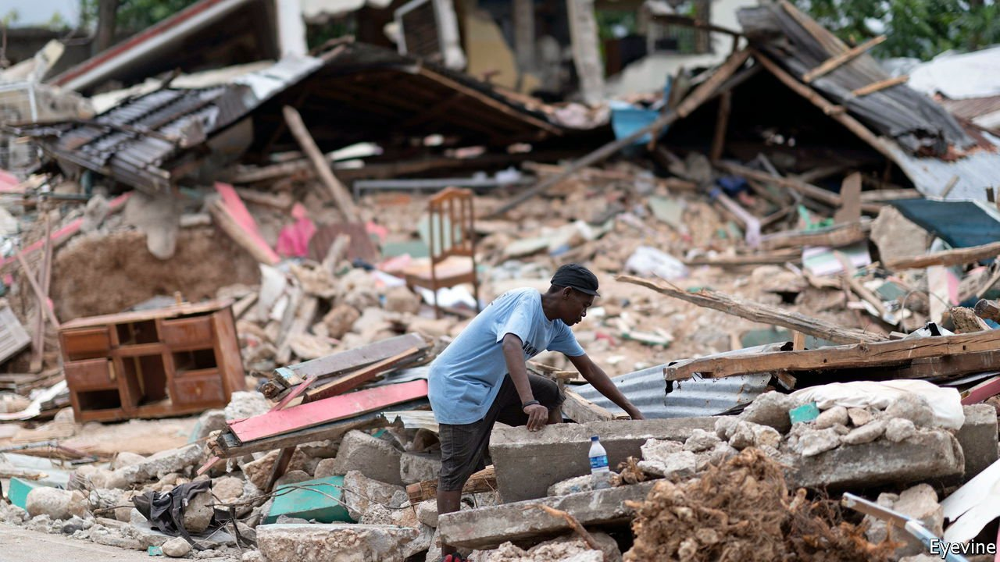
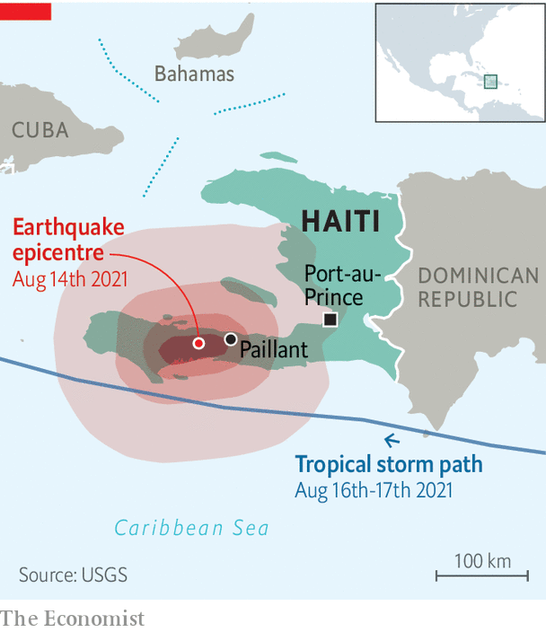

###### Crisis in the Caribbean

# An earthquake adds to Haiti’s woes 

##### The country is still reeling from the assassination of its president 

 

> Aug 19th 2021 

A LLEN JOSEPH was listening to a meditation recording when he felt his house in Paillant moving from side to side. “It was as if I were surfing a huge wave,” he says. Mr Joseph’s town (see map), home to about 20,000 people, was close to the epicentre of an earthquake with a magnitude of 7.2. It struck Haiti on the morning of August 14th. A tropical storm followed just days later, complicating rescue efforts as it brought floods and landslides. So far more than 2,000 people are confirmed dead—a number that is bound to rise. Thousands more are injured, missing or homeless.

 


Haiti, a Caribbean country of 11m people, has been plagued by , poverty and natural disasters for years. But they have come in quick succession of late. The earthquake struck just over a month after , the president, on July 7th, which has created a political vacuum. Even before that, the country was unstable. Gangs had proliferated and the economy had been shrinking for the past two years.


The country still bears the scars from past natural disasters, too. A quake in 2010 devastated Port-au-Prince, the crowded capital, killing 220,000 people. In 2016 the strongest hurricane in five decades hit.

Now Haiti will once again rely on the largesse of foreign donors. But aid is a mixed blessing. Although it has done much good, it has also weakened the government, since it flows largely through private networks. Worse, in the past decade UN peacekeepers accidentally introduced cholera, which has killed around 10,000 people according to official statistics. They have also been accused of sexually abusing Haitian girls.

The government will struggle, as usual, to cope with the latest disaster. Thousands of people are huddled in parks, without shelter, food or water. Several medical facilities, already scarce in the worst-affected area, have been destroyed. As gangs control roads that connect Port-au-Prince with the rest of the country, aid supplies must be airlifted, which slows their distribution. Happily UN officials say they may have struck a deal for safe passage by land.

As the state deals with the earthquake’s aftermath, progress may stall in the investigation into Mr Moïse’s murder. Not that there has been much. Despite multiple arrests, including those of Colombian mercenaries accused of carrying out the operation, few think the authorities are close to finding the real culprits.

Before the quake, elections for a new president and legislature due in September had already been pushed back until November. They may be delayed further. Haiti desperately needs a legitimate government. Mr Moïse had ruled by decree since January 2020, having dismissed all but ten lawmakers from Parliament. Rebuilding the country, controlling gangs and curbing the pandemic are top of the agenda for any new leader. (Just 371 Haitians have been fully vaccinated against covid-19.) Many are voting with their feet: Haitians have fled the country in droves in the past two years. The exodus is likely to grow. ■

An early version of this article was published online on August 17th 2021

