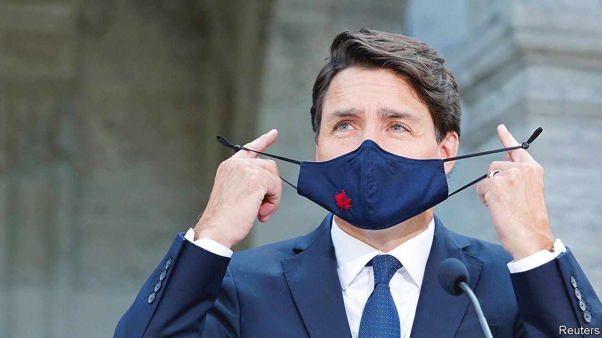

###### Sonny ways

# Justin Trudeau calls a snap election in Canada 

##### The country does not need an election now. But the prime minister does 

 

> Aug 19th 2021 

IN 1972 PIERRE TRUDEAU, Canada’s Liberal prime minister, lost his parliamentary majority in an election and found himself in charge of a minority government. Two years later he went to the country again, regained his majority and remained in office (with a brief interruption) for another decade. His son Justin (pictured), Canada’s prime minister since 2015, now hopes for a similar triumph. On August 15th he called a snap election, to be held on September 20th, with the aim of regaining the Liberal majority he lost nearly two years ago. He may hope to exceed his father’s 15 years in office. After 17 months of pandemic, he said when he asked the governor-general to dissolve Parliament, “we're all wondering what the next 17 months, not to mention the next 17 years, will hold.”

Mr Trudeau has reasons to be confident. Half of Canadians think his government has handled the pandemic well; less than a quarter think it has done badly. After a faltering start the country is among the leaders in administering vaccines: more than 70% of people aged 12 and older are fully inoculated. The IMF expects the economy to grow by 6.3% this year, well above the rich-country average of 5.6%. Mr Trudeau’s main rival for the prime ministership is Erin O’Toole, the leader of the Conservative Party, who is new to the job and has made little impression on voters.


Yet Mr Trudeau is taking a risk. And it is not certain that success—should he secure it—would be as much of a boon for the country as it would be for the Liberal Party.

The prime minister insists that the stakes are high. Canada stands at a “pivotal” moment, “maybe the most important since 1945”, he declares. But it is hard to see why. Mr Trudeau’s lack of a parliamentary majority has little constrained his ability to govern. He has needed the support of just one of the other main parties—if not the Conservatives then the left-leaning New Democrats (NDP) or the separatist Bloc Québécois—to enact his programme.

Most of the time he has got it. His government had cross-party support for pandemic aid to households and businesses worth nearly 20% of GDP. The NDP voted in April for his budget, which proposes high levels of spending (but promises a gradual decline in the deficit). Among its pledges is making child care available to families for C$10 ($8) a day within five years. In June Parliament enshrined in law the goal of reducing Canada’s net emissions of greenhouse gases to zero by 2050.

If re-elected, Mr Trudeau promises more aid to cope with the effects of the pandemic, for example by offering subsidies for the wage and rent bills of tourism businesses. He says he would continue to “build back better” and greener. But he could probably find the votes to do that in the current Parliament.

The main reason for holding an election now, rather than waiting until the end of the parliamentary term in 2023, is probably that a later contest would be harder for the Liberals to win. Canadians might tire of their scandal-prone government, which would then be entering its ninth year in office. The political immunity conferred by the vaccine will have worn off. Mr O’Toole will be better known, and perhaps more appealing to voters. Better to act now, Mr Trudeau may reckon.

His opening gambit has been to put the Conservatives on the defensive for their lack of enthusiasm about vaccinations. The Liberals want to make the jab mandatory for federal workers and passengers on trains and aeroplanes. When calling the election Mr Trudeau chided a Conservative MP for calling such mandates “tyrannical”. Mr O’Toole, whose supporters include anti-vaxxers, prefers frequent testing.

A record-setting heatwave this summer in British Columbia, a western province, also plays into Mr Trudeau’s hands. His most important climate policy has been to set a national floor for the price of carbon. The government intends to raise this from C$40 a tonne to C$170 by 2030. The Conservatives oppose the plan. That may be Mr Trudeau’s most convincing argument for delaying their return to power.

But being green and pro-vaccine is no guarantee of victory. In an election on August 17th Nova Scotia’s Progressive Conservative party defeated the Liberals, who had governed the province since 2013, because voters were angry about failures in health care, such as long waits for ambulances and doctors’ appointments. That may not be an omen: the Progressive Conservatives are not the same party as Mr O’Toole’s.

Perhaps a bigger worry for Mr Trudeau is the Conservatives’ perceived weakness. Few left-leaning voters, who are a majority, fear that the Conservatives will win. That will tempt them to vote for parties to the left of the Liberals, especially the NDP, which has the support of around 20% of the electorate. If that rises to 23%, “it’s an entirely different election,” says Darrell Bricker of Ipsos Public Affairs, a pollster.

Another risk for the Liberals is low turnout. A fourth wave of covid-19, now gathering strength, the complexity of voting by post and doubts that the election is as pivotal as Mr Trudeau says will discourage lukewarm Liberal supporters more than backers of the other parties. The latter are eager for change. “For pollsters this is going to be an incredibly difficult campaign,” says Mr Bricker.

The main risk is not that the Conservatives will beat the Liberals, but that Mr Trudeau will govern from a weaker position than he does currently. It is possible that in the new Parliament the Liberals will need the support of two parties rather than just one to enact legislation. According to 338 Canada, a politics website, gives the Liberals a 85% chance of winning the most seats, but just a 32% chance of winning an outright majority. Even so, Mr Trudeau seems to like those odds. ■

