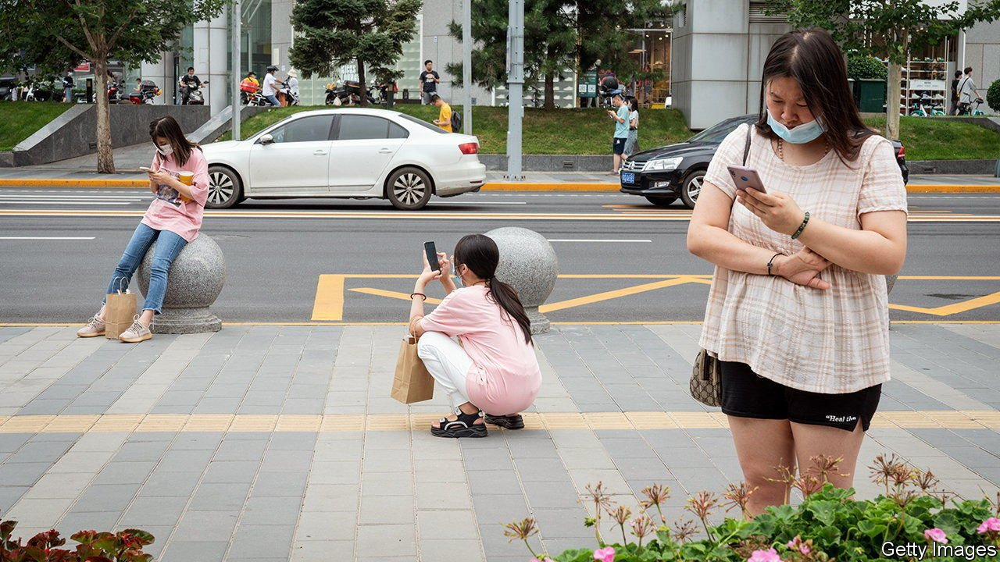
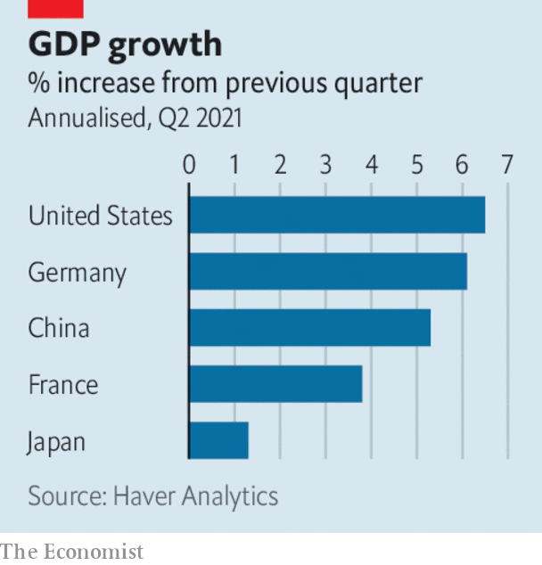

###### 

# Business this week 

#####  

 

> Aug 21st 2021 

China unveiled proposed antitrust regulations for tech firms. The guidelines would ban activities that regulators think will stifle competition and harm internet users. The list includes controlling user traffic, blocking competitors’ products and discriminatory pricing. The shares of Alibaba, Tencent and JD.com, three , all tumbled. Alibaba’s shares in Hong Kong are at their lowest price since they were listed there in 2019.

Meanwhile, the release of  raised concerns about the country’s slowing recovery. Figures for factory output, retail sales and investment activity were all below analysts’ expectations. Economists said that renewed travel restrictions, floods and typhoons were to blame for the bad news.


What’s in store

In America the giants of the  reported solid results. Walmart’s quarterly revenue for the three months ending in July reached $141bn, a 2.4% increase from the previous year. Sales and foot traffic also rose at Target, a rival. However, there are signs that the shopping spree may be coming to an end. The Commerce Department said that its measure of national retail sales dropped by 1.1% in July, compared with a month earlier. Spending fell across many categories, with notable declines in the sales of clothing, furniture and cars.

The inflation rate in Britain dropped to 2% in June, compared with 2.5% the month before. But inflation is expected to climb in the second half of the year, on the back of rising energy costs and global production bottlenecks.

The same factors pushed up consumer-price inflation in the European Union. The inflation rate there was 2.5% in July, up from 2.2% a month earlier.

Japan’s economy grew at an annualised rate of 1.3% in the second quarter. The expansion beat market forecasts and was the result of strong consumer spending and investment. Even so, the rebound is slower than that of other big economies such as America. That is partly because only 41% of Japan’s population has been fully vaccinated. Analysts expect Japan’s growth to be modest for the rest of this year.

 


BHP, the world’s biggest miner, announced plans to leave the London Stock Exchange and list only in Sydney. Ken MacKenzie, the chairman, said the move will make BHP’s corporate structure “simpler and more efficient”. The firm is the second-biggest listed in London by market capitalisation. It also announced that it will merge its oil and gas division with Woodside Petroleum, an Australian firm.

, another big miner, acquired a stake in Britishvolt, a startup with plans to build Britain’s first gigafactory to make batteries for electric cars. As part of the deal, Glencore will supply the factory with cobalt, which is used in the batteries. The firm is one of the world’s largest producers of the metal.

In America road-safety regulators opened an investigation into Tesla. Since 2018, 17 people have been injured and one killed in crashes involving the carmaker’s partially automated driving systems. The investigation will cover 765,000 cars made by Tesla since 2014. The probe is primarily concerned with an apparent inability of Tesla’s autopilot to cope with emergency vehicles stopped in the road while attending other accidents.

Nvidia, a big American chipmaker, reported strong results, thanks to surging demand for online services and gaming. Revenues rose to $6.5bn in the second quarter, 68% higher than a year earlier. Net income almost quadrupled to $2.4bn over the same period. The growth was propelled mainly by its data-centre and gaming businesses.

T-Mobile, an American wireless carrier, said that hackers stole customers’ data from its computer network. The theft affects over 40m current and potential customers. The stolen information includes social-security numbers and driving-licence details.

Wan Long, the chairman of WH Group, the world’s biggest pork producer, has been accused of financial misconduct by his son, Wan Hongjian. The younger Mr Wan previously held a senior position at the firm. In an article published on Weibo, a Chinese social-media site, he claimed that his father has committed fraud, evaded tax and mismanaged company funds. WH Group says the claims are “untrue and misleading”. But investors were spooked. The firm’s share price dropped by 11% on the news.

Space case

Blue Origin, a space firm owned by Jeff Bezos, sued the American government over NASA’s decision to award a $2.9bn contract to build a lunar lander to SpaceX, a rival owned by Elon Musk. Mr Bezos thinks the deal should have been divided up between companies rather than being given to a single firm.

