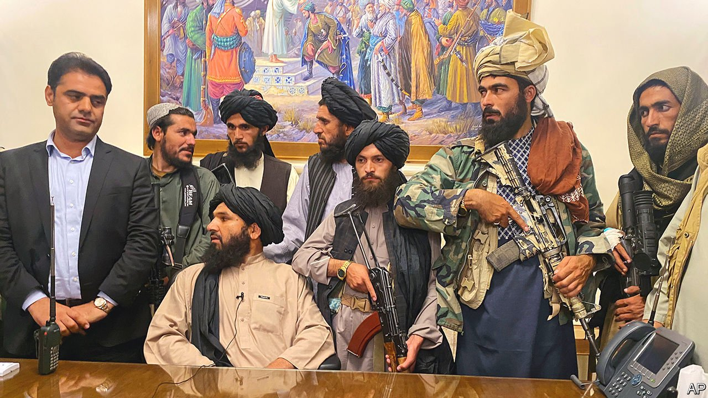

###### 

# Politics this week 

#####  

 

> Aug 21st 2021 

Ashraf Ghani, Afghanistan’s president, fled to the United Arab Emirates as , was captured by the insurgents of the Taliban. A chaotic evacuation of Western personnel and some of their Afghan associates followed from Kabul airport, where at least seven people died in the tumult. President Joe Biden defended the decision to withdraw American security forces from the country and blamed the Afghan government for lacking “the will to fight”.

, Malaysia’s embattled prime minister, resigned after months of political instability and the loss of his parliamentary majority. He remains in office while Malaysia’s king chooses his successor after consulting MPs. Sultan Abdullah said holding a new election during the pandemic would be dangerous.


Tropical Storm Grace drenched , slowing efforts to rescue survivors of a 7.2-magnitude earthquake that struck on August 14th. The death toll rose to more than 2,000, a number likely to increase further. The quake was stronger than the one estimated to have killed more than 200,000 people in 2010.

Peru’s foreign minister, Héctor Béjar, resigned after videos surfaced of him claiming the CIA, America’s intelligence agency, backed the Shining Path, a communist insurgency. Critics say Mr Béjar was one of several radical, inexperienced ministers chosen by the left-wing president, Pedro Castillo, who narrowly won an election in June. Mr Castillo must select a new foreign minister by the end of the month, when Congress will vote on whether to accept his cabinet.

The government of Cuba laid out laws tightening its control of social media. The sweeping decree forbids disseminating content that attacks “the constitutional, social and economic” rules of the state or that encourages demonstrations that threaten “public order”. It also provides a model form for the public to denounce offenders.

’s politicians hit the campaign trail after Justin Trudeau announced that the country will hold an early election on September 20th. The prime minister is cutting short his minority government, which has been in office for just two years, as he hopes that the electorate will reward his administration’s handling of the covid-19 pandemic. His Liberal Party hopes to win more than the 170 seats necessary for an outright majority in the country’s Parliament.

France became the latest European country to suffer from dangerous wildfires, as a large area near the south coast had to be evacuated. Greece, Portugal, Spain and Turkey have all been badly affected by blazes as well.

Israeli firefighters battled one of the largest wildfires in the country’s history. The blaze burned thousands of hectares of forest and sent a plume of black smoke over Jerusalem, though no serious injuries were reported. The authorities are unsure if it was caused by arson or negligence. The fire has since been contained.

Assailants on motorcycles killed 37 people in western Niger, the Ministry of the Interior said. It was not clear who carried out the attack, but armed groups linked to Islamic State and al-Qaeda, two militant groups, have been terrorising the region. Hundreds of civilians in western Niger have been killed by Islamist rebels this year.

The World Health Organisation said a second case of Ebola may have been detected in Ivory Coast, raising concerns that the virus has spread in the country’s economic hub, the city of Abidjan. The first case involved a woman who travelled by bus to Abidjan from Guinea, where an outbreak of Ebola claimed 12 lives earlier this year.

Israeli border police killed four Palestinians during a raid in the occupied West Bank. According to Israel, the police came under fire after entering Jenin refugee camp to arrest a member of Hamas, a militant Islamist group. It was one of the deadliest battles in the area in months.

A petrol-tank explosion killed 27 people and injured dozens more in Lebanon, leading protesters to attack the home of the prime minister-designate, Najib Mikati. Fuel is scarce in Lebanon, which is mired in an economic crisis. The blast occurred as the army was handing out petrol seized from black marketeers.

The International Atomic Energy Agency, the UN’s atomic watchdog, reported that Iran was continuing to produce enriched uranium that can be used in a nuclear bomb. The report complicates efforts to revive the international deal that curbed Iran’s nuclear programme. America demanded that Iran stop its “nuclear escalations”. Iran continues to insist it has only peaceful aims.

China’s crackdown on dissent in Hong Kong continued. Officials arrested four students at the University of Hong Kong for “advocating terrorism” after they paid tribute to a man who had stabbed a policeman and then killed himself. The four students were among 30 participants at a student-union meeting last month, which had been live-streamed online, that approved a resolution “appreciating the sacrifice”. HKU has since cut ties with the union.

Coronavirus briefs


The director of America’s National Institutes of Health described people who have not been vaccinated as “sitting ducks”, and warned that the number of daily cases in America could soon reach 200,000. Greg Abbott, the governor of Texas, who has refused to introduce mask and vaccine mandates, tested positive for covid-19.

The authorities in Iran said the country was undergoing a fifth wave of infections. Curbs on travel were imposed, and shops, restaurants and cinemas ordered to close.

A controversial vaccine-passport scheme in France, which has led to mass protests, was extended to around 120 department stores and shopping centres.

New Zealand went into lockdown after a single case was detected. The government has faced criticism for its strict “zero-covid” approach to the pandemic.

