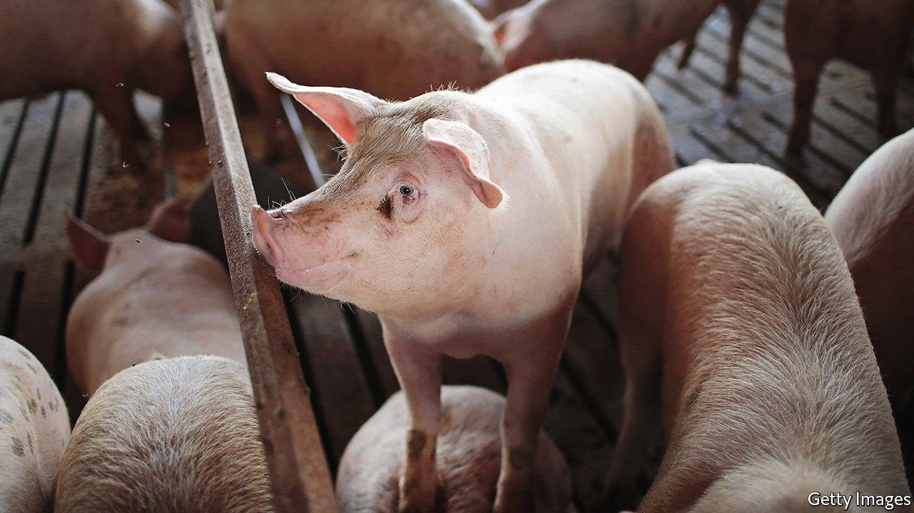

###### Hog tied

# California’s coming bacon crunch 

##### Animal welfare regulations will push up the price of pork 

 

> Aug 21st 2021 

BRINGING HOME the bacon is about to get harder in California. Proposition 12, a ballot initiative passed in 2018, prevents the pork, veal and egg industries from raising animals within confined spaces for all products sold within the state. And while the egg and veal industries met new rules in 2020 (43 square feet, or 13 square metres, per calf raised for veal, one square foot per egg-laying hen), the pork industry may fail to meet the requirements for breeding pigs (24 square feet) by January 1st.

California’s new restrictions are part of a larger movement to release animals from cages. McDonald’s, Kellogg’s, Kroger’s and other businesses announced plans to use only cage-free eggs by 2025. Eight states, including Massachusetts and Utah, passed laws that in effect ban eggs produced by caged hens . California’s law is the most impactful on the pork industry. As the largest consumer of pig products, 116m kilos per year (about 15% of all produced in America), California’s standards have weight elsewhere.


The industry is, naturally, claiming that the law is unconstitutional. So far, challenges have been unsuccessful. The US Court of Appeals for the Ninth Circuit declined the National Pork Producers Council (NPPC) and American Farm Bureau Federation's petition to strike down the law in July. And the Supreme Court denied a petition filed by the North American Meat Institute a month earlier.

Michael Formica, general counsel at the NPPC, says that the new law places an unreasonable burden on pork producers. Currently breeding pigs, which typically weigh about 225 kilograms, are placed in 14-square-foot gestation crates. Less than 4% of all sow housing meets the new standards, according to Rabobank, which finances agriculture.

Activists blame the pork industry. “[They] had three years to change their housing systems. They instead chose to not comply,” says Chris Green of Harvard Law’s Animal Law and Policy Programme. Californians could pay the price. The Hatamiya Group, a consulting firm hired by opponents of the law, estimate that consumers could pay up to 60% more: a $6 pack of bacon could now cost $9.60. Bacon smugglers in Nevada are, presumably, licking their lips.

