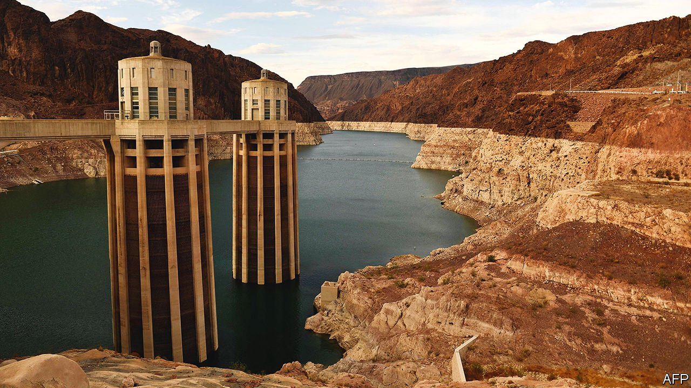
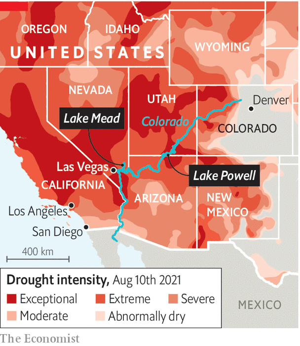

###### Low and dry

# The American West is drying up 

##### The effects of climate change are being exacerbated by a century of bad policy 

 

> Aug 21st 2021 

LOCALS CALL it the “bathtub ring”. A white strip more than 150 feet tall encircles the turquoise surface of Lake Mead, America’s largest reservoir, showing visitors how high the water once was, and how low it has fallen. The shrinking of Lake Mead and Lake Powell, its sister reservoir upriver, is the most visible manifestation of the 22-year megadrought that has gripped the American West. The water levels of both have reached record lows. Dip a toe into Lake Mead and it feels shockingly warm for such a large body of water. The canyons that were drowned when Lake Powell was filled in the 1960s are slowly revealing themselves again.

The drought has become so severe that on August 16th the Bureau of Reclamation, an agency within the Interior Department, declared the first-ever water shortage for the Colorado River. The river is the lifeblood of the south-west, supplying 40m people across seven states with water and hydropower. A patchwork of water rights, laws and litigation means that farmers in central Arizona will bear the brunt of the initial cuts.


There are two main reasons water shortages loom. The first is climate change. Both reservoirs straddle the Colorado River as it meanders from its headwaters in the Rocky Mountains down through the desert south-west to northern Mexico. Warmer winters caused by rising greenhouse-gas emissions have diminished the snowpack that melts into the river each spring. In addition, parched soils have soaked up some of the runoff before it can reach Mead and Powell. Since 2000, when the so-called “Millennium Drought” began, the river’s annual flow has shrunk by nearly 20%. Multiple studies in the past five years have attributed up to half of that decline to human-caused climate change.

Second, poor policy choices made 100 years ago all but guaranteed that the water available to westerners could never meet expectations. After laws such as the Homestead Act encouraged white settlers to move West in the second half of the 19th century, the federal government financed the dams and pipelines needed for cities and agriculture to thrive in the desert. “By moving water around from more water-rich areas to water-poor areas, we sort of enabled these people to migrate and settle,” says Newsha Ajami of Stanford University. “Regardless of the fact that it's dry, or it’s hot—if the water is flowing, you think anything is possible.”

 


Boosterism for shiny new reclamation projects in the early 1900s led to dubious decision-making. The Colorado River Compact, which divvied up the river in 1922, used data from historically wet years to estimate average annual flows. John Fleck, the director of water resources at the University of New Mexico, says a government scientist was ignored when he testified in the 1920s that the river could not meet projected demand. The compact and its addendums, known as “the law of the river”, hold that the seven states and Mexico are to split 20.4bn cubic metres of water each year (or in American terms 16.5m acre-feet, where an acre-foot is the amount of water it takes to submerge one acre of land one foot deep). The river has not lived up to those aspirational figures, says Brad Udall, a climate scientist at Colorado State University. Between 1906 and 1999 annual flows averaged 15.2m acre-feet; since 2000 the river has mustered only 12.4m.

Drought almost seems too puny a word to describe the water scarcity that the south-west is experiencing. “In some ways drought implies that it’s ephemeral,” says Kristen Averyt, Nevada’s climate policy co-ordinator. But the region’s future could be hotter and drier still, according to the most recent report from the Intergovernmental Panel on Climate Change. Discussing the outlook for Las Vegas, John Entsminger, who runs the Southern Nevada Water Authority (SNWA), prefers to talk in terms of aridification, or the long-term drying of the region. “I’m past talking about droughts,” he says.

The region’s rich cities have been planning for this. Los Angeles, San Diego, Phoenix and Las Vegas all get water from the Colorado River—and all have diversified their water supplies. Investing in conservation, recycling programmes and desalination technology has allowed south-western metros to save water even as their populations have soared.

Perhaps no place is more spooked by Lake Mead’s decline than the Las Vegas Valley, which gets 90% of its water from the nearby reservoir. That dependence has spurred innovation. All water that goes down a drain is recycled, according to SNWA, and the city has ripped out grass in favour of desert landscaping. These measures, along with water restrictions and incentives, helped the valley cut water use by 23% since 2002 while adding about 800,000 residents. “People always assume that population growth and water consumption is more or less a one-to-one correlation,” says Mr Entsminger. But “you can add more people to the equation and simultaneously use less water.”

But cities only account for a fraction of water use on the Colorado. Irrigated agriculture slurps about 70% of the river each year. Cuts to the water supply may push farmers to grow different crops, fallow fields or return to pumping groundwater to get by, which isn’t a sustainable option either. Years of overuse have depleted aquifers in parts of Arizona and California.

Meanwhile, some demands on the river are growing. Thanks to generations of neglect, many Native American households do not have access to clean drinking water. Tribes also lack the plumbing needed to take the water they already have rights to. The bipartisan infrastructure bill that passed the Senate last week includes $6bn to help remedy that. As the river shrinks, will such attempts to right enduring wrongs go down the drain?

The steps policymakers and utilities can take to prepare for a drier West fall into two buckets. The first are relatively easy measures. Closely tracking water use in homes, farms and businesses would help people understand just how much they are using—and root out the worst offenders. Cities can also further demand stricter compliance with local water restrictions. “Anybody that uses water in the West needs to pretend they work and they live in a desert—even if they don’t,” says Ms Averyt. “We need to make brown the new green.”

The second group of reforms requires more radical change. The rules governing the Colorado River expire in 2026. But if reservoir levels continue to decline, as projected, officials may be forced to begin negotiations early. Mr Udall argues the region needs to consider a worst-case scenario for the river. Such talk rattles lawmakers who know that asking their constituents—especially farmers and ranchers—to dramatically curtail their water use could be politically untenable. It also makes plans to take more water from the river, as Utah hopes to do, seem tone-deaf.

Making change more difficult is the West’s system of water rights, which gives precedence to whoever used the water first. In practice, that means water allocation is often based on who settled where in the late 1800s, rather than who needs the water most. “We have 19th-century laws, 20th-century infrastructure, and we have 21st-century problems,” says Ms Ajami.

The dwindling Colorado is just one example of how drought is plaguing the West. Elsewhere, right-wing extremists have threatened to take control of reclamation facilities on the border of California and Oregon to release water to farmers. The hot, dry weather that dramatically reduced snowpack in the Rockies and the Sierras has turned forests into tinderboxes. Smoke from wildfires in California is dirtying the air in Denver. Heat waves have baked the desert south-west and Pacific Northwest alike. America spent more than a century trying to reclaim the desert, turning brown landscapes green. Bolstered by climate change, the desert is clawing its territory back.

For more coverage of climate change, register for The Climate Issue, our fortnightly , or visit our 

