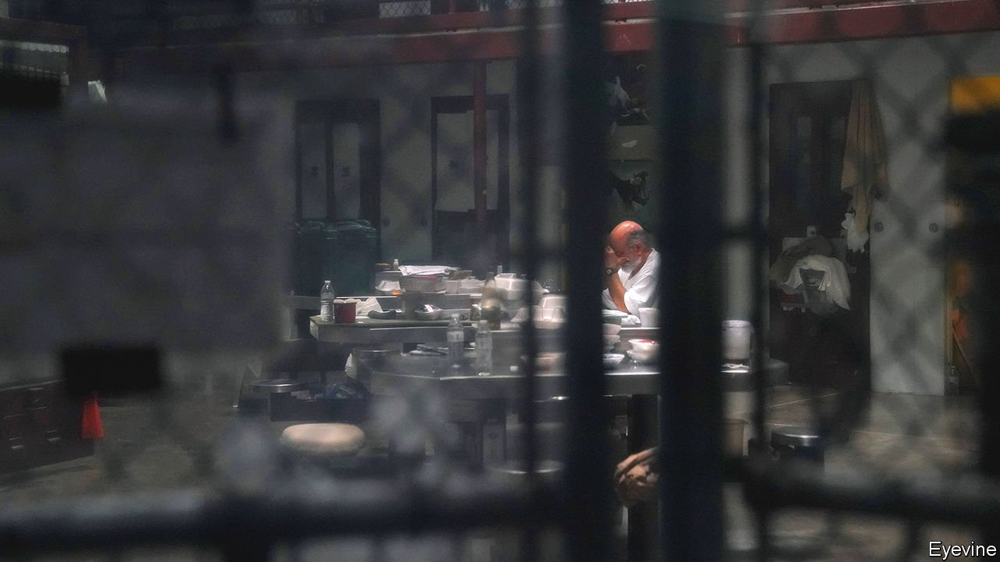

###### No easy escape

# The interminable trials at Guantánamo Bay are about to resume 

##### 20 years after 9/11 some cases are still in the pre-trial phase 

 

> Aug 19th 2021 

TWENTY YEARS after 9/11, the case of the alleged conspirators is set to resume in court over two weeks in September at the Guantánamo Bay detention facility. After a pandemic-induced pause, trials of several remaining detainees began last month. Another prisoner was released on July 19th, the first in over four years. With this new momentum, President Joe Biden aims finally to close the prison at Guantánamo, the site of torture and a legal quagmire that has long tainted America’s image during the “war on terror.” Closing Guantánamo would fulfil a campaign promise, the same promise left broken by Barack Obama.

But the infamous prison may yet frustrate Mr Biden, just as it did his former boss. At root is a broken legal process governing the trials of detainees, the so-called “military commissions”, that has kept prisoners in legal limbo. Congress, however, has refused to reform the commissions and blocked attempts to circumvent them. Mr Obama made halting progress, and Mr Biden has yet to devote real attention to the process. Without change, Guantánamo will be a stain on America’s reputation for years to come.


Beset by delays and the turnover of lawyers, the military commissions have little to show for their efforts. The detainees brought to Guantánamo beginning in 2002 were deemed “unlawful combatants,” neither subject to American courts nor protected by the Geneva Conventions. The commissions were established in 2006 to give the prison a veneer of a judicial system. These courts, born without a body of precedent or procedures, have secured just eight convictions. Many cases today are still mired in pre-trial activity, because of the government’s insistent pursuit of the death penalty and repeated litigation over the admissibility of evidence taken under torture. The absence of constitutional protections has added to the confusion, requiring clarification by higher courts.

Nor have the commissions benefited from stability on the bench or among the prosecution. Changing judges is no simple thing, requiring them to catch up on years of documents. Karen Greenberg of Fordham University School of Law points out that judges at Guantánamo “are not experienced in taking a trial from beginning to end in a procedurally regular way.”

The pending retirement of Brigadier-General Mark Martins as chief prosecutor, after a decade in the job, is the latest setback to the commissions. This came after reports of clashes with the White House over the use of statements made under torture, with Mr Biden’s team opposed.

Over the years, 780 prisoners have passed through Guantánamo. Many of the remaining 39 are entering their second decade in detention having never stood trial. Among them, 12 have been convicted, charged, or await charges for terrorism. Another ten can be transferred to other countries. The rest are examined by the Periodic Review Board, an opaque panel tasked with recommending inmates for release. Yet finding countries willing to receive men who had been under suspicion of terrorism, albeit that no charges had been pressed or proven, is tricky, requiring tactful diplomacy. Meanwhile, detainees still languish behind bars. Abdul Latif Nasser, a prisoner released to Morocco in July, was never charged with a crime in 19 years at the prison.

Congress has refused to remedy the situation. Since 2010, Republicans and many Democrats have united in banning the president from transferring prisoners to American soil. This has blocked prisoners from being tried in faster, standard American civilian courts. Unable to transfer detainees to an American supermax prison, Mr Obama, and now Mr Biden, were forced to find other governments to take the detainees not charged. Even so, some lawmakers have demonised the transfers abroad, warning that detainees will return to the battlefield. Indeed, the Office of the Director of National Intelligence estimates that over 17% of released detainees are confirmed to have re-engaged in terrorist activity. One such recidivist, Gholam Ruhani, has just addressed Al Jazeera from Afghanistan’s presidential palace in Kabul as a leader of the conquering Taliban.

Mr Biden has restarted the transfer process begun under Mr Obama, but he has not gone further. He is reported to be considering a special envoy, following Mr Obama’s example, as part of a policy review. Doing so would ensure that negotiating transfer cases was the responsibility of a single official, rather than sitting at the bottom of the agenda for any State Department official visiting the prisoner’s country of origin. Lee Wolosky, himself a former special envoy for Guantánamo under Mr Obama, says that the administration should also encourage other countries to prosecute detainees accused of crimes committed in their jurisdictions.

The president’s low-key approach, in contrast to Mr Obama’s bold declarations, may be the savvier strategy. With a slim Democratic majority in Congress and an ambitious agenda, Mr Biden may be reluctant to bring attention to so fraught an issue. Yet, as things stand, the administration must work through the sclerotic commissions. Far from America’s mainland and out of the headlines, Guantánamo’s legal machinery grinds forward, while defendants wait their turn. For many detainees, now old men with greying beards, death in prison is their probable fate.■

