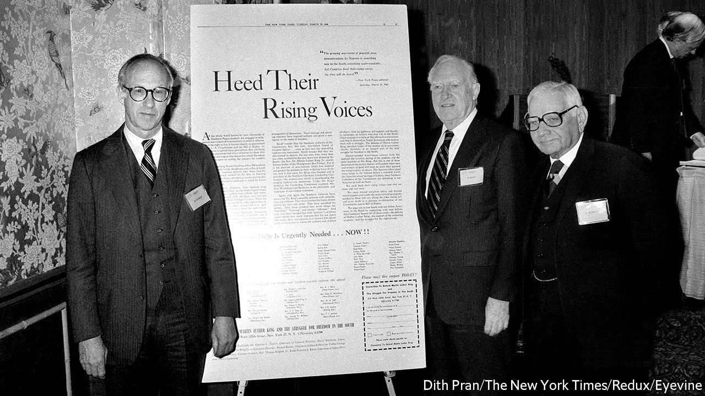

###### Malice afterthought

# Two Supreme Court justices want to revisit a landmark free-press ruling 

##### Does the Sullivan precedent make it too easy to publish lies? 

 

> Aug 21st 2021 

IT HAS BEEN five years since then-candidate Donald Trump called for America’s libel laws to be “open[ed] up” to make it easier for public figures to sue press outlets and win “lots of money”. No such loosening has transpired. But some judges and scholars are raising doubts about the nearly 60-year-old precedent that sets a high bar for successful libel suits.

In July two Supreme Court justices, Neil Gorsuch and Clarence Thomas, took aim at New York Times Co. v Sullivan, the landmark ruling from 1964 that shielded newspapers from southern efforts to stifle coverage of brutality against civil-rights protesters. In their eyes, the “actual malice” standard—which requires public figures alleging libel to prove the publisher printed a statement knowing it was false or without caring whether it was true—may now be damaging. The standard has “evolved from a high bar to recovery into an effective immunity from liability”, Justice Gorsuch wrote, and has become an “ironclad subsidy for the publication of falsehoods by means and on a scale previously unimaginable.”


Justice Thomas agreed that Sullivan has contributed to a “proliferation of falsehoods” by “insulat[ing]…those who perpetrate lies” from libel suits. Both see the decision and follow-on rulings as unmoored from the First Amendment. Laurence Silberman, a judge on the federal appellate court for the District of Columbia, wrote in March that Sullivan has facilitated the rise of something “very close to one-party control” of the media. ”Nearly all television—network and cable,” he reckoned, “is a Democratic Party trumpet.”

This conservative backlash to Sullivan is curious. The original decision was unanimous, as was its reaffirmation in Hustler v Falwell, a case in 1988 involving a parody suggesting that Jerry Falwell had engaged in drunken outhouse sex with his mother. In 2019, too, Justice Samuel Alito spoke up forcefully for press freedom when he defended conservative bloggers being sued for libel by a climate scientist whose views they had attacked.

Yet imposing a greater risk of costly defamation verdicts would make it “nearly impossible for most news organisations to continue to report on the government with the scrutiny we’ve come to expect,” says Sonja West of the University of Georgia. Ted Boutrous, who is defending MSNBC’s Rachel Maddow in a libel suit brought by OAN, an entertainment network, thinks it would be “extraordinarily damaging” for the court to chip away at the decision. Several politicians have recently brought frivolous suits. Mr Boutrous worries that lowering the hurdle to proving libel could have a chilling effect on political speech.

David Logan of Roger Williams University, counters that Sullivan provides “little deterrence of liars and a systematic under-protection of the right to an unsullied reputation”. For Justice Thomas, the shooting in 2017 at a Washington, DC, pizza shop motivated by Hillary Clinton’s purported Satanic child sex-abuse ring is an example of what it has wrought. But there is little reason to think disinformation on social media, much of it from anonymous accounts, would dry up were Sullivan to go.

America’s libel regime may, however, have room for improvement. Ordinary citizens have little hope of protecting their reputations. In 2014, for example, a woman had to prove actual malice when suing Bill Cosby for defamation, because she had thrust herself into a public dispute by accusing him of raping her 40 years earlier. As Justice Thomas has written, it makes little sense to impose this burden on plaintiffs with only brief notoriety.

Ms West says perhaps the level of protection against defamation suits should hinge on whether the speech is a matter of public concern, rather than whether the plaintiff counts as a public figure. In a book review 17 years before she became a justice, Elena Kagan toyed with that idea, too. But for now, Sullivan’s core seems safe: only two of the nine justices have expressed an appetite to abandon it. ■

