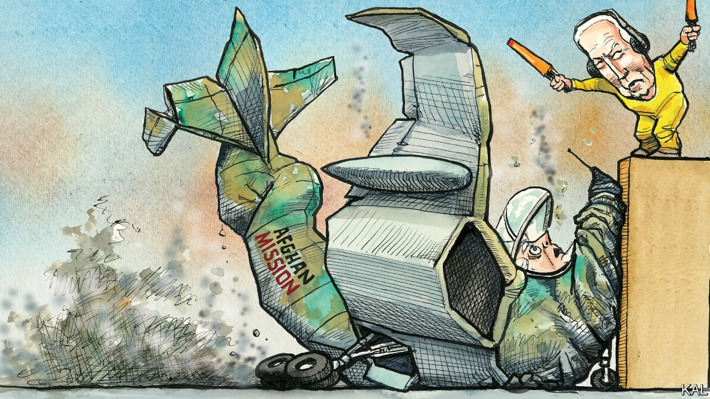

###### Lexington

# Uncle Joe did not know best 

##### After fouling up the withdrawal from Afghanistan, the president blames Afghans and his predecessor 

 

> Aug 18th 2021 

IT WAS ONCE usual for America’s leaders to take the rap for a policy catastrophe on their watch. Dwight Eisenhower drafted a provisional mea culpa on the eve of D-Day. John F. Kennedy accepted “sole responsibility” for the Bay of Pigs. “The buck stops here” read the woodcut that Harry Truman kept on his Oval Office desk. Joe Biden used the same phrase this week in reference to the fiasco in Afghanistan, but in a spirit of defiance, not contrition.

He claimed the collapse of Afghanistan’s security forces was not an indictment of his decision to withdraw America’s troops from the country, but a vindication of it. If the Afghans would not fight to protect their fledgling state, he could not ask Americans to. State-building was anyway not their mission in Afghanistan, he said; rooting out terrorists was. And to those who believe he should not have gone ahead with the withdrawal plan he inherited from Donald Trump, Mr Biden said he would in that case have been forced to escalate the war: “How many more lives, American lives, is it worth, how many endless rows of headstones at Arlington National Cemetery?”


He appears to have acquired some of Mr Trump’s disingenuous method as well as his Afghanistan policy. In fact, around 70,000 Afghan soldiers and policemen have died fighting the Taliban. The country’s forces folded only after Mr Trump cut a deal with their enemies then Mr Biden cut their air and logistical support. And the Democratic president was not always so sceptical of the effort to build an Afghan state; he was initially supportive of it.


Nor is it clear that staying on would have meant escalating the war, in which America has lost 24 soldiers in combat in the past two and a half years. Above all, the catastrophe that Mr Biden was required to answer for this week was not the decades-long failure in Afghanistan, or even his decision to draw a line under it. It was his administration’s astonishing lack of preparedness for the Taliban’s takeover. Aside from an implausible—and swiftly debunked—claim by Mr Biden that America had not previously evacuated many vulnerable Afghans because they had not wanted to leave, the president’s lengthy self-justification seemed mostly intended to distract attention from that disaster.

It was depressing, but not all that surprising. None of Mr Biden’s other recent predecessors owned up to their big screw-ups, either. George W. Bush still defends the debacle in Iraq. Barack Obama has called his failure to enforce his injunction against Bashar al-Assad’s chemical-weapon use one of his proudest moments. Partisan politics, to which foreign policy is now largely subject, does not reward admissions of error. And Mr Biden may be especially averse to them. The president’s scrappy-kid-from-Scranton shtick is not entirely cosmetic. Chafing against the condescension that he has received throughout his long, error-strewn career—from journalists and pundits who have never won an election—he is hair-triggered to stick it to his critics.

There are a lot of them currently. Many Republicans had been reluctant to criticise Mr Biden’s execution of a Trump policy in Afghanistan; they are now unloading on him with pent-up gusto. The party’s leaders, having had all enthusiastic reference to Mr Trump’s peace plan expunged from its websites, are seeking to blame 20 years of failure on the Democratic president. According to Mitch McConnell, “He owns it.” Senator Rick Scott of Florida has suggested Mr Biden should be removed from office. And many Democrats, dismayed by a display of the sort of incompetence they associated with the Trump administration, are not rushing to his defence. Bob Menendez, the Democratic chairman of the Senate Foreign Relations Committee, has announced his intention to hold hearings into both the Trump deal and Biden withdrawal. The top brass and intelligence agencies are also unhappy. Mr Biden ignored their advice in pushing ahead with the withdrawal, and their reputations have now been tarnished by it.

Unless the Taliban or their terrorist allies start killing many Americans, history suggests most of this will pass. Just 18 months after the end of America’s far bigger catastrophe in Vietnam, Bob Dole found no purchase, in a vice-presidential debate with Walter Mondale, for his caustic reference to “Democrat wars”. Most Americans recognised that both parties had been culpable for Vietnam, just as they have been for Afghanistan; and they had anyway moved on to more pressing economic concerns. Given how few Americans have strong views on Afghanistan even now (though most say they are for leaving it) it is safe to assume it will not be a major issue in next year’s mid-terms.

It could still influence them. Republican strategists believe their new attack-line on Mr Biden, that he is incompetent, will prove more effective than their old one, that he is a doddery slave to the far-left. By blaming him for high rates of crime and inflation as well as, should any voter care to remember them, the terrible scenes at Kabul airport this week, they will hope to sustain that attack. It would be an appropriately measly political epitaph to America’s Afghan venture, which for 20 years has been governed far more by political exigencies in Washington, DC—anti-terrorism, pro-development and so forth—than the situation in Afghanistan. It would also be a deserved knock to Mr Biden.

Losing his sheen

Reasonable people can disagree over whether the costs of the Afghanistan mission outweighed the costs of ending it. But it should be clear that the second are diverse and increasing and he is to blame. Having vowed to restore America’s alliances, Mr Biden has strained them, while handing an advantage to Russia and China, the adversaries he swore to confront. He has made a farce of his pledge to restore human, especially women’s and minority, rights to foreign policy. When challenged on those failures, he shirked responsibility and played to the gallery. It has been a wretched week for Afghanistan, America and both their presidents.■

An early version of this article was published online on August 18th 2021

For more coverage of Joe Biden’s presidency, visit our dedicated 

