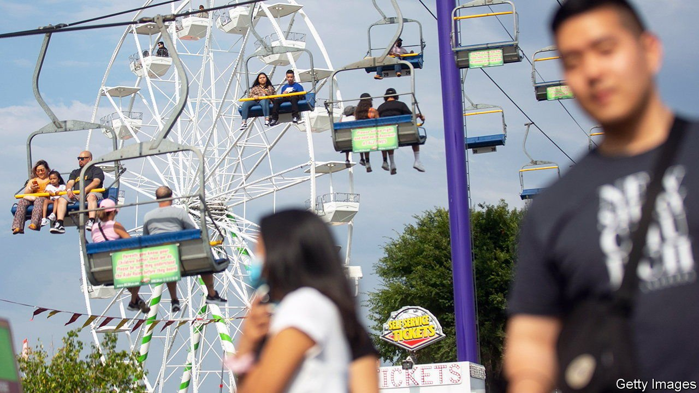
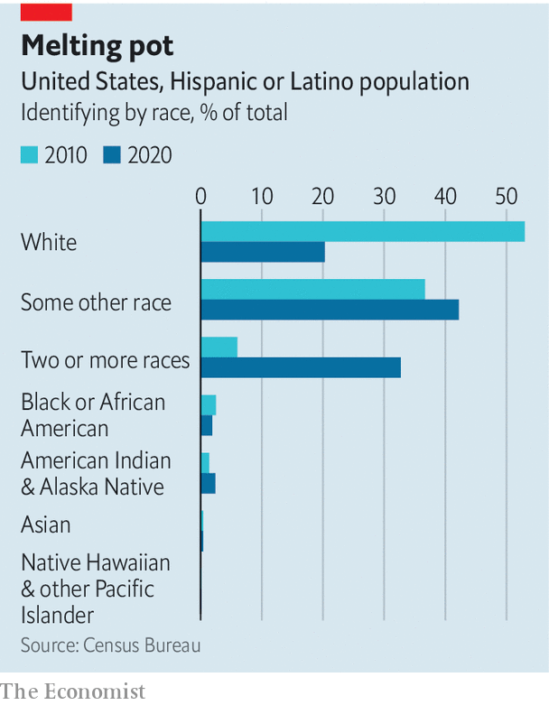

###### The omni-Americans

# Why more Americans are self-identifying as multiracial 

##### Demographic change, the Census Bureau and Donald Trump all played a role 

 

> Aug 21st 2021 

IT WAS FOUR months late, delayed by covid-19, but on August 12th America’s Census Bureau released data from the decennial headcount conducted last year. The results shed light on the sluggish growth of America’s population. Since 2010 it has increased by 7.4% to 331.5m, the slowest growth since the 1930s. And for the first time in America’s history, the number of non-Hispanic white people declined, falling by 2.6% to 192m. They now make up 57.8% of the population.

The reasons for this decline are both demographic and sociological. Whites skew older, with a median age of 44, compared with 38 for Asians, 35 for African-Americans and 30 for Hispanics. Whites have fewer babies and get only a small boost from immigration, since most new arrivals come from Latin America and Asia. By contrast racial minorities are growing fast. They make up a majority of the under-18s.


Categories are also becoming less exclusive. The multiracial population more than tripled in the past decade: one in ten Americans now consider themselves to be racially mixed. There are three explanations for this. One is the rise in interracial marriages, whose share jumped fivefold in 50 years. Another is changes at the Census Bureau, which allowed respondents to write longer answers to the race questions last year compared with 2010.

 


A third factor is that the way people see themselves is changing. Carolyn Liebler, a sociologist at the University of Minnesota, found that just over 6% of Americans changed their race on the census between 2000 and 2010. Many probably did so last year, too. The number of non-Hispanic whites declined by 5.1m, yet non-Hispanic people who identified as part-white rose by 7.2m. A lot of white people probably added another race that they didn’t declare before. It will take a few years and more data to determine how many.

A similar dynamic occurred among Hispanics. The census considers “Hispanic” an ethnicity rather than a race, and treats the two things separately: respondents are simply asked if they are Hispanic or not. The race question omits it. In 2010 a slight majority of Hispanics said they were white on the race question of the census. But that number fell by half last year. By contrast those who said they were “Some Other Race” or “Two or More Races” increased by 41.7% and 567.2% respectively.

One possible explanation is that last year, for the first time, the bureau asked whites to specify their ethnic origins and gave examples—German, Irish and Lebanese, among others—as prompts. Hispanic labels like Mexican or Puerto Rican were not among them. This may have made some reluctant to select the white option. And, in the era of Donald Trump, argues Ann Morning of New York University, many Hispanics got the message that they are not considered “bona fide whites”.

“The question is very simplistic, but the reality is complicated,” says Ms Liebler. The census captures population change in fine detail. It also shows shifts in how Americans see themselves.■

