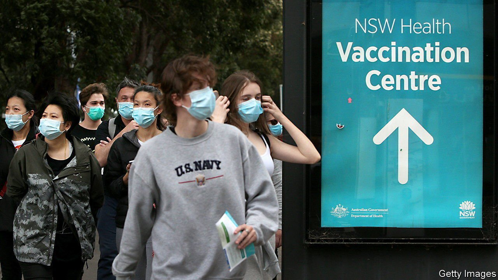

###### Covid how much?

# Australia is ending its zero-covid strategy 

##### The Delta variant has made it untenable 

 

> Aug 28th 2021 

“THIS IS NOT a sustainable way to live in this country,” declared Scott Morrison, Australia’s prime minister, on August 23rd. He was defending a dramatic shift in covid-19 strategy. Since the start of the pandemic Australia has used an approach dubbed “covid zero”, stamping on outbreaks down to the last case, whatever it takes. From now on, cases will be allowed to rise as long as hospitals can cope with them. The plan is to drop most restrictions once 80% of adults are vaccinated, which looks achievable by the end of the year.

Early in the pandemic Australia, New Zealand and other countries in the Pacific closed their borders and set up quarantine hotels to keep the virus out until vaccines were available. More than 30,000 Australians overseas are waiting to return home because of limits on how many can do so each month. Some who got stuck in India contracted covid-19 there and died. But for most of 2020 life in Australia carried on as usual, with schools, restaurants and theatres open—and no masks in sight. When a covid-19 case slipped through the quarantine wall, meticulous contact-tracing prevented big outbreaks. By August 25th Australia had registered 39 covid-19 deaths per million people, compared with about 1,700 per million in Europe.


But the highly contagious Delta variant, which spread globally this spring, has pushed the zero-covid approach to its limits. “It’s not just that you have to do everything you do better. It actually breaks the system,” says Catherine Bennett of Deakin University in Melbourne. Delta spreads so easily that even if contact-tracers reach an infected person within 30 hours of a positive test, their contacts would already have passed the virus down several chains of transmission, says Dr Bennett.

The only way to curb such outbreaks has been through short lockdowns known as “circuit-breakers”. With more infections slipping through the net, that leads to what Dr Bennett calls an “epidemic of lockdowns”. More than half of Australians have been in lockdown at one point or another since June. Melbourne has seen more than 200 days of lockdowns since the pandemic began. Hence the plan to ditch the zero-covid paradigm and accept that cases, and to a lesser extent deaths, will rise.

How high they will rise depends on how quickly Australians are vaccinated. About a quarter are fully jabbed, compared with 50-60% of Europeans and Americans. In addition, almost no Australians have acquired immunity naturally, through infection. Australia’s campaign got off to a late start because of supply delays. It had pre-ordered large quantities of a vaccine that failed in clinical trials, as well as of the AstraZeneca jab. The distribution of doses to 40,000 family doctors, spread over a vast country, has hit some snags. But vaccination has accelerated in the past week.

Other countries using the zero-covid model are in a similar predicament. All of New Zealand is now in lockdown, as cases have hit their highest level since April 2020. Vietnam’s remarkably successful tracing system has been crushed by Delta. Until April this year the country’s new daily case rate had almost always been in single digits; now it is north of 10,000.

Throughout the pandemic the zero-covid countries have been the envy of the world. The final stretch, however, will be their toughest. ■

Dig deeper

All our stories relating to the pandemic and the vaccines can be found on our . You can also find trackers showing ,  and the virus’s spread across  and .

