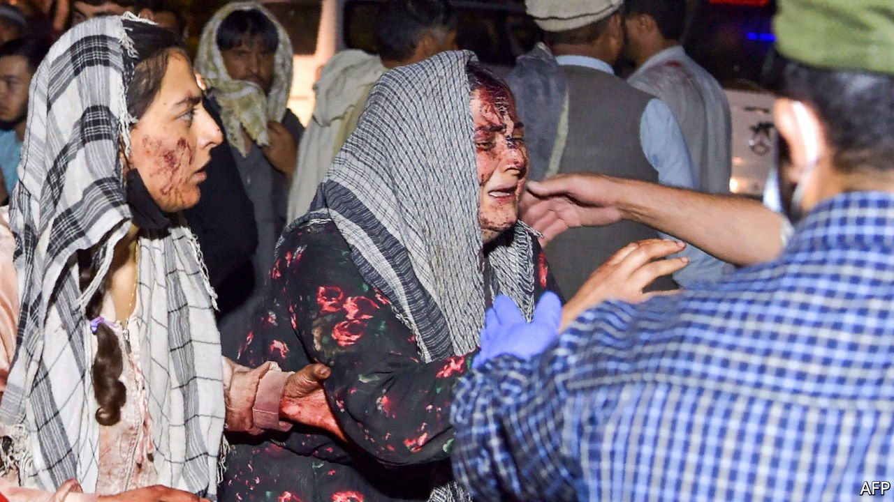

###### Kabul on edge

# Blasts at Kabul airport make the Afghan evacuation grimmer still 

##### And as America clears out, Afghans await a Taliban government 

 

> Aug 28th 2021 

TERRORISTS DETONATED two bombs amid the crowds outside Kabul’s airport on the afternoon of August 26th, casting America’s effort to evacuate its citizens and allies from Afghanistan into even greater chaos. The explosions reportedly killed dozens of Afghans and at least 12 American soldiers.  American intelligence agencies had warned the attacks were coming. Though unsurprising, they are nevertheless horrifying—and call into question the remainder of the evacuation effort.

The attackers set off their devices at two locations, outside Abbey Gate, currently the main entrance to the airport, and at the nearby Baron Hotel, which had been used by British and American forces to process evacuees. America and other Western governments had warned their citizens throughout the previous day to stay away from the airport, but the throngs of Afghans seeking entry remained dense. American Marines were operating outside the gates, bringing in authorised evacuees. America has the Taliban’s consent to continue to evacuate foreigners through August 31st. But the attacks made it clear that no one, including the Taliban, can guarantee the security of those trying to flee the country, or those who may be left behind.


The evacuation is one of the largest airlifts in history: 82,300 people were flown out between August 14th and 25th, the White House said. The airport teems with soldiers and special forces from several countries, including 5,200 Americans. Some are already packing up to get out on time, and flights carrying civilians may largely stop by August 27th. America had issued advance warnings that a terrorist attack could be imminent, and warned its citizens to stay away. Britain, Australia and other countries followed suit; Canada, Germany, the Netherlands, Hungary and Belgium ended their evacuations.

On August 24th, President Joe Biden had insisted that America was “on a pace to finish” by the deadline. But even before the bombings complicated the evacuation, many vulnerable people were certainly to be left behind. The Pentagon has extracted most of the 5,000 to 10,000 Americans it reckoned were in the country. But about a thousand were believed to be left as of August 26th. Any stray Westerners who fail to make it out will present attractive targets for IS or the Haqqani network, a hostage-taking ally of the Taliban.

That leaves the thousands of Afghans. The most vulnerable, such as intelligence operatives or senior government officials, are being given priority. But those with larger families or a lower profile are struggling. “We are going to leave quite a lot of people behind, there’s no doubt,” says an insider familiar with the operation. Britain hopes the Taliban will allow Afghans to leave after August 31st on commercial flights, but it may not be able to keep the airport running—many of the Afghans who can do so are trying to get out. On August 24th the Taliban complained that America was encouraging doctors and other professionals to leave, and said they would no longer allow Afghan nationals to take the road to the airport.

The Taliban’s leaders have yet to announce who will run their government. For years the group has made honeyed promises of a broad-based, inclusive regime. Indeed, since the takeover they have consulted prominently with grandees from the Afghan regime they deposed. Hamid Karzai, a former president, and Abdullah Abdullah, a former chief executive, have tried to position themselves as power-brokers. The Taliban have also sent envoys to the Panjshir valley, to try to negotiate a settlement with government holdouts led by Ahmad Massoud, the son of a famous anti-Taliban commander.

Yet much of this may be for show. The magnitude of the Islamists’ victory puts them in a stronger position than even they expected, says Nematullah Bizhan of the Australian National University: “Other players do not have any leverage.”

The Taliban are clear that they are not interested in a democracy. The new system, they say, will be based on their own draconian interpretation of Islamic law. A figure familiar with the group’s deliberations said that Afghanistan would be overseen by a ruling council while the movement’s supreme leader, Haibatullah Akhundzada, would remain in overall charge, though he has not been seen since the Taliban’s victory. Mullah Abdul Ghani Baradar, the group’s first deputy leader (who met Bill Burns, head of the CIA, when he visited Kabul on August 23rd), is thought to be in line for a senior post. So are Mullah Mohammad Yaqoob, a son of the Taliban’s first leader, and Khalil Haqqani, a leader in the Haqqani network.

The militants are desperately short of people with experience of running a country, yet early appointments do not suggest a broad tent. According to Pajhwok, an Afghan news agency, Gul Agha, a member of the Taliban’s finance commission, has been installed as minister of finance and Sadr Ibrahim, a former military chief, as interior minister. Many names circulating for ministries and governorships are from Helmand, a southern province, raising the prospect of disquiet among northern groups and ethnic minorities.

Yet the regime’s most pressing crisis will be economic. Even before the Taliban takeover almost half of the population, some 18m people, needed aid. In the past two weeks the number of internally displaced people has risen by 53%, to 550,000, according to the International Rescue Committee, an NGO.

Most important, under the previous government international aid amounted to an astounding 40% of GDP and three-quarters of the government budget. That tap has been shut. The Taliban are adept at collecting taxes in the provinces they control, but their revenues cannot come close to replacing the lost aid. The central bank’s $9bn in foreign reserves has been frozen, mostly by America. Without this Afghan businesses will be unable to finance imports, in a country that in 2020 ran a trade deficit of more than a quarter of GDP.

The result will be inflation, unemployment and a crash in income, says Ajmal Ahmady, the former central-bank chief. Already the price of wheat is reported to have risen by 20% or more. “This is going to destroy the economy,” said one expert.

International donors would like to use that prospect to exact concessions. An emergency meeting on August 24th of the G7, a club of rich countries including America and Britain, exhorted the Taliban to treat former government employees leniently, respect women’s rights and above all allow more evacuations.

But it is not clear that such inducements carry much weight. Zabihullah Mujahid, the Taliban’s spokesman, said on August 24th that the group had no list of targets for reprisals. Reports of house searches of ex-government employees belied that. He also asked women to stay home from work until the group’s less enlightened troops had been taught to treat them with dignity. Afghan women fear that may take a long time. ■

 This article has been updated since publication with the news of bombings outside Kabul’s airport. 

