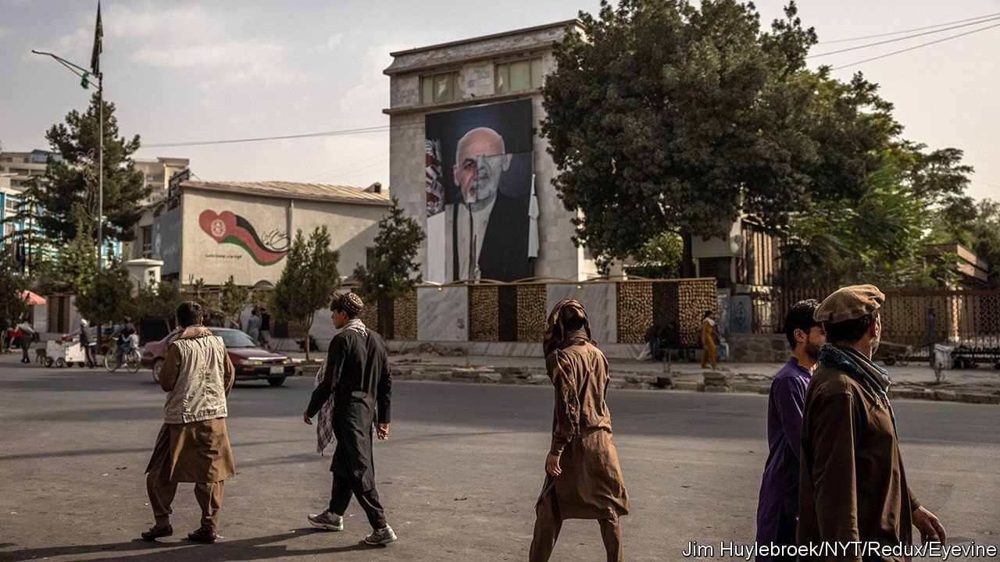

###### Nation-gilding

# The Afghan government was undone by its own corruption 

##### As with Vietnam, an American client state was crippled by graft 

 

> Aug 28th 2021 

IT LOOKED LIKE the fall of Saigon in 1975 on fast-forward: an American-backed army melting away, enemy fighters strolling into the presidential palace, desperate crowds mobbing the airport. But the similarities between Afghanistan and South Vietnam were not only superficial. Both states, built to please their American sponsors, had been hollowed out by one of the oldest diseases of governance: corruption.

In Afghanistan, “from your birth certificate to your death certificate and whatever comes in between, somehow you have to bribe,” says Ahmad Shah Katawazai, a former Afghan diplomat. Officials and police routinely demand baksheesh (a “tip”). As the Taliban advanced, the pay-off required for a passport rose to thousands of dollars.


Worse, a government job is itself a valuable commodity. As Sarah Chayes, an expert on corruption, discovered while running an NGO in Afghanistan, officials often buy their posts and must extort kickbacks to recoup their investment. Mr Katawazai says it can cost $100,000 to become a district police chief. Officials’ main goal becomes extorting revenue to distribute to their families and patronage networks.

Afghanistan was partly run by such networks, even before 2001. But America strengthened them by paying off warlords, according to the Special Inspector General for Afghanistan Reconstruction (SIGAR). In 2009 ISAF, the coalition of NATO-led forces in the country, set up an anti-corruption unit called Shafafiyat (“transparency” in Pashto), with modest results. The government’s anti-corruption prosecutor mainly pursued political enemies. By the end the country was so corrupt that governors cut deals with jihadists. The army’s numbers were inflated by “ghost soldiers”, absentees listed on the payroll so that commanders could pocket their salaries.

Americans may remember the term “ghost soldiers” from the war in Vietnam, where corrupt senior officers used the same system. One South Vietnamese colonel used to order aimless artillery barrages in order to hawk the spent shell casings as scrap metal. As in Afghanistan, police and soldiers profited from the heroin trade. A report in 1978 on the fall of South Vietnam by RAND, a security think-tank, said South Vietnamese themselves believed that corruption was “largely responsible for the ultimate collapse”.

Why then, when it invaded Afghanistan decades later, did America fail to take corruption seriously? One answer is that political thinkers are only now doing so. Scholars such as Francis Fukuyama, a political scientist, see corruption as a throwback to pre-modern governments where power is based on personal ties rather than institutions. In this way South Vietnam and Afghanistan resemble mafias or the feudal states of medieval Europe. States like these lack the cohesion needed to beat a disciplined insurgency such as the Vietnamese communists or the Taliban.

Another problem, says Mark Pyman of CurbingCorruption, a watchdog, is that corruption is too knotty a problem for military officers focused on their nine-month rotations. For their part, aid agencies too often judge success by how much money they disburse. In both South Vietnam and Afghanistan a vast influx of American dollars caused a surge in inflation, wiping out public-sector salaries. (Afghanistan, with a GDP of about $20bn per year in 2020, received $145bn in American aid in 2001-21. Inflation averaged 17.5% in 2003-8.) Public servants had to demand kickbacks to support themselves.

Hence anti-corruption experts recommend that aid should be frugal and focused on achievements. That is easier said than done. If America does not learn that dollars cannot build a real government, it will end up creating more fake ones. ■

