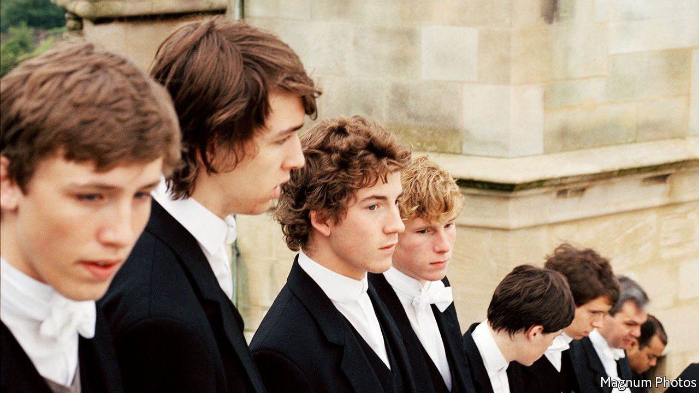

###### Sad little men

# Britain’s private schools are lambasted in Richard Beard’s book 

##### Assessing the impact of an elite education 

 

> Aug 28th 2021 

Sad Little Men: Private Schools and the Ruin of England. By Richard Beard. Harvill Secker; 288 pages; £16.99

AS ITS SUBTITLE promises, this book is an uncompromising denunciation of Britain’s private schools. They offer their charges a Faustian bargain, says Richard Beard: the tools of success (principally fluency and self-confidence) in return for emotional impoverishment. He knows whereof he speaks: in 1975 he was sent from home to a new life sleeping in dormitories and climbing hierarchies, much like David Cameron and Boris Johnson.


This argument is far from original; lambasting public schools for tormenting their inmates and ruining the country is one of Britain’s oldest traditions. (In England and Wales private schools are confusingly known as “public schools”; they themselves prefer “independent schools”.) Thomas Macaulay, a Victorian historian and politician, avoided them after a family friend told his mother that “throwing boys headlong into those great public schools always puts me in mind of the practice of the Scythian mothers, who threw their new-born infants into the river.”

In the 20th century Evelyn Waugh quipped that “anyone who has been to an English public school will always feel comparatively at home in prison.” Goronwy Rees, a journalist, wrote of the public-school boys he encountered at Oxford that they “were all well-taught at school and what they understood they understood very well; what they did not understand included almost everything which would change the world in their lifetime”. Two of the best books about the classic public school (both by T.C. Worsley, a former schoolmaster) are entitled “Barbarians and Philistines” and “Flannelled Fool”.

Updating these criticisms, Mr Beard makes some striking points about the way “total institutions” (a phrase he borrows from the sociologist Erving Goffman) can reconstruct the human personality. The aim of public schools is to make people fit in effortlessly with the changing rules and rituals of the tribe. They do this by removing children from their natural environments, then forcing them to play a succession of different roles. “We were post-modernism come to life,” he writes. “We had our different ‘I’s’, some more made-up than others, customised as required because we didn’t have the peace or privacy to become ourselves in our own time.” Thus Alexander Johnson became Boris, Eric Blair became George Orwell, and Philby, Burgess and Maclean became Soviet agents.

The author also makes good use of his own memories at Radley College. The school was trapped in the past, both the 1940s and 1950s—playground games were an endless fight against the Germans—and to some extent the late Victorian era, when the British Empire encompassed much of the globe. Mr Beard writes movingly about being sent away from home at eight. One boy in his year had to be dragged out of the family car, kicking and screaming, as his mother sat sobbing in the front.

All the same, he sometimes tries too hard to condemn the institutions that evidently caused him much misery. He presents Mr Johnson as the archetype of a public-school man—an entitled and unprincipled bloviator on the surface but, inside, a sad little boy crying for his mother. But there is a range of other public-school types, including dutiful swots like Rishi Sunak, Britain’s chancellor of the exchequer. And Mr Beard fails to notice the way public schools have reinvented themselves to serve a new plutocratic elite, a group both more sentimental about its children and less tied to the nation state.

Today’s public schools are much softer places than Mr Beard remembers. They pamper their pupils with first-class facilities and are hyper-alert to signs of bullying and emotional distress. With the notable exception of Eton College, most now take girls. They are also highly globalised (a third of today’s boarders are born abroad) and increasingly enlightened (Eton has a director of inclusion). The most pressing question about them today is not whether they produce emotional pygmies who will nevertheless go on to run—and ruin—Britain. It is whether they are producing well-adjusted members of the global meritocracy who don’t give a fig for public service. ■

