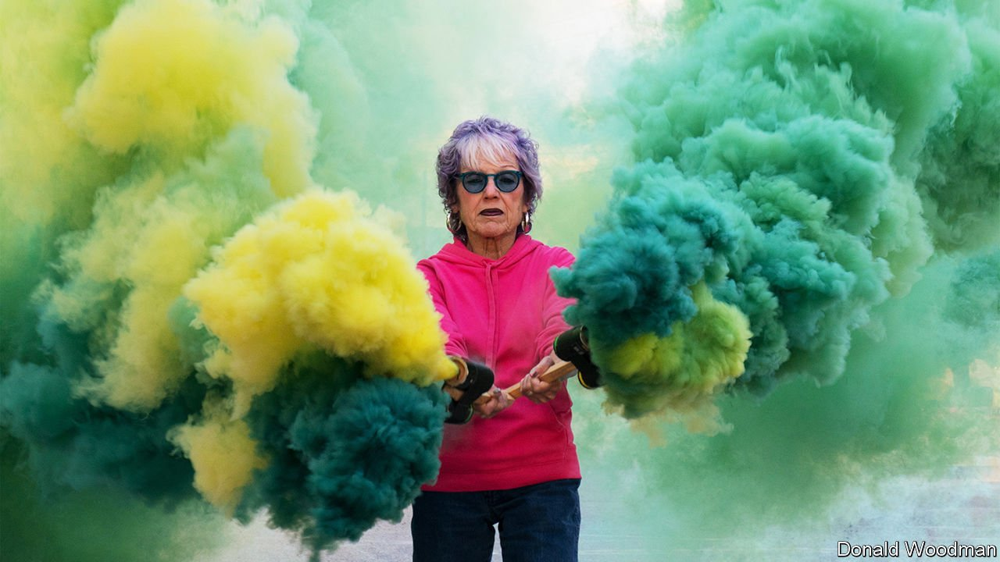

###### Fireworks and feminism

# The first full retrospective of Judy Chicago’s career 

##### Belated recognition for an activist artist 

 

> Aug 28th 2021 

ONE OF THE many snubs that radicalised Judy Gerowitz took place in Los Angeles in the mid-1960s. A prominent curator, visiting the studio the artist shared with her second husband, refused to look at her abstract sculpture, literally averting his eyes to look only at her partner’s work. Years later he apologised, saying that he was flummoxed to find a female artist so superior to her male contemporaries.

By then she had given up trying to gain the acceptance of the mainstream art world. In 1970 the artist took the name of her hometown as her own and “Judy Chicago” was born—along with the first feminist art course in America, which she founded at Fresno State College in California. From then on Ms Chicago was determined to challenge the status quo. Her art would make the white male art establishment as uncomfortable as it had always made her.


American women were increasingly aware of the sexism that constricted their lives. Betty Friedan’s book, “The Feminine Mystique”, had appeared in 1963. In 1971 Linda Nochlin, an art historian, published a groundbreaking essay, “Why Have There Been No Great Women Artists?”, which investigated how creative women had been thwarted for centuries. Ms Chicago threw herself into creating female-focused spaces and works, reasoning that if the art world was hostile to women, they would have to develop an alternative “art infrastructure” that included “establishing our own art history”. But it is only now, at the age of 82, that she is getting her due.

The work that made her name involved five years of intensive labour working alongside hundreds of artisans. “The Dinner Party”, an installation unveiled in 1979, consisted of a large triangular table and 39 place settings, each named after a woman, real or mythical, largely erased from memory. It was, she said, “a reinterpretation of ‘The Last Supper’ from the point of view of those who have done the cooking throughout history”. Shockingly, the piece was filled with glistening ceramic vulvas.

The backlash was swift and ferocious. Critics called it kitsch and pornographic, dismissing it, as Ms Chicago would later say, as nothing more than “vaginas on plates”. It was hugely popular, nonetheless, attracting sell-out crowds in San Francisco and Brooklyn. Yet no other American museums would touch it. For several years supporters arranged to show it at venues around the world. But then the installation was packed away. Ms Chicago returned to her studio, her career sputtering. Not until 2002, when “The Dinner Party” was acquired as a permanent exhibit at the Brooklyn Museum, did her later work start to emerge from its shadow; even now little of her varied output has been widely seen.

“Judy Chicago: A Retrospective”, opening this week at the de Young Museum in San Francisco, is the first full review of the artist’s career, encompassing every kind of work she has made over the past six decades. What it reveals, says Thomas Campbell, director of the Fine Arts Museums of San Francisco, is that “to this day, Chicago’s art is activist in its foundation”.

Ms Chicago agrees. Edward Lucie-Smith, a British art historian, “was right many, many years ago when he called me a ‘moral artist’”, she says. “My work has to do with social justice.” The belief that art can change the world for the better stems from her upbringing, particularly the influence of her father, a Marxist trade-union organiser who died when she was 13.

That insistence on conveying a message is, she believes, also the reason why she was persona non grata in contemporary art circles for so long. “I definitely think there is resistance to some of the subjects I’ve taken on. As the art industry has developed, ‘content’ has become more and more a dirty word.” For her, “content” has mainly revolved around questions of privilege and power. She spends years on each new subject: the generative female body in “The Birth Project”; violent masculinity in “Power Play”; the brutality of historical oppression in “The Holocaust Project”. Ms Chicago’s goal is to wake up the public at large, not to appeal to the art elite.

Across her career she has experimented broadly, moving from two to three dimensions, from bronze and needlework to coloured smoke and fireworks, often melding text and image. Her subjects dictate her approach, she says, scoffing at distinctions between “high” and “low” media. She has taken a course in painting car bodywork and commissioned legions of seamstresses; the “idea that a technique has gender is just preposterous”. From the start, her aim has been to show that “the female experience can be a path to our understanding of the universal in the way that male experience has been for centuries.”

Finishing touches

It is not always pretty. Her figures can sometimes look cartoonish. Yet the best, in “The Birth Project” especially, are transcendent. Entering the exhibition, which starts, unusually, with recent work, viewers come face to face with a harrowing subject. In haunting sculptures and graphics painted on black glass, “The End: A Meditation on Death and Extinction” portrays her own death and those of other species that mankind is destroying. The subjects may change, but the purpose of her art remains the same: “Will it actually open people’s eyes, and break their hearts, the way it broke my heart,” she asks, “to the point that we actually do something?” ■

