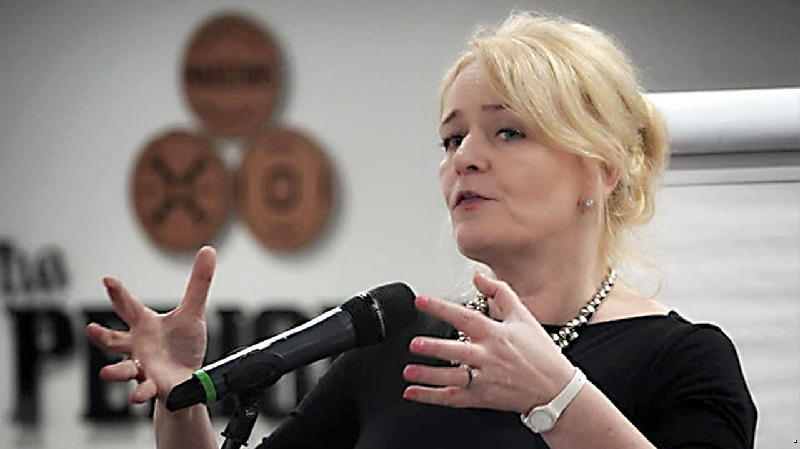

###### Bosses beware

# A new general secretary at Unite plots a radical overhaul 

##### British workplaces are likely to see more strikes 

 

> Aug 28th 2021 

AGED 17 AND working as a silver-service waitress in London, Sharon Graham led an unofficial walkout in support of colleagues on casual contracts, which won them equal pay. It gave her a taste for facing off against employers. Now 52, she will soon have plenty of opportunity to satisfy it. On August 25th Unite, Britain’s second-largest—and by far its loudest—trade union, elected her as its new general secretary. She is expected to move the union away from Westminster and back into workplaces. The impact will be felt not just on the political left, but in boardrooms.

Unite officials had expected an easy win for an insider, Steve Turner, an assistant general secretary and, in the words of one observer, “the anointed one”. He has been a loyal deputy to Len McCluskey, the retiring general secretary, and he played a big part in shaping the government’s covid-19 furlough scheme. During the campaign Ms Graham faced abuse from activists who accused her of splitting the left, thus supposedly providing a route to victory for Gerard Coyne, the least radical candidate.


But union elections are seldom only about points on the political spectrum. Candidates generally split between insiders with institutional experience and reformers popular with members. Ms Graham dubbed herself the “insurgency candidate” and highlighted her success in winning disputes. Many who voted for her will have known her from her former role as head of Unite’s organising and leverage department. Turnout was low, as is usual in such votes: less than 10%.

The fact that Unite members found her appealing is an indictment of Mr McCluskey’s tenure, during which the effort to propel Labour’s former, far-left leader, Jeremy Corbyn, towards Downing Street trumped everything else. Unite sank millions in members’ dues into this failed enterprise. It has cut the amount that will go to Mr Corbyn’s successor, the more centrist Sir Keir Starmer. Who leads Labour, and whether the party wins elections, matter little to many Unite members. Four in ten voted for the Tories in 2019, says YouGov, a pollster. Ms Graham plans to refocus on shop-floor battles. “For too long now, it seems to me that the political tail has been wagging the industrial dog,” she says. She argues that if unions are properly supported, politics will naturally shift to the left.

Supporters hope her victory will further energise organised labour. According to research by the Resolution Foundation, a left-leaning think-tank, trade union membership has started rising again after decades in which it fell. The share of employees who are in a trade union edged up from 23.3% in 2017 to 23.7% in 2020, bringing total membership to 6.6m.

Membership continues to tilt away from the private sector towards the public sector, however. Last year 227,000 public-sector employees joined a union, and 110,000 private-sector ones left. This shift has caused something of an identity crisis. The highest-paid fifth of employees in the public sector are nearly seven times as likely to be in a union as the lowest-paid fifth in the private sector, says the Resolution Foundation. “Nobody wants to see us become a purely public-sector trade-union movement, important though those members are,” says Frances O’Grady, the general secretary of the Trades Union Congress, an umbrella group. But organising in the private sector is much harder, a fact she attributes, at least in part, to the workforce being “Balkanised” by outsourcing.

Another long-term trend in labour activism may help lure them in: a shift away from strikes and towards legal action. GMB, a union that draws members from many sectors, spent years in court seeking greater employment rights for Uber drivers, and in May it signed a deal to represent 70,000 of them. Targeted ads on social media may also bring in new members, as may apps that help unions organise workplace campaigns. Ms Graham approves of such innovations, but declares herself still a fan of the factory gate. “Legal action is no substitute for organising workers and building workplace power,” she says.

She is also the chief cheerleader for “leverage”, a radical tactic that involves going over bosses’ heads to company directors, shareholders, investors and suppliers. After British Airways, the national flag-carrier, threatened to fire and rehire thousands of Unite members, she set up BABetrayal. She says targeting its parent company brought BA back to the negotiating table. To help settle a dispute at a bus company in England, she brought it to the attention of Sweden’s government, putting a potential contract there at risk.

Such methods win not just disputes, claims Ms Graham, but new members. She has run 12 leverage campaigns, with an unbroken record of success. She hopes to use the technique to attract workers in the gig economy. “Despite small-scale attempts, there has been no comprehensive campaign to build fighting unions in the ‘new’ areas of work,” she has said. But other union bosses say they have to meet gig workers away from workplaces because they are terrified of being seen by employers. Persuading them to harry shareholders and board members may prove difficult.

Under Ms Graham’s leadership, strikes will probably become more common: she plans to set up a Strike Support Team to assist shop stewards. Supporters compare her to Jack Jones and Arthur Scargill, radical union leaders who tormented one government after another in the late 20th century. “I will not hesitate as Unite’s general secretary to fight bad bosses relentlessly,” she says. “I am up for that.” ■

