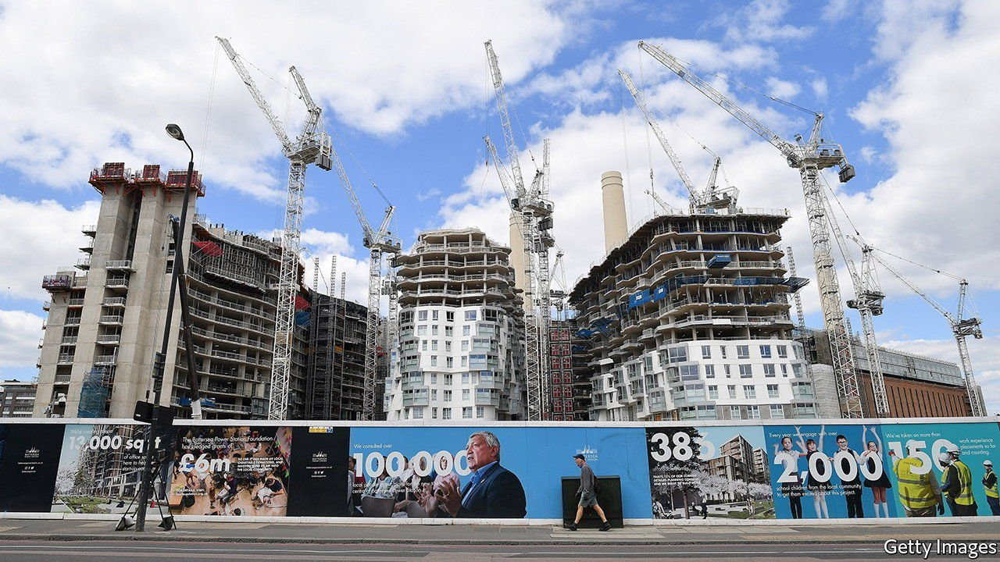
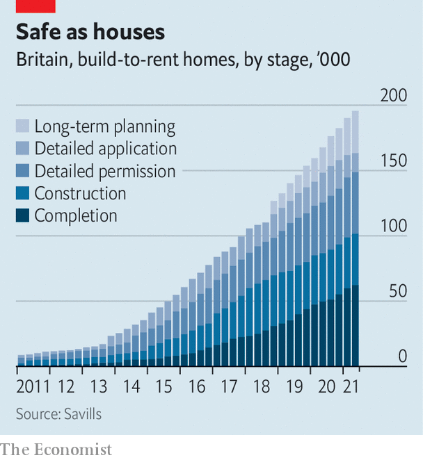

###### Housing

# Big British companies are entering the rental market 

##### The build-to-rent sector is booming 

 

> Aug 28th 2021 

CHATTER ABOUT house prices and the property market has long been a dinner-party staple. Now it is spreading to the boardroom. An internal job advert at Lloyds Banking Group has revealed that the lender plans to enter the build-to-rent sector, with an ambitious target of owning 50,000 properties by 2030. John Lewis, which sells everything a dinner-party host might want for the home, announced earlier this summer that it plans to build 10,000 rental properties. Large insurance companies, such as Aviva and Legal &amp; General, have entered the market in recent years, as have several private-equity firms.

Britain’s private rented sector is big and growing. Almost one in five English households rented privately in 2020, up from around one in ten in 2001. It is also strikingly amateur, dominated by individual landlords who own at most a handful of properties. The largest private landlord, Grainger, a listed firm, owns around 9,000 units, giving a market share below 0.2%.


But during the past decade the rental sector has started to professionalise. And the build-to-rent stock, though still a small share of the total, rose from around 1,000 in 2011 to over 62,000 in mid-2021, with 133,000 more under construction or in the planning process (see chart). Analysts reckon that, by the end of the decade, one in five newly built homes could be institutionally owned and rented out.

 


One reason for the boom, says Andrew Burrell of Capital Economics, a consultancy, is that retail and office properties are comparatively unappealing. Many investors wish to keep some capital in British real estate, but fear that shopping centres and high streets are in long-term decline, and that office rentals will be hit by the post-pandemic rise in working from home. Residential demand shifts mainly with demography and is less buffeted by the business cycle. People will still need somewhere to sleep, says Lawrence Bowles of Savills, a property firm: “You can’t digitalise a bed.” And in an era of low interest rates, steady rental income becomes more attractive.

A decade ago most British build-to-rent projects were at the premium end of the market. They came with bells and whistles such as gyms, concierge services and even dog-washing stations. But that has begun to change. The fastest growth is now to be found in single-family homes, rather than flats, typically on the outskirts of big cities such as Birmingham, London and Manchester. Families with children are often unwilling to move, since changing schools would disrupt their children’s education. That makes them ideal tenants for big, professional landlords, who tend to have longer time horizons than individuals whose entire wealth is tied up in just a handful of properties. The coming decade is likely to see further diversification, say those familiar with the sector, for example into schemes that offer shared ownership or are purpose-built for retired people.

Institutional interest in their wares is a boon for big housebuilders. Lloyds will be working with Britain’s largest, Barratt Developments. And it is well-timed, since another source of demand may soon weaken. Since 2013 the government has subsidised mortgages through “Help to Buy”, which provides equity loans that allow borrowers to buy with smaller deposits. But the scheme’s rules were tightened in April, and it is due to be phased out by 2023. That will make shifting stock much harder, says the boss of one big building firm, so a build-to-rent deal makes a lot of sense. “We can accelerate building because we’ve already got an institutional buyer.” ■

