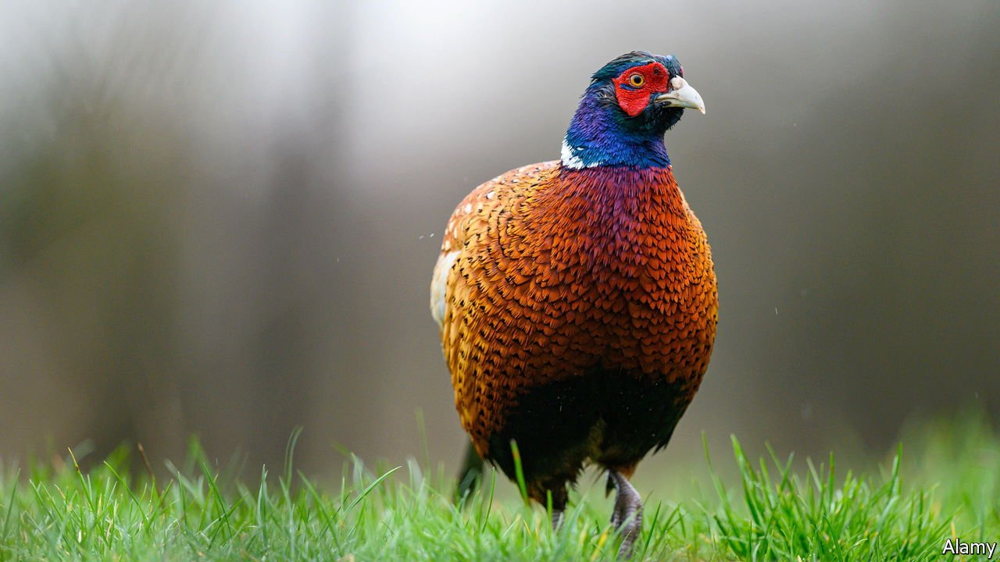

###### Pheasants revolt

# Britain has an enormous number of pheasants 

##### Whether this is a good thing is a matter of taste 

 

> Aug 28th 2021 

FOR SOME readers, “Lady Chatterley’s Lover” was a disappointment. “[T]his fictional account of the day-by-day life of an English gamekeeper is still of considerable interest to outdoor-minded readers, as it contains many passages on pheasant raising,” wrote a reviewer in Field &amp; Stream, a hunting periodical, in 1959. Unfortunately, “one is obliged to wade through many pages of extraneous material” to get to the passages “on the management of a Midlands shooting estate”.

Pheasants rarely command attention—and yet there are oodles of them. The most recent estimate puts their number in early August (before shooting season begins) at 31.5m, and their share of the nation’s wild-bird biomass (together with the less numerous partridge) at around half. The number released into the wild each year after rearing has risen by around 900% since the 1960s. Yet, as in Lady Chatterley, they seem peripheral to the narrative.


One reason is that official figures held on them are so poor. The government knows how many pigs there are in England (4m), cattle and calves (5.2m) and llamas (1,000). There is a Sheep and Goat Inventory (in England, unlike the End Times, the species are bracketed together). And it tallies deaths caused by various animals, including dogs (two in 2019), rats (one) and crocodiles (zero).

But there are no good data on pheasants. Anyone who holds 50 or more captive birds should fill in a form for the poultry register, but many do not. Estimates differ wildly: another commonly cited one puts the total far higher: at 47m.

Opinions differ on whether this abundance is a good thing. Animal-lovers say that shooting pheasants is cruel. Saboteurs sometimes try to stop shoots. Environmentalists say pheasants’ droppings damage the soil, and that they boost the number of predators such as foxes. But they also bring benefits, says Joah Madden of Exeter University, who produced the most recent estimate of their number. They have shaped the countryside for the better: 28% of British woodland is managed for game, and if you spy an isolated copse or strip of trees on a hill, there is a fair chance it is there to provide cover and good sport.

Gamekeepers also like to point out that, despite its image as the preserve of toffs, pheasant-shooting attracts a diverse clientele. “I’ve been on a day’s shooting and there’s been a duke there, and there’s been somebody who worked at Argos,” says Glynn Evans, the head of game and gun-dogs at the British Association for Shooting and Conservation. It’s a far cry from 1928 and the publication of Lady Chatterley, when the sport, like the novel, was hardly the sort of thing a gentleman would care to see his wife or servant indulge in. ■

