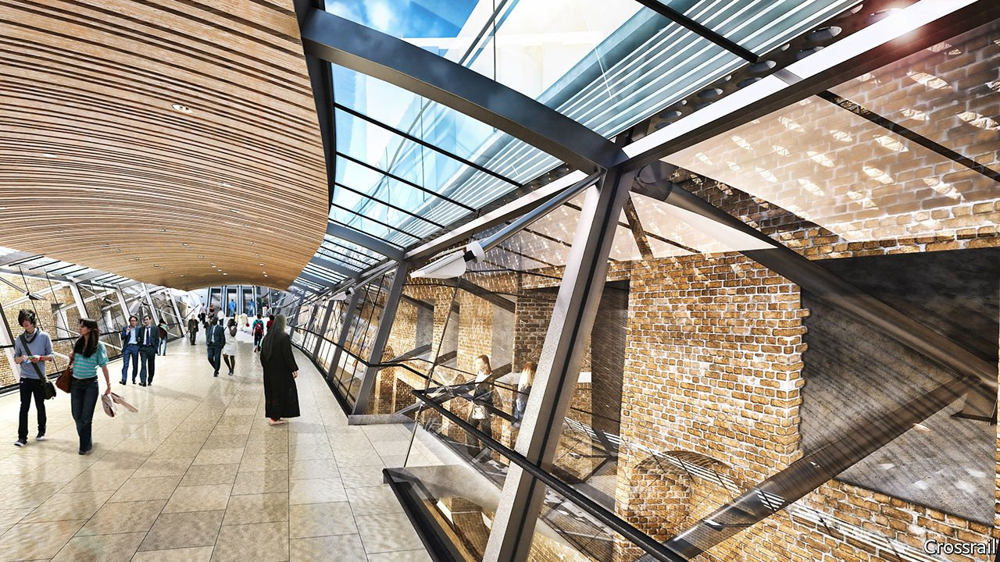

###### Light at the end of the tunnel

# Crossrail, London’s new train line, is almost finished 

##### But will the commuters come? 

 

> Aug 28th 2021 

THE NEW Elizabeth Line section at Whitechapel station is austerely beautiful. Descend the escalator and sharp angles meld into sinuous curves; move towards the platform and the light shifts from cool to warm, the better to entice commuters speedily towards their trains. A sleek new one hisses to a halt—and its doors fail to line up with those separating the platform from the rails. Construction started in 2009 and should have finished in 2018, but completion is now expected only in 2023. With each delay the price tag has risen, from an estimated £14.8bn ($23bn at the time) to £18.9bn.

Rising costs and overruns are hardly unheard of in ambitious infrastructure projects: costs for HS2, a high-speed rail link, have ballooned far more and it is now at risk of being scaled back. The challenges for Crossrail were different, but it too was highly ambitious. Measuring 118km end to end, it runs beneath London from Reading, a commuter town to the west, to Shenfield, an eastern suburb. At its heart are two 21km-long tunnels, at depths of up to 40m. Each train can accommodate 1,500 passengers, not far off double capacity on older lines, and the platforms are long enough to allow carriages to be added in future. Once it is fully operational, central London’s rail capacity will increase by 10%.


The main source of difficulties was not tunnelling, as many had predicted before work started. That finished in 2015. The toughest challenge, says Mark Wild, the project’s boss, has been integrating a tangle of signalling systems. A modern interoperable one covers the whole line. Another, dating back to the 1950s with 1990s additions, covers above-ground sections that share older tracks with existing services. Finally, radio-signalling covers the underground sections. All need to work in harmony with other systems, from fire control to ventilation. In total, these involve more than 16m components, some physical and others virtual, which have generated 250,000 quality-assurance documents and are supplied by dozens of contractors.

Construction in the capital poses further difficulties. “London is both a mega-city and very old,” says Mr Wild. “You have to deal with archaeology and skyscrapers.” The renovation and expansion of Whitechapel station had to be squeezed in round sections of the Tube that date from 1876. British safety regulations are also unusually stringent by international standards.

Crossrail’s former management failed to appreciate how complex all this would be. A government spending watchdog found in 2019 that it had “no realistic plan” to deliver the programme, had designed the commercial contracts poorly, and was unaware of how delays were mounting up. Recruitment also proved tough. A follow-up report last month concluded that the new team was doing better, but new risks are still being spotted.

As the end date comes into view, however, so does an awkward question: will the commuters come? Before the pandemic most of London’s rail network was over capacity at peak times. Yet the boom in working from home puts predictions about commuting into doubt. Transport for London’s central planning scenario is for rail travel to be 18% lower by 2031 than previously forecast. The line’s managers brush off such worries. On the timescale of the Tube, says Mr Wild, the pandemic is a blip. Crossrail was designed to last 120 years, but he thinks it could survive for 300. ■

