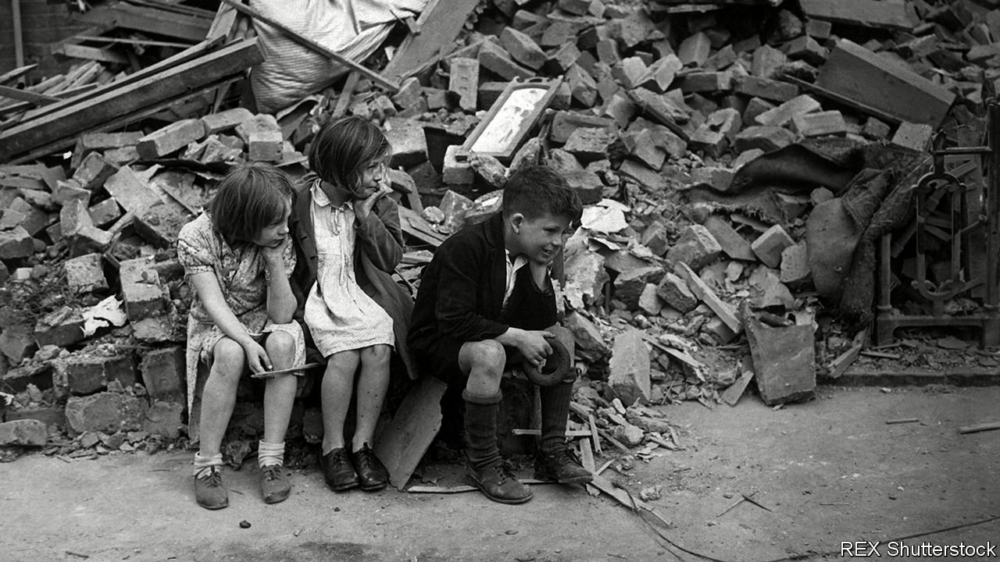

###### Not even past

# How German bombs shape London’s gangs 

##### The past of the city can be seen in its present 

 

> Aug 28th 2021 

JUST AS LINES on a summer wheat field reveal ancient walls below, so the architecture of an old city can be glimpsed in the new. The west ends of British cities tend to be swankier than the east, in part because prevailing British winds blew Victorian pollution eastward. Factory owners, preferring not to sit in their own smog, moved upwind.

London lends itself to such analyses because it has long had good maps of bad things. After the Great Fire of 1666, engravers produced an “AN EXACT SVRVEIGH” of the “RVINES OF THE CITY”. Two centuries later Charles Booth sent surveyors out into its streets to note broken windows, barefoot children and “rough Irish”, then colour-coded them (black for “vicious, semi-criminal”, yellow for wealthy). Academics have found considerable agreement between his “Maps Descriptive of London Poverty” and modern patterns of deprivation.


A new study by academics at the London School of Economics exploits another record of misery: the London Bomb Census. After raids, officials would note where bombs fell and the number killed. Overlaying the maps they made on modern gang territories reveals suggestive similarities. The probability of finding a gang is 7% higher in areas that were bombed than those that were not. And with gangs come knives: gang presence in an area increases the likelihood of a knife crime by 22%.

The causal chain has several links. Bombs create dereliction, and hence space for tower blocks. By concentrating people living on benefits, these distil disadvantage, says Tom Kirchmaier, one of the study’s authors. Just one tower block on a council estate correlates with a 15% average annual rise in knife crime.

The moment before a parachute bomb landed in London could be quiet, almost serene. Destruction, Graham Greene wrote, came “drifting quietly down on green silk cords”. Then windows would shatter and walls cave in. The ground itself would “dent”. The blast could be felt half a mile away, Greene noted. The echoes reverberate still.

