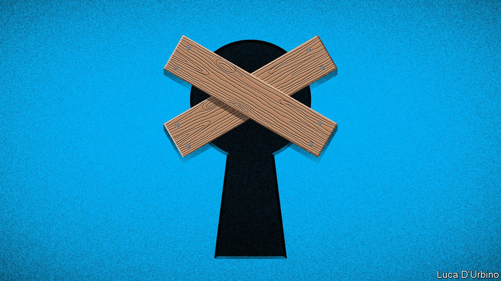

###### No sex please, we’re skittish

# OnlyFans U-turns on its porn ban 

##### The subscription platform wobbles under pressure from banks 

 

> Aug 25th 2021 

MARIE WORKED as a nanny for 14 years, until last October, when health problems made her switch to work she could do from home: selling amateur pornography. Today she makes $12,000 a month on OnlyFans, an online subscription platform where she updates a feed of “BBW” (Big, Beautiful Woman) photos and videos, and sells extras including knickers-by-mail.

Perhaps not for much longer. On August 19th OnlyFans said that, from October, it would ban the explicit content that dominates the site. Contributors, some of whom had been reassured that it would “always” allow X-rated material, were outraged. Amid an exodus, on August 25th it suspended the ban. Performers like Marie, who thinks nannying is no longer an option after her spell in porn, are shaken. “OnlyFans was a godsend,” she says. “Now it’s kind of a nightmare.”


The site, founded in 2016 by 33-year-old Tim Stokely, tends not to feature in official promotions of Britain’s startup scene. Yet with projected revenues of $1.2bn this year, it is one of the country’s most successful internet firms. After three slow years, during which a majority stake was sold to Leo Radvinsky, an American porn mogul, it boomed in 2020 as youngsters sought to make a living under lockdown. It now claims 130m users and 2m contributors, who earn more than $300m a month after OnlyFans takes its 20% cut.

The botched pivot, likened by some to a strip club focusing on chicken wings, was attributed to “the requests of our banking partners and payout providers”. Mr Stokely told the Financial Times that banks including BNY Mellon, Metro Bank and JPMorgan Chase had made life difficult (the banks declined to comment). The U-turn was credited to “banking partners’ assurances”.

Payment handlers have been tightening their rules on porn. From October Mastercard will require banks to certify that sites complete checks including reviewing content before publication. OnlyFans says it does this; in July it deleted 655 accounts, 15 for publishing child-sex images. But a BBC investigation found the site gave second chances to accounts that broke its rules.

This has spooked investors. The “creator economy” is all the rage among venture capitalists, who have piled into firms like Cameo, which sells celebrity videos. Yet despite its growth and fame (Beyoncé has namechecked it in a song), investors have passed on OnlyFans. Some see reputational risk. Others probably hesitated “while the threat of being shut down by payment processors hung over its head”, says Josh Constine of SignalFire, a venture fund.

Following its flip-flop, OnlyFans risks losing contributors, too. “What they’re trying to say is, ‘We’ve gone soft-core from hard-core,’ but their messaging has been so poor that they have gone to no-core,” says Myles Jackman, a lawyer who represents sex workers. Contributors have been circulating spreadsheets comparing other platforms’ payout rates. The Adult Performance Artists Guild (APAG), a union, has offered advice on how to switch to other sites, such as Fansly and PocketStars.

There is “a continuous migration of sex workers around the digital domain”, says Mr Jackman. Mira, a 23-year-old who has sold selfies since her teens, says her main worry about the OnlyFans fiasco is that “it may become a trend with any future site”. Payment firms like PayPal and Square have ditched porn. Cryptocurrencies may offer an alternative. Pornhub, which was dropped last year by Mastercard and Visa after being found to have hosted videos of minors, accepts Bitcoin and the like.

Without sex, OnlyFans’ purpose would be unclear. A few celebrities use it for non-X-rated purposes, including Floyd Mayweather, a boxer, but none has been a hit. Bella Thorne, an actress, made a fortune last year selling a “nude” photo for $200, but had to issue refunds after buyers complained that she was still in her smalls. OFTV, a new venture that is clean enough for app stores, is full of bland “influencers”. Meanwhile, according to court documents OnlyFans’ parent company is being pursued by British tax authorities for more than £10m ($13.6m) in unpaid VAT (the firm disputes it), and APAG is considering legal action. A quietly successful startup suddenly looks all too short of fans.■

