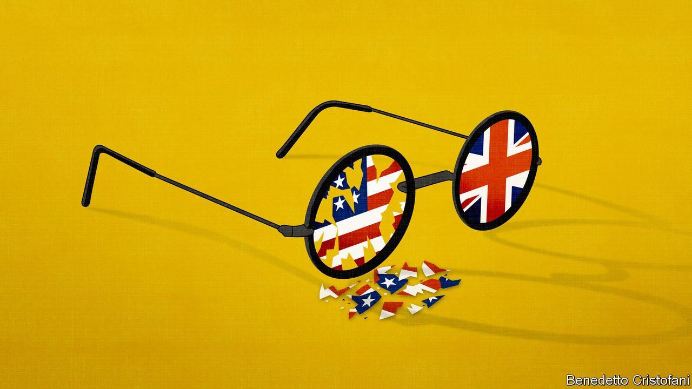

###### The special relationship

# The Afghanistan debacle has weakened ties between Britain and America 

##### It strengthens the case for Boris Johnson’s government to work more closely with the European Union 

 

> Aug 28th 2021 

EVER SINCE Winston Churchill, British prime ministers have boasted of their special relationship with American presidents. Yet this supposedly sunny partnership has experienced its fair share of clouds. The past few weeks have seen a big one, after Joe Biden unilaterally announced that all American troops would leave Afghanistan by August 31st, opening the way to a lightning conquest of most of the country by the Taliban. The chaos that followed at Kabul airport as thousands of frightened Afghans tried desperately to escape has shocked the world—and led even the British to ask if the transatlantic relationship is still working.

This is certainly another unsettled moment. But it is worth remembering that the relationship has survived storms before, from the Suez crisis in 1956, through Harold Wilson’s refusal to enter the Vietnam war, to Richard Nixon’s decision to abandon the gold standard in 1971. Even when relations were warm, there were rows. Margaret Thatcher was infuriated by Ronald Reagan’s unilateral invasion in 1983 of Grenada, a member of the British Commonwealth. Tony Blair was angered by George Bush’s refusal to sign up to climate-change targets. More recently the relationship between Donald Trump and Theresa May was icy, especially when he criticised her Brexit plans. America’s habit of failing to consult even close allies before big decisions dates back decades, not weeks.


Although some Tories privately wanted a Trump re-election last year, Mrs May’s successor, Boris Johnson, must have hoped for better things with Mr Biden. He received the new president’s first phone call to a foreign leader, and in June welcomed him on his first overseas trip. Yet there were signs that the two are not soulmates. When a BBC man asked Mr Biden for comment on the campaign trail, his instant response was “I’m Irish!” He plainly disapproves of Brexit. He has little interest in a trade deal with the British (or anyone else). And his priorities as president are overwhelmingly domestic, not international.

All this helps explain some of the vitriol hurled at Mr Biden over the past couple of weeks for his hasty and shambolic withdrawal from Afghanistan. Unnamed government sources were quoted calling him gaga, or worse, and comparing him unfavourably with Mr Trump. On August 24th, when Mr Johnson as G7 president called an emergency meeting of the group’s leaders, Mr Biden flatly rejected his allies’ request for an extension of the August 31st deadline to pull out all troops. The race is now on to  as possible, even while accepting that thousands with strong claims to protection from America and its allies will be left to face the Taliban’s vengeance.

Behind the headlines, diplomats on both sides insist that relations are still close. Mr Biden is said to have spoken to Mr Johnson more than to any other world leader. Sir Simon Fraser, a former head of the Foreign Office now at Flint Global, says structural co-operation in intelligence, security and military matters remains as deep as ever. Britain spends more on defence than any of America’s other European allies and has dispatched its new aircraft-carrier, Queen Elizabeth, to the South China Sea, where America now spies its most important strategic interests. And Mr Biden should be far more helpful than his predecessor at the climate-change summit in Glasgow in November.

Yet changes in America over the past 20 years have inevitably downgraded the transatlantic link. It is over a decade since Barack Obama ostentatiously “pivoted” from Europe to Asia. Mr Biden may have proclaimed that “America is back” after the Trump years, but he shares his predecessor’s preoccupation with Asia and the rise of China. America’s appetite for military engagement abroad has been reduced by experience not just in Afghanistan, but in Iraq. Its interest in places of most concern to its European allies, such as the Balkans or north Africa, has hugely diminished.

The real concern for Britain is that more clouds may lie ahead. The biggest may be Northern Ireland, which provoked tension in June. The Biden administration supports the Northern Ireland protocol struck between Britain and the European Union, which avoids a hard border in Ireland that might threaten the peace process by, in effect, keeping the province in the single market. Averse to the border controls between Great Britain and Northern Ireland that this necessitates, Mr Johnson’s government is demanding a wholesale rewrite and threatening to suspend the protocol if the EU refuses. Ian Bond of the Centre for European Reform, a think-tank, notes that support for the peace process is unusually bipartisan in America. If Mr Johnson is seen as threatening it, the reaction in Washington will be fierce.

The American administration has accepted the reality of Brexit, but still wants Britain to repair its battered relationship with its nearest neighbours. As Sophia Gaston of the British Foreign Policy Group, another think-tank, puts it, geography matters in foreign and security policy just as much as in trade. And that strengthens the case for the Johnson government to do more to engage with the EU.

The EU has offered just such a close relationship in foreign and security policy, only to be spurned. A recent British government review of foreign and security policy talked up relations with France and Germany, but largely left out the EU. Yet it is not really possible to forge closer bilateral relations only with individual EU members, because they are building a common policy in Brussels. A more adept British government would seek closer links with both America and the EU; as Karin von Hippel, director of the RUSI think-tank, suggests, it is always possible to dance with several different partners.

Peter Ricketts, another former head of the Foreign Office, notes in his recent book, “Hard Choices”, that Britain has fallen a long way from the early 1940s, when one of his predecessors drafted the Atlantic Charter that became the basis for the American-sponsored post-war international order. He is now a keen advocate of closer co-operation with the EU, not least because the Afghanistan debacle underscores the case for it. Sadly, the government’s ideological opposition probably means it will not happen. ■

