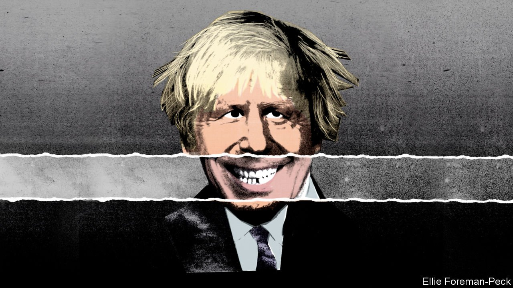

###### Bagehot

# What Tony taught Boris 

##### Seen from the suburbs, Blairism and Johnsonism look uncannily alike 

 

> Aug 28th 2021 

IN SEPTEMBER 1995 Boris Johnson, a rising star of the Daily Telegraph’s comment pages, spent an evening with the Dulwich Labour Party. His trip to the south London suburb was an act of anthropology, undertaken to study a new tribe: the educated middle classes who had fallen hard for Tony Blair. Mr Johnson’s hosts plied him with Bulgarian red wine and taco crisps, and raged at the dying Conservative government. He was an observant visitor, recalls John McTernan, his chaperone and a future aide to Mr Blair.

Mr Johnson was a keen student of New Labour, whose era coincided with his own ascent to prominence. He was repelled by its “bare-faced quasi-messianic effrontery”, “spin-driven vanilla-flavoured candyfloss nothingness”, and assaults on fox-hunters and smokers. But he was mesmerised, too, for Mr Blair was a winner. Mr Johnson watched how “Supertone” ransacked the Tory wardrobe, played the press “like a master organist” and imposed a new doctrine on his party. (“In the game of political repression, the Burmese police have little to teach New Labour.”) As the years went on, scandals and sleaze seemed not to touch his popularity. In 2002, now editing the Spectator, a Tory-leaning weekly, Mr Johnson named Mr Blair parliamentarian of the year, hailing his “unchallenged dominance of the political landscape”.


These days the two premiers seem to occupy opposite ends of that landscape. Mr Blair marched into Afghanistan shoulder to shoulder with an American president; Mr Johnson, at odds with the White House, is forced to retreat. Mr Blair wanted Britain at the heart of Europe; Mr Johnson delivered Brexit. In university seminars Mr Blair is described as a centrist and Mr Johnson as a right-wing populist. One belongs to Clintonworld and the other is claimed by Trumpland. Mr Johnson’s ministers denounce the Supreme Court and Scottish and Welsh parliaments created by Mr Blair as constitutional vandalism, and stuff quangos once dominated by Blairites with their own fellow-travellers. Fourteen years into his retirement, Mr Blair still outshines Mr Johnson in intellectual discipline, darting ahead of a disorganised government with plans to fix covid-19 testing and vaccinations. They are ancien régime and brutish new order, separated by the Brexit revolution.

Yet the prism of Brexit refracts political hues into artificial separation. Seen through it, the past is distorted, too. Mr Johnson has learned much from Mr Blair. On the campaign trail and in the suburbs, the two men look more alike. That resemblance contains a warning for the prime minister.

Mr Johnson’s premiership, like Mr Blair’s, rests on a supersized personal mandate. His appeal runs deep into places where his party’s does not. (“They know that Tony won their seats,” Mr Johnson once said of Labour’s pliant MPs.) Both are instinctively comfortable in suburban England, never wagging the finger about how people should run their own lives. And they provoke a similar fury in their enemies, who give them the same epithet: liar.

Both focus ruthlessly on what they call “the people’s priorities”, namely jobs, health, crime and education. This is the terrain where elections are won and lost. Today’s Tory leaflets are reminiscent of New Labour’s early work, with endlessly repeated promises of more nurses, teachers and police officers. (Both men, notes Patrick Diamond, a former Blair aide, swept to office after a long period of tight public spending.) The skirmishes over flags and statues that dominate newspapers feature remarkably little. Mr Johnson’s campaign slogan in 2019 to “Get Brexit Done” was a promise to make the wrangling go away, not to prolong it.

Their methods are increasingly similar, too. Mr Johnson lampooned public-sector targets as Soviet and dehumanising. Now he has adopted them and asked Sir Michael Barber, who ran Mr Blair’s “delivery unit”, to construct another for him. Mr Blair declared Whitehall inert and unresponsive long before the same thought occurred to Dominic Cummings, the erratic aide who helped bring Mr Johnson to Downing Street.

Mr Johnson has episodes of Blairite centrism, making promises on climate change and obesity of the sort he once described as nanny-statism. Mr Blair, for his part, sometimes had a Johnsonesque populist streak, dubbing his project the “political arm of the British people”. He searched constantly for eye-catching initiatives that would convince voters that he was “on their side”. Yobs and nuisance neighbours were favourite targets. Mr Johnson once called this stuff authoritarian, ineffective and depressingly popular—but in office, he has embraced it. Priti Patel, the home secretary, is scarcely more draconian than her New Labour predecessors, who mooted tagging asylum-seekers as if they were criminals, or processing them overseas.

His final lesson

Mr Johnson revelled in Mr Blair’s downfall in 2007, squeezed out by his chancellor, Gordon Brown (“a blubfest of nauseating proportions”). Mr Blair left office frustrated. The retail offers that brought him to power—shorter waits for health care, smaller school classes—now seemed to him ridiculously modest. He settled too late on the structural reforms the public sector required, by which point his government was distrusted and tired, weighed by scandal and the war in Iraq.

The question, says Mr Diamond, is whether Mr Johnson is capable of becoming a reformer too. Despite a hiring spree, it will be hard to improve public services before the next election, since covid-19 has created long backlogs for practically everything. Sweeping reforms are in short supply. Tory MPs may neuter his overhauls of social care and planning law. Ideas to “level up” Britain’s poor regions are sparse. Mr Cummings, who had a Blairite appetite for fighting vested interests, has gone. And all the while the government acquires an air of fatigue and muck at remarkable speed. Mr Blair’s most important lesson is that it is not enough to win power: you must use it before it wanes. ■

