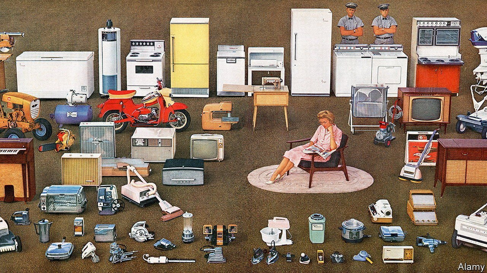

###### Jeff & Andy’s

# Amazon’s department-store plans are less surprising than they appear 

##### The e-commerce giant gets physical 

 

> Aug 28th 2021 

“THE WORLD wants you to be typical …Don’t let it happen,” Jeff Bezos warned in April in his last annual shareholder letter as CEO of Amazon. Hence bewilderment that his e-empire is to adopt a retail format that is very typical indeed: the department store. Having helped drive many chains out of business, it is now eyeing the format to boost its own retail fortunes.

As a company, Amazon is entering a more mature phase. Now with a new chief executive, Andy Jassy, it is being forced to recognise that pure e-commerce has limits. It is also facing fresh competition from conventional retailers like Walmart and Target that are belatedly showing that they, too, can do the internet well.


Amazon’s high-street presence is small. Since 2015 it has opened 24 bookshops in America. Its 30 “4-star” shops, which stock items customers rate highly, function like a walk-in website. Whole Foods, an upmarket grocer it bought in 2017, contributes the bulk of its physical-store revenues, which accounted for just 4% of Amazon’s total sales in the most recent quarter. Its new Amazon Fresh grocery chain and Amazon Go cashierless stores barely chip in.

So the new 30,000-square-foot (2,800-square-metre) retail spaces it is reportedly envisaging mark a departure. Amazon has neither confirmed nor denied its plans. But leaked details on the stores’ size and locations suggest substance behind the reports. The first are to open in California and Ohio. If they go well, Amazon is expected to roll out more.

Why invest in the high street just as covid-19 has lifted e-commerce? The growth rate of sales on Amazon’s platforms, including third parties, had slowed before the crisis, from nearly 30% a year to below 20%. The trend reasserts itself as people return to shops. In the past quarter Amazon’s own online sales grew by only 16%, short of investors’ (muted) expectations.

In future customers will want “omnichannel” retail that combines online and physical shopping, says Mark Shmulik of Bernstein, a broker. As for Amazon’s move into department stores, he has one question: “What took them so long?” The firm’s motive is also defensive. Walmart has made omnichannel work well during the pandemic by melding its formidable physical network with its website and offering a same-day “click-and-collect” service.

Getting more physical may not be easy. Amazon’s bricks-and-mortar performance has been ho-hum. Whereas most other big American grocers’ sales have doubled or even tripled in the pandemic, those of Whole Foods have barely budged, notes Sucharita Kodali of Forrester, a research firm. Amazon’s total physical-store revenues last year were 6% lower than in 2018.

Making Amazonmarts appeal to shoppers may be harder than Amazon anticipates. It reportedly wants them to sell its cheap private-label garments and gadgets, which is at odds with its aspirations for the stores to offer high-end fashion, where it has struggled online. It is unclear if the outlets will mimic existing examples of the department-store canon, as Amazon Fresh shops resemble conventional grocers, or if Amazon plans to shake things up.

Another question is how the move will affect returns for shareholders. Amazon should be able to rent or buy locations cheaply—bankruptcies have left many department-store properties up for grabs. Yet investors may be disappointed that Amazon will devote ever more resources to retail. Many prefer its faster-growing, vastly more profitable and techier businesses: digital ads and cloud computing. “Why tackle a dying industry?” asks Ms Kodali, suggesting that Amazon could have another crack at making smartphones.

Amazon’s share price is down by 8% since its latest results. As well as posting slower online sales for the second quarter it forecast slowing total sales in the next. It also warned that costs will rise sharply in the future as it ramps up investing. Physical retail would claim some of the dosh. The irony would not be lost on Sears and other defunct department stores. ■


