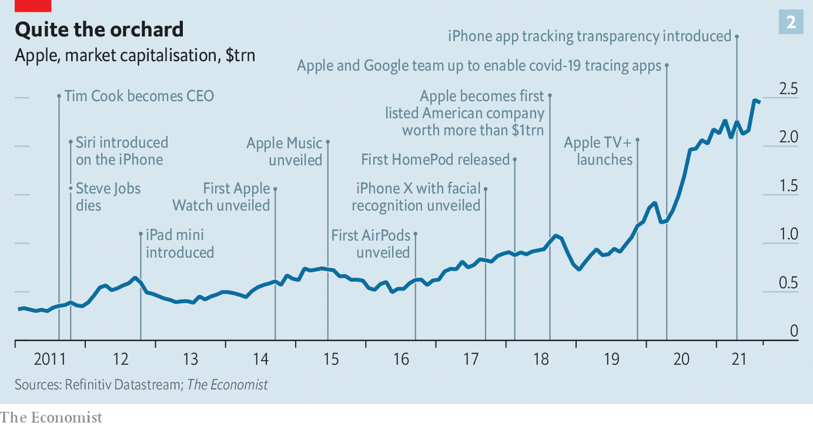
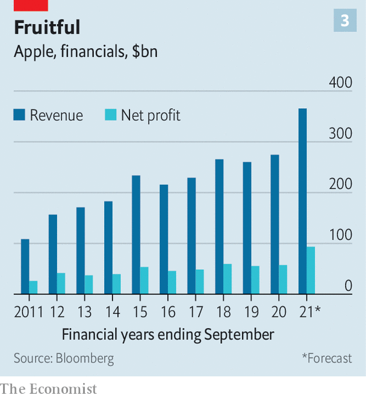
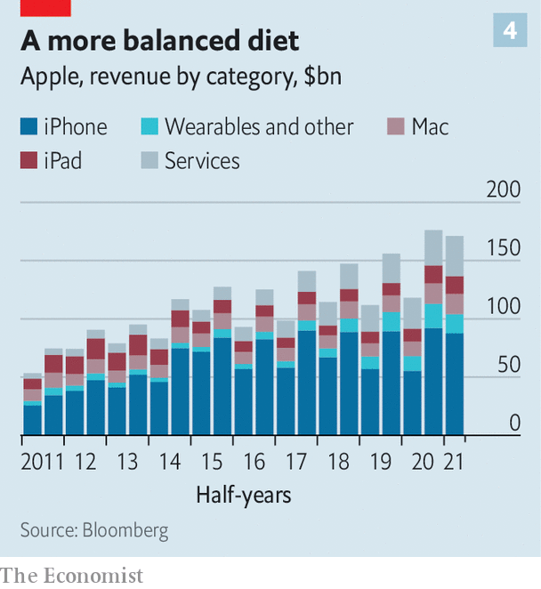

###### The great successor’s second act

# Apple has had a successful decade. The next one looks tougher 

##### As Tim Cook celebrates his tenth anniversary at the helm, the world’s most valuable company faces fresh challenges 

 

> Aug 23rd 2021 

THE APPLE will surely fall, even if ever so slowly. When Tim Cook took the helm from Steve Jobs, the firm’s co-founder, a decade ago, even the most boosterish of Apple fanboys worried that the company was destined to decline. Without Apple’s original Willie Wonka, the digital chocolate factory was about to be run by an automaton who made his career organising global supply chains and scrutinising spreadsheets. How could someone with so little dazzle inspire Apple employees to continue creating “insanely great” products, in Jobs’s famous formulation?

It turned out Mr Cook could. As he celebrated his tenth anniversary as Apple’s boss on August 24th, no one made a peep. And for good reason. He has staged what is arguably the greatest succession success in tech, an industry littered with managers who failed in the effort to follow in the founders’ footsteps. In fact, in pure financial terms, he has been a far more successful chief executive than the late Jobs, who succumbed to pancreatic cancer six weeks after stepping down.


No chief executive in history has created as much overall shareholder value as Mr Cook (see chart 1). When he took over from Jobs the company had a market value of $349bn. Today it is worth $2.5trn (see chart 2), more than any other listed firm ever. Under his aegis annual sales surged from $108bn in 2011 to $274bn last year. Net profit more than doubled, to $57bn, overtaking Saudi Aramco’s oil-fuelled earnings and turning Apple into the world’s most profitable company. Less widely noticed, during his tenure the “Apple economy”—its own annual revenue plus everything other companies make on one of its platforms—has grown sevenfold, to more than $1trn.

 


Given such achievements, Mr Cook could have retired amid gushing tributes around now (and with a spot in the billionaire club). Instead, he is likely to stick around at least until 2025, when his current stock grant will fully vest. This in turn raises the question of how long he can keep Apple on its stratospheric trajectory. The short answer is that it will be much harder than in his first decade. Many of the global tailwinds that have lifted Apple to such dizzying heights are now reversing.

 


For a longer answer it helps to understand what Mr Cook got so right. Besides being an exceptional manager, he proved adept at harnessing the forces that have powered the tech industry—and with it global economy—in the 2010s.

The first of these was the mobile-led digitisation of life. To satisfy the world’s voracious appetite for mobile computing, he kept pushing for constant improvement of the iPhone. Whereas the iPhone 4s, announced shortly after he became chief executive, was still essentially a souped-up mobile phone, the iPhone 13, expected to be launched in September, will be a hand-sized supercomputer with a processor nearly 50 times faster. Even Apple’s Watch and AirPods, the main new products since he took over, can be seen as extensions of the mighty iPhone. More than a billion of Apple’s smartphones are now in use globally, one for every seven Earthlings.

Another force which Mr Cook has deftly harnessed is globalisation, in particular the rise of China. Even before he took over from Jobs, he was instrumental in outsourcing assembly of Apple’s devices to the country. Its biggest contract manufacturer, Foxconn, now employs about 1m people there. Most of them assemble iGadgets. On top of that, untold numbers work for suppliers of other components. And besides using China as a factory, Mr Cook was early to see its potential as a market—now Apple’s biggest after America and Europe, generating 19% of revenue and, possibly, a bigger share of profits.


Mr Cook’s third coup was understanding the importance of network effects—the economic mechanism in digital markets which makes big businesses even bigger. That is something that eluded even Jobs, who was ambivalent about the iPhone’s App Store. By contrast, Mr Cook doubled down on the digital “flywheel”: the App Store attracted more app makers, which attracted more users, which attracted even more developers and so on—until it became the world’s foremost digital marketplace by revenues. Today it hosts nearly 2m apps, which facilitated $643bn in billings and sales in 2020 for app developers, according to a study sponsored by Apple.

Mr Cook was also the first big-tech boss to signal, loudly and often, that companies of Apple’s size and reach must take some responsibility for their impact on the wider world. Under Jobs, a gadget’s looks were more important than how they were made. Today Lisa Jackson, a former head of America’s Environmental Protection Agency and now a vice-president directly reporting to Mr Cook, is involved in product development from the start. Apple has set itself the laudable goal of becoming carbon-neutral across all its products by 2030. And Mr Cook has called privacy “a fundamental human right” and, among other things, forced app makers to ask users whether they want to be tracked by advertisers.

 


Admittedly, being pro-privacy aligns with Apple’s business model, which unlike those of Facebook and Google does not make money by collecting data to sell targeted ads, and climate-cuddling plays well with the sensibilities of Apple’s mostly well-off users at little cost, given Apple’s relatively shallow carbon footprint. This has helped keep regulators off Apple’s back—and made it into the world’s most valuable brand, according to one estimate.

Cooking lessons

In other words, after ten years of Cookery Apple is a bigger and better version of itself, says Horace Dediu, a long-time Apple watcher. That, though, is not to say it is invulnerable. Three challenges stand out: growth, geopolitics and competition.

On the surface, growth looks healthy enough. To the surprise of those analysts who have for years predicted the iPhone’s decline, the device keeps raking in money. Global unit sales are down from a peak of 231m in 2015, but only a bit: Apple still sold 200m of them last year. But the market for smartphones will eventually mature. And even if this takes time, Apple will increasingly run up against a problem familiar to all large firms: the bigger they get, the harder it becomes to grow rapidly.

Mr Cook has been able to tap into other sources of revenue, notes Neil Cybart, who runs Above Avalon, a website that analyses all things Apple. The firm’s services business, including the App Store and Apple Music, has surged from $8bn in sales in 2011 to $65bn in the past four quarters (see chart 4). Though wearables like the Apple Watch and accessories such as the AirPods are a smaller business than the iPhone, they generate lots of revenue: nearly $9bn in three months to June. Last year AirPods ended up in more than 200m ears and Apple Watches on 34m wrists, respectively outselling all other high-end ear buds and all Swiss timepieces combined.

 


At some point, however, Apple will need another keystone innovation like the iPhone. Hence talk of “iGlasses”, which would add a digital layer to the physical reality perceived by the wearer, and even an “iCar”. Although the firm does not confirm this, it is an open secret that it has been working on both for years. Leaks suggest that augmented-reality glasses may finally be coming in the next year or two and Apple reportedly has plans to release a vehicle that is both electric and self-driving in 2024. But it is also widely known that things have not been going well and timelines have slipped in the past.

The car, which unlike the glasses is not a natural extension of Apple’s current consumer-tech line-up, would be difficult to pull off. Even without a petrol engine and a gearbox, a vehicle is much harder to manufacture than a smartphone. Apple’s automotive thinking appears to have gone back and forth between building its own self-driving cars from scratch or providing the necessary electronics and software to other carmakers.

Mr Cook’s second big challenge is geopolitics. Apple has so far escaped the mounting tensions between the West and China, where most of the firm’s products are assembled and many of them are sold. Mr Cook has made all sorts of concessions to the authorities in Beijing, from moving its Chinese users’ information to data centres in the country, where they can be accessed by local law enforcement, to taking down some apps in the Chinese version of its App Store. “We follow the law wherever we do business” is Mr Cook’s motto.

Now, though, the pugnacity with which the Chinese government has gone after its own technology giants must be making some in Apple’s futuristic headquarters in Cupertino, Silicon Valley, nervous. Though it has been beefing up manufacturing in other countries, particularly in India and Vietnam, Apple does not have an alternative to China for the bulk of its assembly. It is hard to see where else it might find one. Only China has a ready army of workers needed to quickly ramp up production of the latest iPhone.

Judging by Apple’s latest supplier list, the firm has even increased its reliance on Chinese companies. Of the top 200 suppliers, 51 were based in China, up from 42 in 2018. At the height of the trade war then-president Donald Trump waged with China in 2019, Goldman Sachs, an investment bank, estimated that in the worst-case scenario Chinese retaliation could reduce Apple’s profits by nearly 30%.

Apple’s jams

The fallout could be worse if Apple’s products and services were banned in China. As the Communist Party turns increasingly authoritarian and the West increasingly suspicious of China, Apple may become a target of Beijing’s wrath or the sort of nationalist-tinged boycotts that have hurt Western brands from the NBA to Zara.

And if Apple’s importance to China’s economy continues to offer a protective shield, this may anger governments and consumers in the West. According to human-rights groups, some of Apple’s suppliers are linked to forced-labour camps for Uyghurs, an oppressed Muslim minority, in Xinjiang. Mark Zuckerberg, Facebook’s boss, has called out Apple for hypocrisy for touting privacy protection at home while allowing the government in Beijing to access personal data in China. “At some point something will happen that becomes a loyalty test,” thinks Willy Shih of Harvard Business School.

Apple says that it has found no evidence of any forced labour in its supply chain. And Mr Zuckerberg himself could also be accused of being hypocritical, since Facebook is making billions from Chinese advertisers on its social networks. But even if those controversies end up being resolved in Apple’s favour, they are feeding into pushback against its behaviour at home: witness the recent brouhaha over its plans to scan private pictures on iPhones for child pornography.

Mr Zuckerberg’s China-related broadside also hints at Mr Cook’s third challenge: competition. Network effects are not the only thing benefiting firms like Apple. Another is the lack of real rivals. Some view Alphabet (Google’s parent company), Amazon, Apple, Facebook and Microsoft as a cartel whose members have tacitly agreed not to encroach on each other’s core businesses. Apple has never made an effort to be a social-media powerhouse and Facebook has not attempted to create an alternative app store. Instead of building its own search engine, Apple cut a deal with Google, making it the default search engine on the iPhone (and charging an estimated $8bn-12bn annually for the privilege, equivalent to 14-21% of Apple’s net profit in 2020).

Such cosiness is fraying. To sustain trillion-dollar valuations all the tech giants are searching for new sources of growth—and finding them on one another’s turf. Giving iPhone users more control over their data may be rooted in a genuine wish to protect their privacy, but it also keeps data out of Facebook’s hands, which could help Apple build its own advertising business. Apple is also rumoured to be working on its own search engine.

The rivalry is heating up in its principal hardware business, too. In America the iPhone remains dominant. Globally, however, iPhones account for one in seven smartphones sold, according to Canalys, a data provider. Earlier this year Xiaomi, a Chinese firm, overtook Apple as the world’s second-biggest smartphone-maker by volume.

Apple’s forays into newer markets face stiff competition. Its HomePod smart speakers came late and did not make much headway against Amazon’s and Google’s products. Apple’s mixed-reality glasses, should they indeed see the light of day, will have to duke it out against Facebook’s Oculus, Microsoft’s HoloLens and other fancy headgear. And an iCar would be taking on Teslas and a car park’s worth of offerings from established carmakers.

Regulators may also try to make digital markets more competitive. Apple is expected to win its trial against Epic Games, the maker of “Fortnite”, a popular online video game, which accuses Apple of illegally protecting its App Store. A ruling should come later this year. Even if Apple prevails in American courts, however, trustbusters elsewhere may not let it off the hook as easily.

In July Margrethe Vestager, the European Commission’s deputy head and the EU’s trustbuster-in-chief, warned Apple that the bloc’s proposed Digital Markets Act will not allow it to hold up privacy and security as reasons to limit competition in the App Store, as Apple has argued in the Epic lawsuit. Loosening of the App Store’s rules and lower commissions (currently up to 30% on most app purchases) could make a serious dent in the company’s lucrative services business.

An executive of Mr Cook’s stature and experience may well be able to overcome these headwinds. Whether that will be Mr Cook himself is less clear. He is 60 and has said he will “probably” not stay on for another ten years. This raises the question of who might have the vision and the skills to succeed him.

One former executive has a radical proposal: Apple should stop being a pedlar of luxury goods. The firm’s “obscene” gross margins of more than 40% in the past quarter make it lazy, he argues. To maintain them, the firm squeezes developers and suppliers. Instead, it should use its power and cutting-edge technology to develop devices and services for the 3bn people on Earth who have yet to enjoy the benefits of the digital era.

Too many Cooks?

This could help solve Apple’s growth conundrum. But it is unlikely to fly with its margin-loving shareholders. The possible successor to Mr Cook mentioned most frequently, Jeff Williams, is a less radical departure from the status quo. Mr Williams is considered by many insiders to be “Tim Cook’s Tim Cook”: a doppelganger not just in looks (tall, lean and grizzled) but also in thinking and experience. He has been doing Mr Cook’s old job overseeing Apple’s supply chain and operations since 2010. Those skills have served the company remarkably well in the past decade. To keep thriving Apple’s next chief executive may need a different set of abilities. ■

For more expert analysis of the biggest stories in economics, business and markets, , our weekly newsletter.

