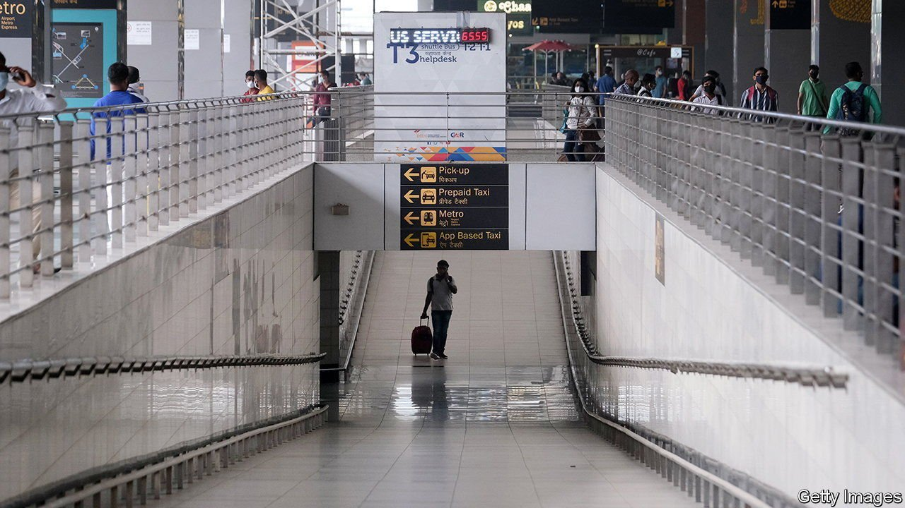

###### Gone today, here tomorrow

# India’s government wants to monetise state-owned assets 

##### Or does it? 

 

> Aug 28th 2021 

IN FEBRUARY THE administration of Narendra Modi trumpeted a sweeping plan to privatise India’s corporate jewels. Past governments have made such promises with little to show for it. Yet this time investors’ ears perked up. Covid-19 had drained public coffers by crushing the private economy while piling costly burdens on the public sector. In India’s business circles hope flickered of an economic reset that might complete the fitful liberalising project that began 30 years ago in response to another economic crisis.

After months of silence, on August 23rd the finance minister, Nirmala Sitharaman, finally spoke up. The goal, she said, was to raise $81bn, or 3% of GDP, over four years. But rather than doing so through outright sales, the transactions will be more complex—and less transformative as a result. The Indian state will liquidate small minority stakes in a few airports. Other big assets are expected to be leased to investors for up to 25 years. “Monetisation of core infrastructure assets”, Ms Sitharaman intoned, “does not mean selling the assets.”


The assets not being sold include 42,300km of power lines, 26,700km of highways, 8,200km of natural-gas pipelines, 400 railway stations, 150 trains, 160 coal-mining projects, 25 airports and stakes in nine ports. In this half-hearted divestment strategy Mr Modi seems to emulate India’s biggest private conglomerate, Reliance Industries, which has sold minority stakes in various bits of its empire such as mobile telecoms and refining while retaining ultimate control over them.

This approach has its advantages. Investors get a stable, bond-like return in entities that are already up and running (which removes the headache of dealing with India’s baffling permitting process). The public gets a chance of better services, as new operators improve efficiency and increase investment. In the past moving assets into private management helped spruce up airports in Delhi and Mumbai.

Missing from Ms Sitharaman’s announcement was an update on the fate of big companies. Three divestments are said to be in the works, involving the Shipping Corporation of India, Pawan Hans (a helicopter service) and Neelachal Ispat Nigam, a steelmaker. But progress appears glacial.

Most disappointing of all was the government’s reluctance to follow up on its promise to sell the biggest prizes, such as Life Insurance Corporation of India (LIC), Air India (the flag-carrier, also wholly owned by the state), Bharat Petroleum (an oil-and-gas giant that is listed but state-run), and even some state banks. The sale of such assets, which were nationalised after India’s independence in 1947, would carry symbolic, not just financial, weight.

Observers blame the lost momentum on three causes. First, the government still has uses for some of the firms; LIC has served as a source of bail-out cash for struggling businesses. Second, the firms’ employees are a powerful constituency that resists change. Third, like bureaucrats everywhere, Indian ones worry that a completed sale would prompt endless inquiries into whether the price was too low. For everyone involved, safer to do nothing. ■

For more expert analysis of the biggest stories in economics, business and markets, , our weekly newsletter.

