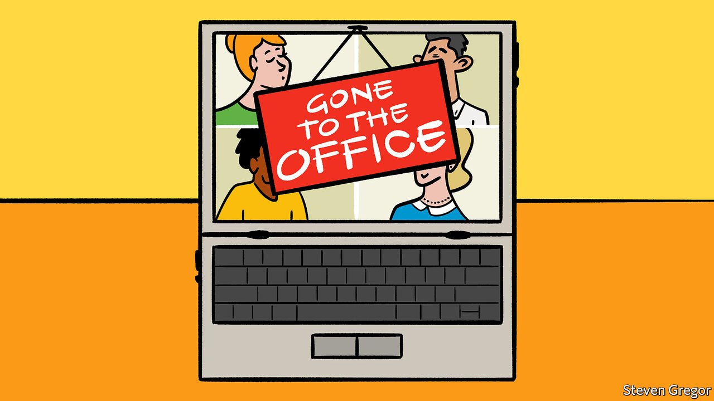

###### Bartleby

# Why women need the office 

##### Female workers should think twice before opting for more remote work 

 

> Aug 28th 2021 

IT IS A truth universally acknowledged that women carry a heavier burden than men when it comes to child care and household chores. It became truer still during the pandemic home-working experiment, and is likely to hold in the likely hybrid future of part-remote work. It is tempting for some women never to set foot in the office again, if their firms allow it, so they can devote time otherwise wasted on commuting or office chit-chat to more pressing family matters. According to research by Nicholas Bloom of Stanford University and colleagues, 32% of college-educated American women with children want to work remotely full-time, compared with 23% of comparable men.

Such decisions are completely understandable—not least because besides more responsibilities at home, women’s lot at work can be no picnic, either. Female managers often end up playing the conventional male and female roles, leading the pack while also nurturing those left behind. It can be tiresome to be many things at the same time.


Understandable, but still regrettable. Some reasons for that are mundane. Your columnist, a guest female Bartleby, finds that the office offers a welcome break from the never-ending duties of housekeeping and parenting. Other reasons are mercenary. One pre-pandemic study on work-life balance suggested that women were likelier than men to experience “flexibility stigma”.

In the wake of covid-19 flexible work arrangements are less stigmatised (for now). A recent British government report warned that their uptake may be unequal between the genders. If more women work from home, and take on an even greater share of family responsibilities, the result may be an ever-bigger gender pay gap and an ever-harder glass ceiling.

There is another, more elusive reason why women who do not return to the office are missing out. Not every workplace is as informal as The Economist’s (with its deadpan humour and discussions of muscle tone and QE, alcohol consumption and the equity risk premium). Yet even in duller corporate settings, walking down a corridor, washing hands in the bathroom or making yet another cup of coffee in the kitchen, you are only seconds away from a chat or a joke. That can—admittedly unreliably and in ways that are difficult to measure—spur spontaneity and lead to new ideas.

Compared with that, virtual collaboration is like evaporated milk with 60% of its water removed: safer, mostly up to the job but a sterile version of face-to-face interaction that leaves an unsatisfying aftertaste. Physical proximity brings higher risks (once of death or injury by an enemy, today of a face-to-face snub, more painful than a mean tweet, or of a covid-19 infection). It also brings higher rewards, including emotional ones that are no less important than the pragmatic sort.

Though times have changed, many female workers, including Bartleby, find themselves sympathising with Irina, one of the titular “Three Sisters” in Anton Chekhov’s play from 1900. Holed up with her two siblings in the countryside she longs for Moscow—not only its vibrancy and worldliness but the opportunity it affords for work. Her frantic desire to work reflects an attempt to escape the tedium of domesticity, and invest life with meaning by imposing a framework and a sense of accountability. Many modern executives, male and female, would recognise Chekhov’s belief that being guarded from work is a curse, not a blessing. The same goes for being shielded from the office, notwithstanding its myriad complications.

There are downsides to being a clinically efficient flexiworker. They include relinquishing the daily banter and sense of complicity among colleagues, many of whom double as friends. Women determined not to waste a single minute when they could be multitasking will give up more than just professional advancement, important though that is. They are also giving up a sense of connection to others. Hyper-efficiency and distance mean less opportunity for interpersonal tension but also less gratuitous joy, which is hard to replicate on Zoom.

Those brief moments of joy are an important part of working life. It is nowhere and everywhere, like seeing the Virgin Mary in burnt toast. It is to be treasured precisely because it does not last. Bartleby recommends squandering precious minutes, here and there, on camaraderie and pointless glee. The cost, in the tedious aspects of office life, is tolerable. The returns, emotional as well as practical, can be immense.


