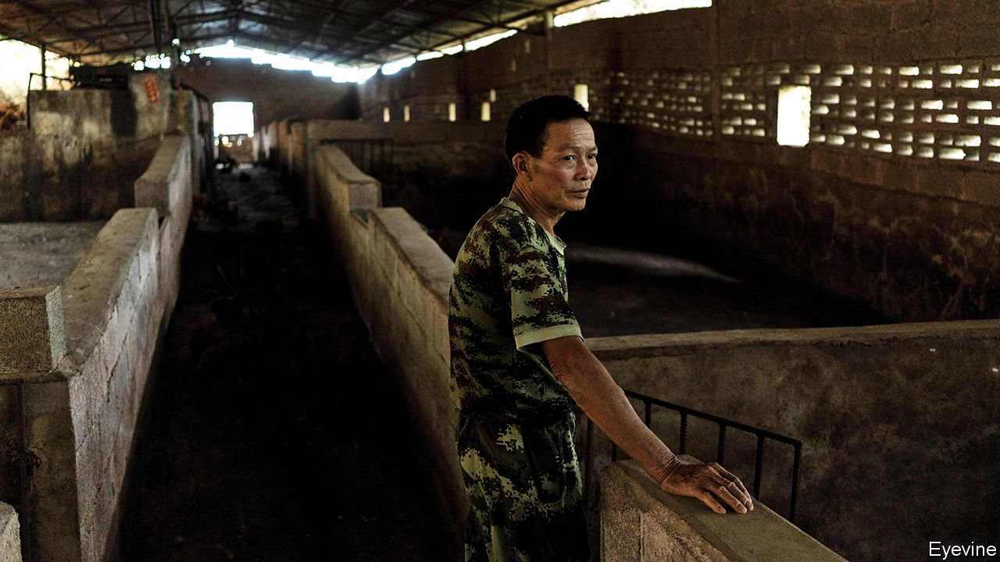

###### A pig of a problem

# African swine fever is spreading rapidly in China, again 

##### The country has kept covid-19 in check, but its pigs are dying in droves 

 

> Aug 28th 2021 

LESS THAN two years ago Chinese officials warned that the spread of a deadly and highly transmissible virus was threatening the country’s economic stability and its people’s prosperity. Curbing the outbreak was a “major political task” said Hu Chunhua, a deputy prime minister and member of the Communist Party’s ruling Politburo. He said his instructions on how to tame the disease were to be treated as a “military-style order”.

Mr Hu was speaking in August 2019, months before covid-19 was identified. He was referring to another virus—the one that causes African swine fever. This haemorrhagic disease is harmless to humans but deadly to the pigs that provide one of China’s most important sources of food and a livelihood for tens of millions of the country’s farmers. In contrast with its remarkably effective battle against covid-19, China has failed to conquer swine fever. “It seems like China can’t do for pigs what it did for people,” says an executive at a Chinese pig firm.


With one of the world’s highest rates of pork consumption, China is normally home to about half of global pig stocks. But its porcine population has been severely affected by a swine fever panzootic (the animal equivalent of a pandemic) that began in 2018 and has threatened herds in many countries. It has wrought havoc in the supply of China’s staple meat, creating wild swings in the prices of pork and feed grains. Officials say that in 2019 it resulted in the loss of between one-fifth and one-third of the country’s pigs from disease or culling. That year swine fever cost the industry between $50bn and $120bn, according to the Asian Development Bank. In 2020 stocks recovered swiftly. But by late last year infections began to rise again.

Pigs in a poke

In late 2019 and early 2020, as the pandemic of covid-19 began developing in the city of Wuhan, the government kept the public largely in the dark. Since then it has become more open about new coronavirus infections. It has been far less forthcoming about swine-fever cases. In July officials said there had been 11 outbreaks of the disease since the beginning of 2021, twice the number reported in the whole of the previous year. The new hotspots are widely separated, with some in the far north-east and others in the south-west. Officials hint at the scale of the problem. Efforts to control it, they say, are “complicated”. But pig-industry insiders say the government is painting too rosy a picture. “It’s out of control,” says one. Only a small share of infections are being reported, say executives at several Chinese swine firms.

One reason for China’s secretiveness is that admitting the scale of the problem would raise questions about whether it should do what other countries have done to end it. During this panzootic and earlier outbreaks, some have culled large portions of their pig stock and closely monitored the destruction of carcasses. Were this to happen in China it could cause years-long disruption in pork supplies on a scale too large to be alleviated by imports or government stockpiles. Shortages and high prices of pork could infuriate the public.

During the covid-19 pandemic, China has mobilised millions of party members to enforce lockdowns and help ensure the supply of essentials to affected people. It has devoted far less energy to controlling swine fever, which would also require considerable vigilance and manpower. About 40% of China’s pork is produced by small family farms. Many have neither the money nor the know-how to raise pigs hygienically. They often feed hogs with household swill that contains infected meat and can easily spread the disease unless it is superheated first, which it rarely is. When cases of swine fever are reported near their farms, owners often sell their animals before they show symptoms. This helps the virus to spread and causes surges of supply which can depress prices. Live hogs are more than 60% cheaper than at the beginning of this year. The glut has forced many sellers out of business.

The government is even being secretive about market data. Recently it has ordered news outlets only to use official figures relating to the prices, supply and consumption of pork. These are often unreliable. Two Chinese consultancies, Cofeed and JC Intelligence, which had supplied more widely trusted numbers, have been closed in recent months with little explanation. Some of their employees have reportedly been detained. It is a vicious circle. A lack of good information is making it hard for farmers to make sound decisions about breeding and selling. That causes fluctuations in supply, which in turn makes the market even murkier.

As with the coronavirus pandemic, vaccination offers hope. Several countries are trying to develop one. America is co-operating with Vietnam, conducting field tests of a vaccine among infected herds there. China has said little about its own efforts. Linda Dixon, a swine fever specialist at the Pirbright Institute, a British research centre, says a vaccine, if proven safe, effective and easy to distribute, “could be a game changer”. But the most optimistic prediction is that approval of one could be at least a year away. Meanwhile, China will continue to be plagued by fake vaccines. These are commonly used by small farmers who are more susceptible to persuasion by the snake-oil merchants who promise protection for herds without the need for costly biosafety precautions.

The collapse of many small businesses may worry officials, who forever fret about social stability. But some producers are suffering less, having alternative sources of revenue such as from other kinds of livestock and crops. The government may even see some benefit in a shake-up of the industry. It is keen to promote the development of larger pig farms. These are usually better managed and more able to invest in effective virus-control measures.

China crows about its crushing of covid-19. It has achieved success by deciding early on to put extraordinary effort into stamping out infections. But because people cannot die of African swine fever, they are less likely to complain about its consequences. So the government’s instinct is to use the kind of tactic with the pig disease that it initially tried with the coronavirus: covering up. The party has shown remarkable strength in its handling of covid-19. In the face of another viral outbreak, its inadequacies are abundantly evident, too. ■

