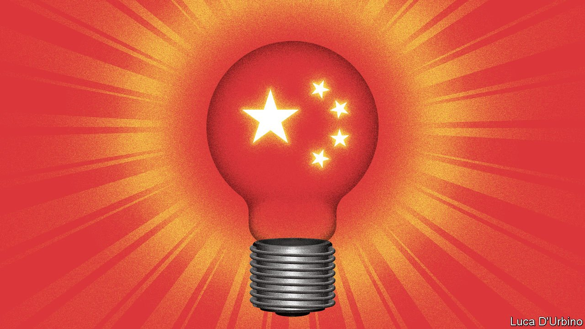

###### One more thought

# Research centres promoting Xi Jinping’s ideas are proliferating 

##### When will his philosophy get a snappier official name? 

 

> Aug 28th 2021 

CHINA’S PRESIDENT, Xi Jinping, is hardly ever grilled in public about what he thinks. The few interviews he has given have been highly staged. But his propagandists have been building a network of institutes devoted to studying his thoughts. In June one was established to research “Xi Jinping thought on the rule of law”. The following month, two others were founded to analyse, respectively, his pronouncements on economics and green development. It is the biggest mobilisation of academic effort to parse the speeches of a serving leader since the era of Mao Zedong.

China now has 18 Xi-thought research centres. Many of them focus on a particular topic such as politics, culture, science, education, religion, diplomacy or national security. Mr Xi’s ideas about these matters make up what is officially known as “Xi Jinping Thought on Socialism with Chinese Characteristics for the New Era”. The Communist Party adopted this as one of its guiding philosophies at a five-yearly congress in 2017. The first study centres were opened soon afterwards.


They enjoy high political status. Some of their directors are senior party officials. The new one devoted to the economy is embedded within the National Development and Reform Commission, the government’s planning agency. It will be “an important think-tank”, according to state media. For much of the post-Mao period, the prime minister has overseen economic policy. Not so under Mr Xi. He has, in effect, sidelined the current prime minister, Li Keqiang, who has a PhD in economics.

The new rule-of-law centre is run by the China Law Society, an official club of legal experts. One of Mr Xi’s main messages on this subject is that the party leads the judiciary and that notions such as the separation of powers or judicial independence are Western-inspired heresies. In a speech in December China’s domestic-security chief, Guo Shengkun, used the phrase “Xi Jinping thought on the rule of law” 27 times. The Education Ministry’s centre is studying the promotion of Mr Xi’s thoughts in schools.

The recent flurry of Xi-centre openings may reflect an attempt to boost his already enormous profile ahead of the next party congress, which is due to be held late next year. It will be a crucial one. In 2018, not long after the latest congress, the country’s rubber-stamp parliament scrapped the state presidency’s ten-year term limit. The move fuelled speculation that Mr Xi planned to remain as China’s leader for at least another five years beyond 2022 (he also serves as party chief, a far more important role for which there has never been a term limit, but the two jobs have usually been held concurrently). In the coming months, officials are likely to build a case for Mr Xi’s continued rule. The centres will play their part.

Keep it short

Analysts will watch for signs that the cumbersome 16-character phrase used to describe Mr Xi’s thinking is being modified to put him on a par with Mao (who ruled until he died). Mr Xi has already surpassed his other predecessors. The thinking of two of them, Hu Jintao and Jiang Zemin, is also enshrined in the party charter but without their names attached. Deng Xiaoping is mentioned by name, but his thoughts are merely described as a “theory”. The only Chinese leader with a snappily named philosophy is Mao: his is known simply as Mao Zedong Thought. Were Mr Xi’s to be abbreviated in the same way, it would be yet another indication that his grip on power is unlikely to wane next year. Few people believe it will decline.

Mr Xi’s ideas are so wide-ranging and often so vague that they defy ready definition (although the idea that the party must control everything, including academia, permeates his speeches). But those with questions may turn to the party’s main newspaper, the People’s Daily. It is halfway through a serialisation of a book published in February titled “Xi Jinping Thought on Socialism with Chinese Characters for the New Era: Questions and Answers for Learners”. Each day it prominently publishes a couple of new ones. Despite its connections, the newspaper appears not to have persuaded the man himself to explain. ■

