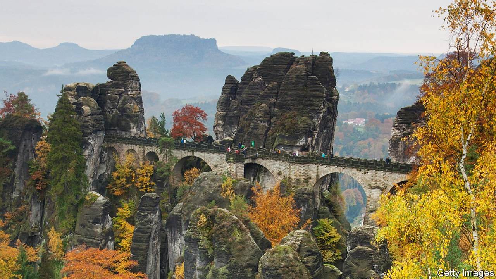

###### Saxon Switzerland

# A visit to a stronghold of the AfD, Germany’s far-right party 

##### Its candidate is a cop suspended for protesting against covid lockdowns 

 

> Aug 28th 2021 

CLOSE TO THE Czech border, south-east of Dresden, around the Elbe valley, lies one of Germany’s prettiest though clunkiest-titled electoral districts, a constituency called Saxon Switzerland Eastern Ore Mountains (SOE). Its majestic sandstone peaks, verdant trails, beautiful medieval cities and villages have been memorialised by German romantics such as Caspar David, a 19th-century painter. Hundreds of thousands of tourists flock to the district every year. Unemployment and crime are low. The population is almost entirely ethnic German.

On the face of it, life is dandy in Saxon Switzerland, but at the last federal election in 2017 the populist-right AfD scored its best result there, with 35.5% of the Zweitstimmen, the second votes, which determine the overall proportion of seats that each party holds in the Bundestag. Frauke Petry, a former party leader, won 37.4% of first votes used to elect MPs directly and thus became one of 94 AfD novices in the Bundestag, though eight of them, including Ms Petry, have since left the AfD.


“Saxon Switzerland is the fief of the AfD,” says Steffen Janich, who beat six rivals to become the party’s candidate for SOE at next month’s election. Mr Janich was suspended last year from the local police force because he led a “corona walk” in Pirna of around 180 opponents of the government’s measures to contain the covid-19 pandemic in April 2020 during the first lockdown ban on such gatherings. He was also suspended, he says, because of what he calls an “Instagram friendship” with Lutz Bachmann, the founder of Pegida (Patriotic Europeans against the Islamisation of the Occident), an openly racist movement.

Mr Janich’s denial of the gravity of the pandemic (he refers to the Delta variant as a “summer flu”) probably helped him to become the AfD candidate in its strongest constituency. The fractious party excels at exploiting voters’ latest bellyache. He is helped by the weakness of the established parties in his district, says Sebastian Reissig of Aktion Zivilcourage, an NGO in Pirna. The NPD, a neo-Nazi party, used to play a significant role in county councils and even the Saxony state parliament, but has withered away, to the benefit of the AfD.

The AfD has become more nativist since the previous federal election—and its support has weakened in many states. Yet according to a poll last week by Infratest dimap, a pollster, it will still come first in Saxony, with 23% of the second votes.

Mr Janich’s chances of being elected to the next Bundestag are fair, although he is far less well known than the telegenic Ms Petry was last time. He says his party is popular in SOE because Saxons are conservative—and are anxious about their Heimat, which means “home” but also conveys a sense of tradition and place. This angst has been played on by the AfD. But it may be that voters will realise that the party has no remedies for their worries, just as they did with the NPD. These days, it has no seats in any council or parliament. ■

