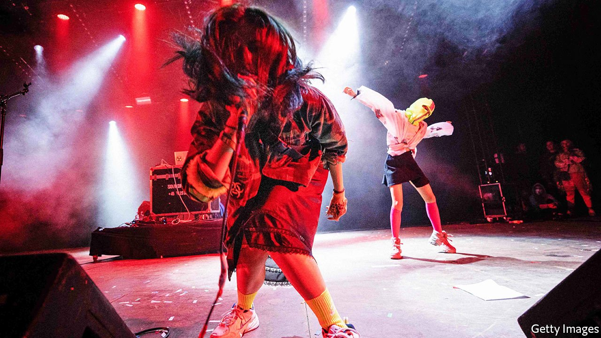

###### Bigots anonymous

# Bullies proclaiming “national patriarchy” harass Russian feminists 

##### Some fear the police are abetting them 

 

> Aug 28th 2021 

ANNA KUZMINYKH, a 27-year-old film director, is also a member of Pussy Riot, a punk-rock-and-performance-art group that has been protesting against Vladimir Putin’s authoritarian government for the better part of a decade. In July, along with four other members of the group, she was arrested (twice) for “disobeying police orders”.

After 30 days in jail, Ms Kuzminykh was released this month. Then the real trouble began. As she recounts, “My phone started ringing off the hook, 50 numbers at once were calling me.” The messages were littered with threats like “Slut, we will kill you and your whole family.”


Ms Kuzminykh’s ordeal is not by any means unusual. Russian women with non-traditional views are increasingly being harassed by reactionary groups, whose targets include feminists, gay activists, women who work in the porn industry and those who dare to have romantic partners who are not ethnic Russians.

One group that has been organising such bullying campaigns is Male State, which describes its ideology as “national patriarchy”. It was founded by Vladislav Pozdnyakov, a bodybuilder, in 2016. In 2018 he was convicted on a charge of inciting hatred of women; his group had harassed many of them individually. A year later Mr Pozdnyakov fled to Poland.

Exile, however, has not stopped him from revving up his angry male fans. Male State says it opposes Russia’s current leaders for being too pro-women. It has around 83,000 followers on its Telegram channel. Its members search for people—usually women—who express feminist or gay-friendly views on social media, or are part of the porn business, and then use online tools to track them down.

When they succeed, they get nasty. Many victims are sent photos of their homes or their relatives. The threat is not hard to discern. Ms Kuzminykh says the tipping point for her was when someone sent her a photo of her little sister over WhatsApp, a social-media service.

Many activists suspect that Male State has ties to the Russian authorities, especially the police. Members of Socfemalternativa, a leftist group, were harassed by Male State and became the subject of a report prepared by the Interior Ministry on feminists who attend protest rallies. The report included photos, addresses, social-media accounts and other private information. Much of this had appeared earlier in Telegram channels run by Male State. “It’s not just that they know my address or my apartment number—they even know the floor I am living on,” says Ms Kuzminykh.

Some victims have changed cities; at least a dozen have fled Russia. Among those who stay, many fear to go outside; some have become suicidal. Ms Kuzminykh is planning to leave Russia. She wonders if a western European country, or America, might recognise her as a political refugee. She doubts that Russian cops will protect her. On the contrary, she fears they may be helping her tormentors. ■

