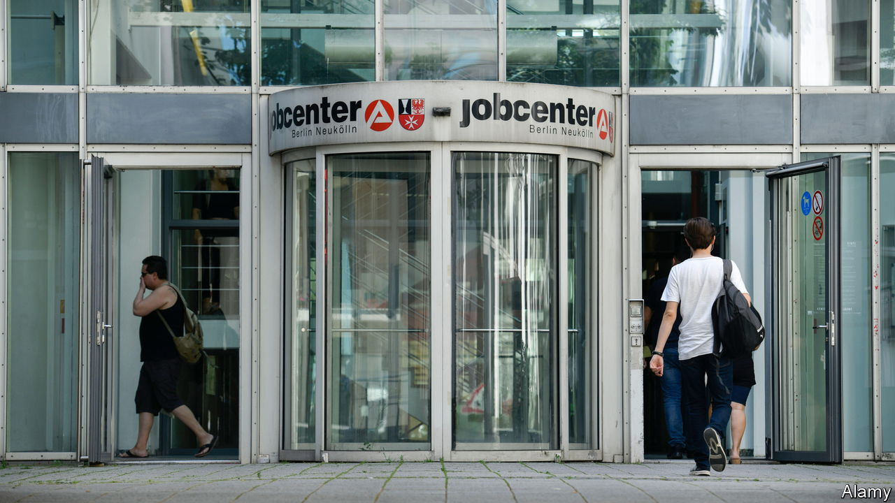
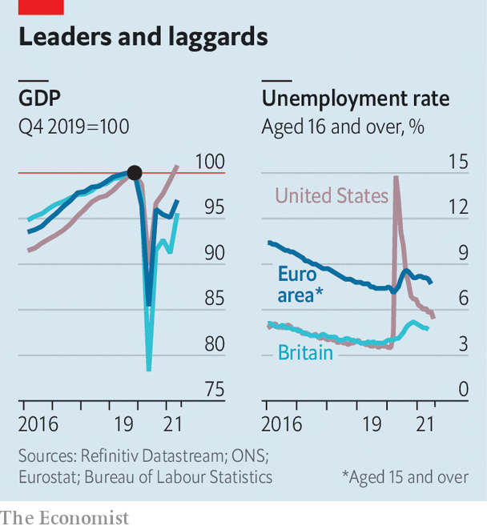

###### Not yet out of the woods

# Employment is growing strongly in the euro zone 

##### But the recovery still has some way to go 

 

> Aug 28th 2021 

ADDRESSING THE Brussels Economic Forum in June, Ursula von der Leyen, the president of the European Commission, gave an upbeat assessment of the EU’s recovery. She promised that “in 18 months from now, all 27 member states will be back on track, recovered from the crisis.” But she noted that “it is not by chance. This is the result of the policy decisions we took since the very early days of the pandemic.” A sequence of recent strong output and employment figures indeed seem to vindicate this bold claim. On August 23rd the preliminary estimate of the euro-area purchasing managers index, a monthly survey of companies compiled by IHS Markit, suggested that employment in July and August will turn out to have grown at its fastest monthly rate for 21 years. That followed solid official data on output and employment the previous week.

Mrs von der Leyen credited European governments for preventing a big rise in unemployment during the crisis. The euro area experienced a much lower peak in unemployment than America (see chart), mainly because governments were quick to expand their national job-retention schemes. In Germany, for example, the terms of the Kurzarbeit scheme, under which workers work shorter hours for less pay to avoid layoffs, were loosened. Agency workers were included for the first time, and the government put in more cash, offering to reimburse workers for at least 60% of forgone wages and 100% of social-insurance contributions. In Italy restrictions on the size and type of firms eligible for government support were relaxed, and the processes for claiming support were simplified. An attempt to ban layoffs, however, was unsuccessful.


Yet unemployment data present a misleadingly rosy picture of the euro-area labour market, for two reasons. The first is that the labour-force participation rate fell sharply as the crisis hit, and has not yet recovered. In contrast with America, where more than half the fall in participation reflects people retiring during the pandemic, the fall in Europe was more evenly spread and includes many younger workers, who will almost certainly want to resume looking for jobs in the future. Altogether, around 2.5m fewer people are in work than at the end of 2019, and the vast majority of them are not classed as unemployed, since they are not actively looking for work. In the most recent data, about half of the jobs shortfall was in Spain and Italy, which historically have had serious problems with job creation.

 


Millions of people who are still using job-retention schemes are also treated as employed for the purposes of official statistics. The European Central Bank recently estimated that around 5% of the labour force were still enrolled in them in May, or roughly another 10m people. Some may be tempted to increase their hours over the next few months as the schemes grow less generous, or even expire, as is due to happen at the end of December in the four biggest EU economies. But others, particularly seasonal workers, may find there are no jobs available. There will no doubt be calls for the schemes to be extended, at least for the industries that have been worst affected by lockdowns, such as retail, recreation and hospitality.

Policymakers face a delicate balancing act. Extending job-retention schemes puts more strain on government finances: public debt across the euro zone has recently risen above 100% of GDP for the first time, up from 86% at the start of the pandemic. But if schemes are wound up before demand for workers has recovered sufficiently, there is a risk of widespread long-term unemployment. Although euro-area activity has been growing strongly over the summer, in the second quarter GDP was still 3% below its level at the end of 2019. At that point it had already recovered in America (see chart).

European governments did well last year to mitigate the effect of lockdowns on their labour markets, and will take comfort from this week’s figures. The outlook for the jobs market looks much better than after the global financial crisis, when it took nine years for employment to return to 2008 levels. But millions of European workers still lack the job opportunities they had 18 months ago. It is too soon to declare that the euro area is back on track. ■

