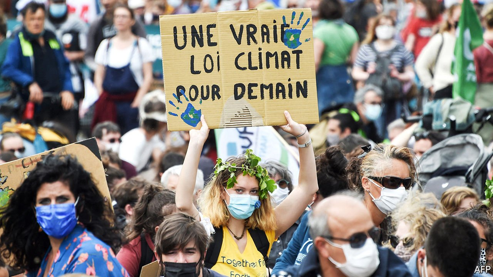

###### Green list

# France’s Greens prepare to pick a standard-bearer 

##### The party’s militant base wants to fight climate change without nuclear power 

 

> Aug 28th 2021 

THESE ARE succulent times to be a French green. Fully 81% of respondents to a recent poll said climate change was a “very serious problem”, up from 69% in 2015. Recent wildfires, floods and a late frost are a grim reminder of environmental dangers. In local elections last year Europe Écologie Les Verts, the French Green party, won control of some big cities, including Bordeaux, Lyon and Strasbourg. And the rise of the German Greens has raised hopes of a similar breakthrough in France, ahead of presidential elections next year.

So it is with a spring in their step that the Greens are preparing to pick a presidential candidate, at a two-round vote in September. Five candidates are standing, and the race is peculiarly open, not least because only 17,000 people have so far signed up to vote. This puts the choice in the hands of party devotees who, says one Green, “are militant and clearly to the left of the Socialists”. The Greens could well end up with a candidate who delights the radical base, but repels voters.


The French Greens emerged from the anti-nuclear movement of the 1960s, and mix radical environmentalism with calls for more social intervention. Bizarrely, they want to scrap nuclear power, although it generates 70% of France’s electricity while emitting no carbon. They vow to reintroduce a wealth tax, which President Emmanuel Macron ended, and want to shrink the working week from 35 to 32 hours. The party is “clearly to the left of the German Greens”, says a member.

Yannick Jadot, a national leader, is the most familiar candidate, having won the Greens’ nomination for the presidential election in 2017. He is considered the most moderate, and has distanced himself from the far left and the party’s “anti-growth” campaigners (among them Delphine Batho, a rival candidate). Yet les écolos have an impressive history of disregarding favourites, as Mr Jadot knows, having defeated the previous one, Cécile Duflot.

Outsider appeal could help Sandrine Rousseau, a radical economist. A year before the #MeToo movement, she called out a Green deputy for sexual harassment. Ms Rousseau calls herself an “eco-feminist”: against “all forms of predation”, whether of the planet or the human body, and against the attitude that “you take, you use, you throw away”. This chimes with a younger generation, particularly women.

Another potential pick of the militant base is Eric Piolle, mayor of Grenoble. He advocates a “humanist arc”, reaching from the Socialists to the far left. Boosted by re-election in 2020, he has been criss-crossing France to show he is not just a big-city, bicycle-riding type. Asked why the Greens struggle to speak to those outside big cities, Mr Piolle retorts: “On the contrary, it’s the president who speaks only to those in big cities.” Recent weather-related disasters, he says, have shifted rural views.

The Greens’ big-city image lingers, though. Mr Jadot hinted as much by insisting last week that he is not into “agri-bashing”. Smallholder farmers in la France profonde, who put pesticides on their fields and petrol in their vehicles, resent being told they are irresponsible. And France learned from the gilets jaunes the perils of increasing the carbon tax on motor fuel—although Mr Piolle argues that the protests were in fact more about “social justice”. Ordinary people felt punished, he says, while the rich, who take flights for weekend trips, were getting tax breaks. The movement has since faded.

The Greens also suffer from a reputation for dotty ideas. The mayor of Bordeaux cancelled the city’s annual Christmas tree. The mayor of Lyon lambasted the Tour de France, a national treasure. When Mr Piolle denounced the roll-out of 5G, Mr Macron mocked those who want to emulate an “Amish model”. A lack of experience has largely protected the party from the messy compromises that government imposes.

At stake is more than the Greens’ own presidential prospects. Their choice will also help determine whether the Greens or the Socialists become the main force on the French left in coming years. A similar battle is also being fought on the right, between moderate nationalists who seek to win votes back from the hard-nationalist Marine Le Pen and centre-right politicians who hope to peel voters from Mr Macron.

Much depends on whether the left can unite behind one candidate. Alone, Mr Jadot scores 7-8% in polls. Unless rivals sink their differences the Greens will face Socialist, Communist and other rivals too. The space to the left of Mr Macron is as crowded as a Paris cycle lane. Which is good news for the president. ■

For more coverage of climate change, register for The Climate Issue, our fortnightly , or visit our 

