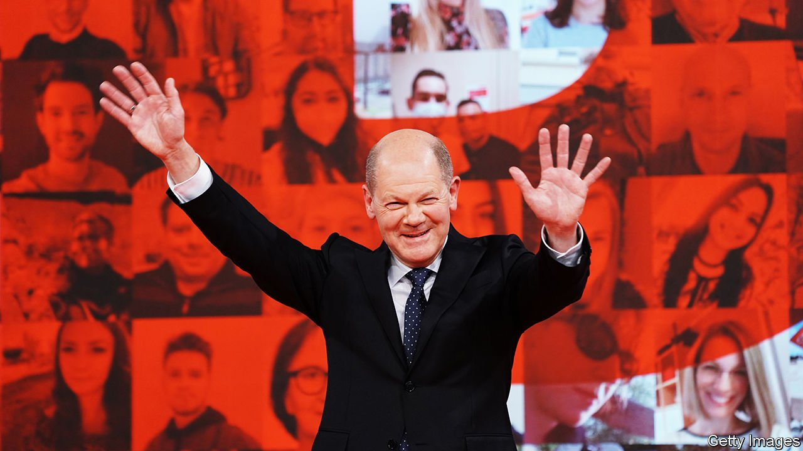
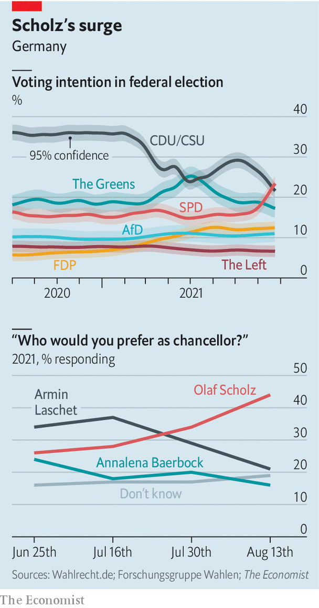

###### What a time to be Olaf

# The Social Democrats’ surge upends Germany’s election campaign 

##### It might even see the Christian Democrats leave power 

 

> Aug 25th 2021 

THE CROWD at the UfaFabrik, a cultural centre in Berlin, cheers as the moderator reveals a new opinion poll: Germany’s Social Democrats (SPD) have overtaken the Green Party for the first time in a year. It falls to Olaf Scholz, Germany’s finance minister and the SPD’s candidate for the chancellery, to calm his own supporters. It’s election day that counts, he says, before proceeding to a sober discussion of Afghanistan and other themes. In a display of party unity Mr Scholz is welcomed by Kevin Kühnert, a leftist former leader of the SPD’s youth wing who for years was a major irritant to the party’s centrist leadership.

The SPD’s late surge has become the biggest story in the most volatile German campaign in living memory. The Economist’s statistical model finds a 33% chance that the SPD will take first place in the . Two weeks ago the number was just 1%. On August 24th Forsa, a pollster, placed the SPD ahead of its senior coalition partner—the conservative Christian Democratic Union ( CDU) and its Bavarian ally, the Christian Social Union ( CSU)—for the first time since 2006.


The SPD’s travails once seemed boundless. After slumping to 20% of the vote at the previous election, in 2017, the party reluctantly agreed to continue propping up the CDU/ CSU in government. Mr Kühnert’s campaign to return to opposition looked vindicated as the SPD’s support dipped further. In 2019 Mr Scholz’s bid to run the party was thwarted by two obscure members of its left wing. Worse, like its European counterparts, the SPD appeared to be facing structural decline, as its blue-collar base faded and it struggled to find a consistent message that could successfully unite its warring wings.

 


What explains the revival? The 63-year-old Mr Scholz, a serious type with decades of governmental experience, is a big asset: he polls far ahead of his party. Wisely, the SPD has placed him at the heart of its campaign. And if the awkward squad has not gone away, it has remained largely mute since last August, when Mr Scholz was anointed the SPD’s candidate to replace Angela Merkel as chancellor. All this has drawn some wavering supporters back to the fold. Having long argued that German voters would warm to their candidate, Scholz allies take satisfaction in seeing their prophecy fulfilled. “As the Chinese say, what you need in this job is strategic patience,” says one.

For all that, the SPD is polling only a bit above its score in 2017, a result so miserable it triggered mass soul-searching and a formal inquiry. The bigger story is a fragmented electorate and the deepening woes of the SPD’s rivals. After a brief bump in the spring the Greens have reverted to a level that disappoints those who dreamed of the chancellery, even though it would still mark a doubling of their result in 2017. This leaves the SPD bearing the standard of German progressives—and the battle for the chancellery looking like a straight duel between Mr Scholz and Armin Laschet, the CDU/CSU candidate.

That suits the SPD, because the CDU/CSU campaign has misfired spectacularly. Having hoped to coast to victory, Mr Laschet, the jovial, gaffe-prone premier of North Rhine-Westphalia, Germany’s most populous state, has found himself presiding over an ideas-free campaign and a party with nothing to say after 16 years in charge. The CDU/CSU has lost a quarter of its support in six weeks. Mr Laschet’s “disastrous” ratings show that even the party’s hardiest supporters are struggling to warm to him, notes Rüdiger Schmitt-Beck, a political scientist at the University of Mannheim. Mr Scholz, who has the reserve typical of Hamburg, the city-state he ran for seven years, will win no awards for charisma. But Mr Laschet’s failings throw his assets into sharper relief. Many CDU/CSU voters prefer him to their own man.

Mr Scholz’s record has its blots, including mismanagement of riots during a G20 summit in Hamburg in 2017 and a brace of tax and regulatory scandals on his watch. But these blemishes seem either too distant or too complex to stir voters’ concerns. And unlike both Mr Laschet and Annalena Baerbock, the Greens’ chancellor-candidate, Mr Scholz has not put a foot wrong during the campaign.

Moreover, Mr Scholz has chalked up notable successes as finance minister, including the European Union’s €750bn ($886bn) recovery plan, which his ministry helped draw up, and the G20’s recent corporate-tax agreement. On the campaign trail he vaunts Germany’s €130bn response to the pandemic, which kept a lid on unemployment and blunted the recession. Years of fiscal restraint allowed this splurge, Mr Scholz argues: a claim that seeks to unite his social-democratic standing with a reputation for caution. He wants Germany to return to the deficit-limiting strictures of its “debt brake” in 2023.

A modest, experienced politician with a command of detail: Mr Scholz would not mind much if some spot signs of the outgoing chancellor in his demeanour. Yet that is only half the picture, say acolytes. Unlike Mrs Merkel, Mr Scholz has ideas for Germany’s future, including shepherding the transition to a carbon-neutral economy and retaining its export prowess. Although his foreign-policy record is thin, it is easier to imagine Mr Scholz, rather than his rivals, going mano a mano Merkel-style with Vladimir Putin or thrashing out deals at an all-night EU summit.

The SPD’s late charge throws up fresh possibilities for coalition-formation after the election. Mr Scholz’s best chance of becoming chancellor is at the head of a “traffic-light” government, uniting the SPD, the Greens and the liberal Free Democrats (FDP). The FDP, a likely kingmaker, would prefer a “Jamaica” coalition with the CDU/CSU and Greens. But Mr Scholz has been wooing the party with honeyed words about Germany’s long “social-liberal” tradition. The SPD surge therefore not only boosts Mr Scholz’s chances of landing the job he has wanted for so long. It could also see the CDU/CSU follow Mrs Merkel out of office entirely. ■

Dig deeper

All our stories relating to Germany’s election can be found on our .

