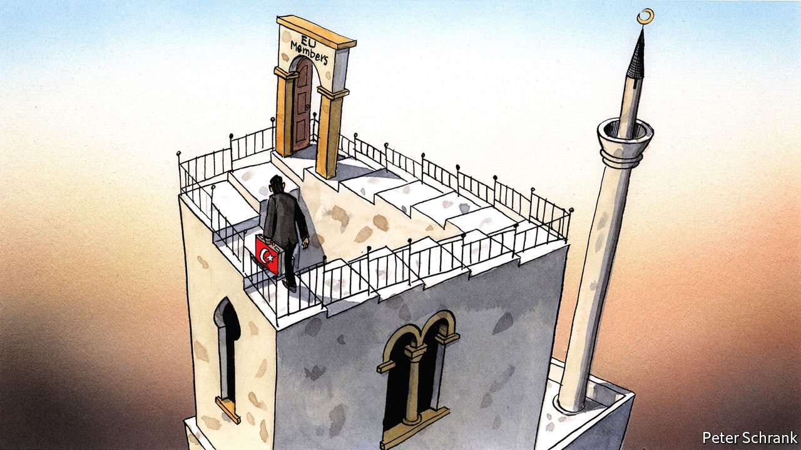

###### Charlemagne

# The fiction that Turkey is a candidate to join the EU is unravelling 

##### Many European voters don’t want a big Muslim nation in their club, even if it becomes more democratic 

 

> Aug 28th 2021 

AUSTRIA’S CHANCELLOR, Sebastian Kurz, may have been speaking for a few other European governments earlier this summer when he suggested that Turkey would be the most appropriate refuge for Afghans escaping the Taliban. But he was not speaking for Turkey, or for the Afghans themselves. Recep Tayyip Erdogan, the Turkish president, declared last week that Turkey would not be “Europe’s refugee warehouse”. Most Turks agree. In a country home to well over 4m migrants and refugees, including an estimated 200,000-600,000 Afghans, resentment towards the newcomers is mounting. But so is frustration that Turkey, formally a candidate for membership in the EU, has become its buffer state.

For years, policy wonks used to reach for a variation of an old Soviet joke to describe the membership talks between Turkey and the EU: we pretend to negotiate, and they pretend to reform. Today, there is no use pretending. The accession process is dead. In its place, a deal the EU struck with Mr Erdogan to keep migrants and refugees out of Europe has taken centre stage in the relationship. That agreement, too, is starting to come under strain.


The EU’s reports on Turkey’s progress towards accession once made the front pages of the country’s newspapers. In today’s Turkey, the EU is a spent political force. In theory, all it needs to do to remedy this is to say that a democratic Turkey, as opposed to the police state Mr Erdogan has been assembling, can expect to have a place in the EU once it cleans up its act. Turkey’s beleaguered democrats would like to hear nothing more. Mr Erdogan would probably like to hear nothing less.

Yet this is the one thing EU officials cannot say. Turkey is bigger than any EU country and its people are mostly Muslim. Many European voters regard the prospect of such a nation joining the club with horror. So the chances are that the EU will not accept Turkey whatever its democratic credentials. Signs of this were present from the start of the membership talks in 2005, when European leaders insisted on an “open-ended process”, the outcome of which they would not guarantee.

In Mr Erdogan and his government they have found a terrific excuse to kick the can down the road. Turkey’s leader has locked up the Kurdish opposition, harassed the mainstream one, neutered the press and the courts, and clashed with Greece, Cyprus and France in the Eastern Mediterranean. As a German foreign minister remarked a few years ago, the EU will keep Turkey out of the club as long as Mr Erdogan is in power. The truth is that it will probably do so no matter who is in charge.

For now, both the EU and Turkey have decided that the best thing to do is nothing. Neither wants to break off negotiations, and both have something to gain from the impasse. Europe does not have to push forward a process it does not believe in, and Mr Erdogan does not have to sign up to reforms that would weaken his control over parts of Turkey’s economy and its institutions.

As a result, it is the deal the two sides made in 2016, after nearly a million migrants and refugees reached Greece, that now drives the relationship. In exchange for $6bn in assistance to Syrian refugees and a vague promise of visa-free travel to Europe for Turks, Mr Erdogan’s government has reined in smuggling networks and taken back migrants attempting to cross the Aegean. The EU has reason to be pleased. The number of crossings dipped to less than 10,000 last year, compared with 850,000 in 2015. Some in Europe now propose extending the agreement’s provisions to Afghans. Turkey has so far balked at that idea.

The deal has also changed the way the EU and Turkey do business. European governments, especially Germany’s, are now extremely wary of rocking Mr Erdogan’s boat, says Michael Leigh, a former EU official. The leverage the EU once had over Turkey’s leader has gone. The bloc occasionally makes noises about human rights, democracy and the need for a solution in Cyprus. Mr Erdogan blithely ignores them.

The migration deal helped contain a populist backlash in Europe. But it has helped spark one in Turkey. Resentment of refugees, made worse by an economic crisis, has occasionally turned violent. Earlier this month a mob in Ankara, Turkey’s capital, destroyed homes and shops belonging to Syrians after a Turkish teenager died in a fight between locals and refugees. Such incidents remain rare, a remarkable thing given the size of the refugee population. But tensions are bound to mount as tens of thousands of newcomers start to reach Turkey, this time from Afghanistan, by way of Iran.

Getting nasty

Until recently, immigration had not been a big issue in Turkish politics. But this too is changing. The opposition has tapped into anti-refugee sentiment. Kemal Kilicdaroglu, head of the CHP, the largest opposition party, recently pledged to send all Syrian refugees home if his party takes power. (Most Turks, including a majority of government supporters, would support this, polls say.) Mr Erdogan, already criticised for keeping the border with Syria open for years, is facing heat for doing too little to protect the one with Iran. Work on a border wall is continuing. The debate is poised to become nastier ahead of elections scheduled for 2023. The deal with the EU is sure to come under fire.

Some Turkish diplomats suggest fixing the relationship with the EU through seemingly technocratic manoeuvres, including an upgrade to the bloc’s customs union with Turkey, visa liberalisation and co-operation on foreign policy. But even this seems impossible. Turkey does not want to make the necessary concessions, including an overhaul of its draconian terrorism laws, and the EU does not want to be seen as offering Mr Erdogan rewards. A breakthrough may happen, but not before voters give Mr Erdogan and his coalition the boot. Even then, EU membership will not be on the table. Perhaps it was never there to begin with. ■

