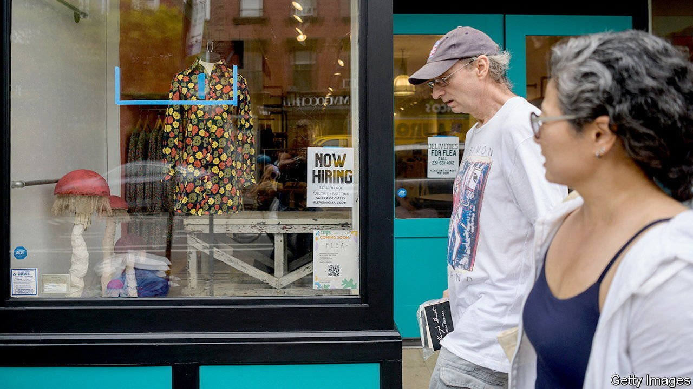
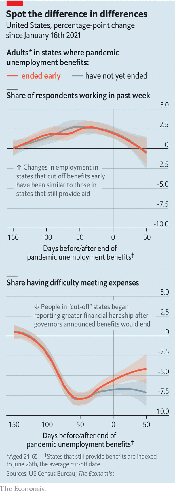

###### Disappearing incentives

# Ending pandemic unemployment aid has not yielded extra jobs—yet 

##### American states that cut off extra benefits have seen increases in hardship, but not in employment 

 

> Aug 28th 2021 

ONE OF THE questions gripping America is the extent to which generous unemployment benefits are distorting the economy. When covid-19 began to spread last year, Congress expanded unemployment insurance (UI) by topping up payments, allowing recipients to claim for longer and widening the eligibility criteria. The aid helped preserve incomes during lockdowns and fuelled consumer spending during the recovery. In March lawmakers extended federal funding for the benefits. But it is due to expire on September 6th—with consequences that are uncertain.

One possibility is that the cliff-edge will bring people back to work. Although employment remains about 5.7m below its level in February 2020, firms are struggling to fill vacancies. In July wages in leisure and hospitality jobs were nearly 10% above pre-pandemic levels. Economic theory says that UI deters jobseeking—a prediction supported, at least to some degree, by most studies of its effects before 2020.


Yet this relationship has not been apparent during the pandemic. Congress allowed states to opt out of the prolonged benefits this year. Over the summer 26 of them—mostly those with Republican governors—ended at least some benefits early. Their economies do not seem to have benefited much. Between June and July the share of working-age people who were employed rose by 3.5 percentage points in states that kept the benefits, exceeding the 2.7-percentage-point increase in states that cut them off.

Several groups of researchers have struggled to unearth the expected correlation using more sophisticated methods. The latest attempt is by Kyle Coombs of Columbia University and co-authors, who studied the bank records of 18,000 low-income workers. They found that, in the states that ended benefits, 26% of workers who had previously received them were employed in August, compared with 22% in other states—a difference that, as a share of the entire labour force, is modest.

 


The Economist has conducted its own analysis. The Census Bureau’s Household Pulse Survey (HPS) interviews tens of thousands of people each week about how the pandemic is affecting them. One of the questions is whether respondents have worked in the past week. We measured how the share of people aged 24-65 in each state who said they were working had changed since January. Using a technique called “difference in differences”, we compared average changes in reported employment rates in two groups of states, those that ended benefits early and those that had not. The numbers were virtually indistinguishable: in months when employment rose in cut-off states, it climbed by a similar amount in other states. The same was true when employment declined.

The absence of large effects does not mean that previous beliefs about UI were wrong. The pandemic is a highly unusual period for the economy, meaning the effects of benefit cut-offs could take longer to appear. By making jobseekers choosier, higher UI may be boosting wages instead of limiting the employment recovery—which might sound desirable, but could be inflationary. In cut-off states the earnings of drivers on ride-hailing apps, which respond in real time to labour supply and have been falling lately, have declined by about 10% more than in other states, reckon economists at Goldman Sachs, a bank. The nationwide cut-off in September should, they say, increase labour supply and slow the pace of wage growth.

One consequence of withdrawing benefits might not come as a surprise. It has left the jobless with less money in their pockets. Mr Coombs and his colleagues found that in cut-off states affected workers reduced their weekly outlays by $278. Our analysis of the HPS shows that the share of adults saying it was “somewhat” or “very” difficult to pay for typical household expenses began rising in cut-off states shortly before the expiry. Elsewhere, there was no change (see chart).

That raises the possibility that cutting off benefits could harm overall consumer spending. But the numbers involved are puny: a $2bn fall between June and early August, compared with monthly aggregate consumer spending of over $1.3trn. The labour-supply effect should be more significant—if it shows up. ■

For more expert analysis of the biggest stories in economics, business and markets, , our weekly newsletter.

