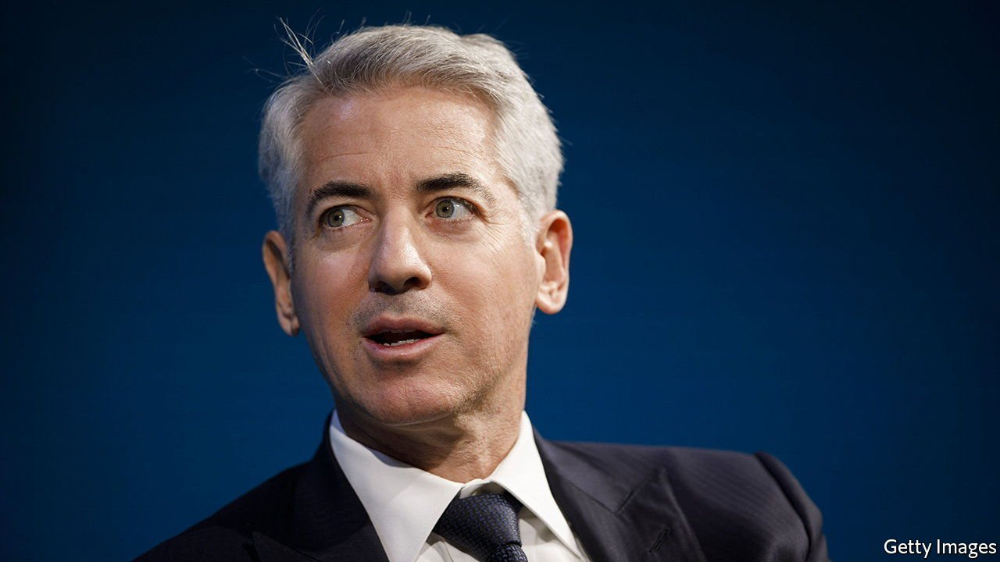

###### Bright SPARC

# Out of Bill Ackman’s SPAC woes comes innovation 

##### The world’s largest-ever SPAC might give way instead to a SPARC 

 

> Aug 28th 2021 

IN THE CLASSIC 1980s arcade game, Pac-Man is pursued by killer ghosts as he attempts to achieve his goal of gobbling up little dots. These colourful ghosts have various tactics to scupper Pac-Man: “Blinky” (the red one) gives chase; “Pinky” and “Inky” (the pink and the blue spooks) obstruct his path and attempt to corner him.

Bill Ackman, a hedge-fund tycoon turned sponsor of a “special-purpose acquisition company” (SPAC), has become a financial Pac-Man of sorts. The goal of a SPAC is to gobble up a private company and take it public. It raises capital from investors that is held in a listed vehicle while it seeks a merger target. In July last year Mr Ackman raised $4bn for Pershing Square Tontine Holdings, making it by far the biggest SPAC created. But he has been pursued by a bevy of ghosts.


First came Pinky and Inky, the obstructors. For most Wall Street endeavours the more capital the better, but for SPACs too much cash can complicate matters. They typically take a minority stake in a private firm, so a big fund must limit itself to the tiny pool of such firms worth tens of billions of dollars. After months of searching Mr Ackman tried to strike a deal in June to buy shares in Universal Media Group, a subsidiary being carved out of Vivendi, an entertainment conglomerate based in Paris. This was an unusual use of SPAC capital: it would spend only some of the vehicle’s funds, and planned to buy shares in a firm that, at the point of the transaction, would already be public. The Securities and Exchange Commission (SEC), America’s markets regulator, objected to the deal, leading Mr Ackman to write to investors on July 19th that he would no longer pursue it.

Next came Blinky, the hunter. On August 17th George Assad, a shareholder in the SPAC, sued it, alleging that it was actually an investment fund, which must be registered with the SEC and abide by all kinds of rules. The claim is that the only activities the SPAC has ever undertaken are investing in securities and equities, namely Treasuries and the attempt to buy listed shares—the terrain of investment funds.

Mr Ackman’s SPAC is a particularly good target for this complaint, even though its bid to buy public shares eventually failed. But the argument could apply to SPACs in general: all hold their assets in Treasuries from their inception until they consummate a merger. If successful the suit would probably require SPACs to be registered as investment funds. Given the resulting onerous disclosure requirements and fee caps, this could kill SPACs altogether.

Whether the lawsuit will succeed is unclear. The SEC has treated SPACs as distinct from investment funds for decades. Writing to investors on August 19th, Mr Ackman argued that the lawsuit was “meritless”. But it may have spelled game over for his SPAC regardless. SPACs have just two years to find a merger target and, Mr Ackman wrote, “the mere existence of the litigation may deter potential merger partners”. He announced that he plans to dissolve his SPAC and return the capital raised.

Yet Mr Ackman is not defeated. In June he filed a registration for a new gambit: a “SPARC”, or special-purpose acquisition rights company. This is like a SPAC, but without the pot of capital. Rather than issuing shares at $10 or $20 a pop to raise a pot of money that is invested in Treasuries while the sponsor hunts for a target, he plans to distribute the right to buy shares at $20 once a deal is announced. Once he liquidates his SPAC and returns the capital to shareholders, he plans to distribute free SPARC rights to them instead.

The new structure still requires regulators’ consent. But in many ways it could be more efficient. It eliminates the opportunity cost of locking up investors’ funds for two years. Shareholders can still approve or reject a deal: whereas with SPACs they can opt out, by claiming their money back or voting against the merger, with SPARCs they opt in. Playing SPACman may not have been fun any more, but Mr Ackman has moved on to a new game. ■

For more expert analysis of the biggest stories in economics, business and markets, , our weekly newsletter.

