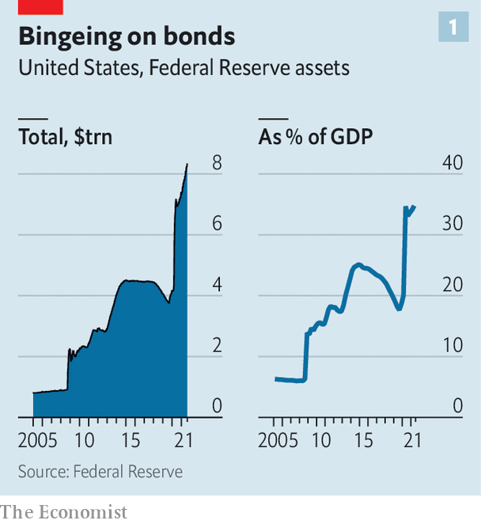
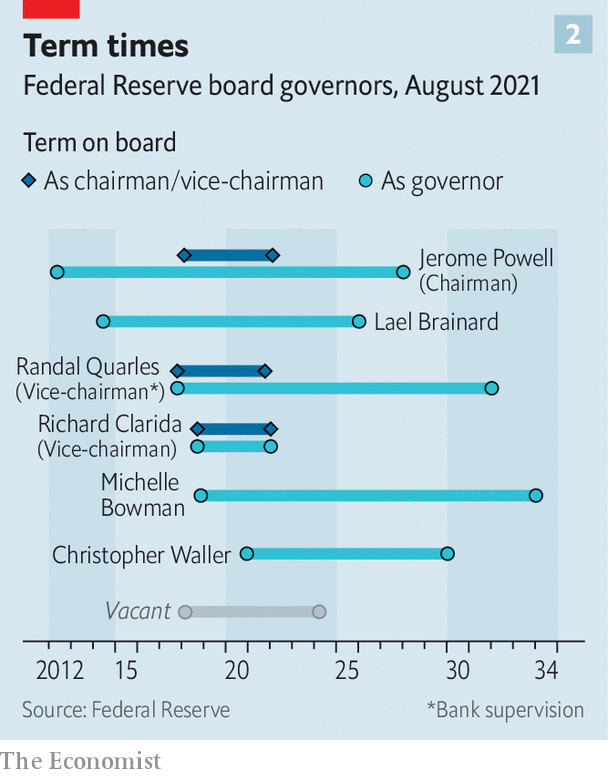

###### The fight over the Fed

# The new Powell doctrine 

##### The Fed has taken a bold gamble under Jerome Powell. Will he get to see it through? 

 

> Aug 28th 2021 

NO ONE CAN accuse him of inconsistency. Over the past year Jerome Powell, chairman of the Federal Reserve, has again and again used the same phrasing to kick off his press conferences after it sets interest rates. “Good afternoon. At the Federal Reserve, we are strongly committed to achieving the monetary-policy goals that Congress has given us: maximum employment and price stability.” It may not set pulses racing. But that is just how Mr Powell wants it: a projection of control, in terms any schoolchild can understand.

The simple wording belies a remarkable evolution in Fed policy and practice on his watch. Mr Powell has overseen a giant monetary response to the covid-induced slowdown. The Fed has bought more than $4trn in assets during the pandemic (equivalent to 18% of GDP), dwarfing the scale of its actions after the global financial crisis, and swelling its total balance-sheet to $8.3trn (see chart 1). Mr Powell has refined the way the Fed communicates, targeting his messages at ordinary Americans rather than economists. He has led a landmark shift in the way it thinks about interest rates. And in the process, he has presided over a bold gamble, keeping policy ultra-loose even as inflation soars. To his supporters—of whom there are many—he saved America from an economic catastrophe. To his critics, however, he is steering it into danger.


These days much of the conversation about Mr Powell focuses on whether President Joe Biden will reappoint him. His four-year term as chairman ends in February 2022. Mr Biden is expected to announce in the coming weeks whether he will renew Mr Powell’s term or nominate a replacement, giving markets time to brace for the change, if there is one. Progressives within the Democratic Party accuse Mr Powell of slowly dismantling rules intended to make the financial system safer, and would prefer a chairperson who is tougher on banks. Lael Brainard, the lone Fed governor who has consistently opposed moves to, for instance, soften lenders’ leverage limits, is their favoured candidate.

 


Still, most Fed watchers expect Mr Powell to get a second term. Betting markets assign it an 85% probability. Most Democrats and Republicans think he has done a good job in tough times. The economy is recovering and stocks are near all-time highs. Why rock the boat? The politics would look good, too. Mr Biden would re-establish a precedent, broken by President Donald Trump, of reappointing Fed chiefs first chosen by a president from another party. It would also make sense to anyone tracing the arc of Mr Powell’s leadership. Over the past four years he placed his big bets. The test of whether he was right or rash will come in the next four.

An assessment of Mr Powell’s record can be divided into three periods. The first was before the pandemic. His most notable achievement was arguably political. The central bank faced the gravest challenge to its independence in decades when Mr Trump railed against its interest-rate rises. Mr Powell stuck to the Fed’s agenda and patiently explained that the president had no authority to fire him, but otherwise refused to get drawn into a war of words. Mr Powell also displayed intellectual flexibility. When inflation dipped in 2019, the central bank swiftly reversed gear and began cutting interest rates—and held them low even as unemployment declined to levels that economists had assumed might lead to upward price pressures. “He let the economy push farther and farther than anyone thought it could go,” says Jason Furman, an economic adviser to President Barack Obama.

The second period came with the onset of the pandemic. As the economy came to a sudden stop in March 2020, stocks plunged and credit markets seized up. Mr Powell wasted no time in engineering a massive rescue, slashing rates to zero and buying up a wide range of assets—not just Treasuries and mortgage-backed securities but also, for the first time, corporate bonds. Within three months the Fed’s asset holdings had increased by $3trn.

The third period of Mr Powell’s tenure, unfolding now, is the most contentious. Many who applauded the Fed’s stimulus during the depths of the pandemic think the central bank should have started rolling it back. Monthly asset purchases of $120bn make little sense, and indeed may be storing up trouble, when inflation is running above 5%. Move too slowly to unwind, and financial markets could overheat (some prominent investors such as Jeremy Grantham argue that they are already red-hot). Move too quickly, and a market crash would be a self-fulfilling prophecy, rippling through the global economy. Sonal Desai of Franklin Templeton, an asset manager, calls it the “hardest high-wire balancing act we’ve seen in a long time”.

Priced to perfection?

Mr Powell is trying to pull it off by giving markets plenty of warning, in the hope of avoiding a repeat of the “taper tantrum” that spooked markets in 2013. He is due to speak at an annual Fed jamboree—usually held in Jackson Hole, Wyoming, but being conducted online because of covid-19—on August 27th, after The Economist goes to press, when he is expected to say that a tapering of asset purchases could start later in the year. Many observers expect a three-step shift: a pre-announcement at the central bank’s rate-setting meeting in September that a tapering announcement will come at its November meeting, followed in December by actual tapering.

Guesses about the tapering schedule, though, are only one element of the debate now swirling around Mr Powell’s agenda. Last year he introduced a new framework for monetary policy (building on a shift that started under his predecessors, Janet Yellen and Ben Bernanke), announcing that the Fed would target an average of 2% inflation over the longer run, while also seeking to let the economy reach full employment. He has also pledged that the Fed will not raise rates until inflation is at 2% and is forecast to stay above it for some time. Tapering can begin earlier, as long as there is “substantial further progress”—a deliberately vague phrase—towards meeting the inflation and employment targets. What he could not have foreseen was the extremely uneven recovery from the pandemic, with prices climbing but the unemployment rate still nearly two percentage points higher than at the start of 2020.

“The Fed has tied its hands to be quite late to remove monetary-policy accommodation,” says William Dudley, former president of the New York Fed. Mr Dudley thinks that the Fed’s new framework is correct, but worries that the implementation has been too rigid. He says that he would have argued for less extreme conditions to taper or to raise interest rates. Mr Furman warns that Mr Powell could be paving the way for unpredictable policy, which would give rise to the very market shocks he has wanted to avoid. “There’s been a bit of assuming that everything’s going to work out exactly right, and not having much public communication about what will happen if it doesn’t,” he says.

Yet many other economists and Fed veterans support Mr Powell’s approach. The average-inflation framework was designed with the broader backdrop in mind: steadily lower inflation was keeping interest rates low and limiting the Fed’s monetary space. Covid-19, though an extreme challenge, is unlikely to alter these long-standing structural forces. Much of the recent surge in inflation appears to stem from ephemeral factors such as gummed-up supply chains. David Wilcox, a former research director at the Fed, says that as long as inflation expectations remain anchored at 2%, the Fed is likely to wait it out. “In that context an abrupt move to tighten could be a costly mistake,” he argues.

If inflation persists and filters into wages a year or so from now, that would be a different story—but a modest overshoot would not necessarily be an unwelcome one. “If inflation runs to the upside, that’s a problem they want to have, and they have the tools for dealing with it,” says Alan Levenson of T. Rowe Price, an asset manager. As it stands, the central forecast of members of the Fed’s rate-setting committee is for inflation to return to roughly 2% next year. Market pricing of Treasury bonds points to much the same outcome.

 


For all the controversy about Mr Powell’s monetary policy, it is his approach to financial regulation that has been the biggest lightning-rod for his political opponents, especially progressive Democrats. “I see one move after another to weaken regulation over Wall Street banks,” Senator Elizabeth Warren said at hearings in July. Defenders of Mr Powell say that such a characterisation is unfair. The Fed did, for instance, scrap pandemic-era limits on most banks’ stock buybacks and dividend payments at the end of June, but that was only after subjecting them to three stress tests to confirm that they had more than enough capital. In other areas, the Fed under Mr Powell has been strict. In March it rebuffed banks’ requests to extend an exemption on leverage caps that had helped them during last year’s slowdown.

If Mr Biden wants to keep Mr Powell in his job while signalling a tougher stance on regulation, he has an obvious solution. Randal Quarles’s term as the Fed’s vice-chairman responsible for banking supervision ends in October (see chart 2). Instead of nominating Ms Brainard as chairwoman, he could choose her to replace Mr Quarles. For markets, such a reshuffle would minimise the turbulence from changing Fed chiefs at a critical juncture. Politically, it would be deft. And it would give Mr Powell a chance to answer the fundamental question posed by his policies: whether the great monetary loosening, so necessary last year, can be unwound without doing great harm to the economy. ■


