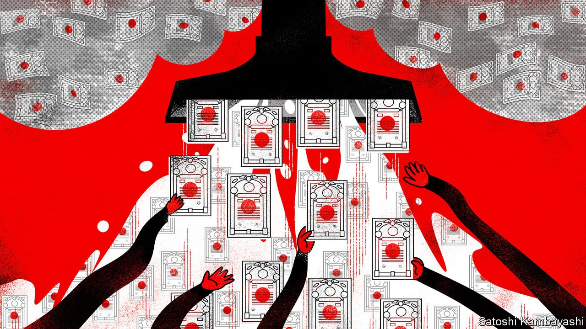

###### Buttonwood

# Trading in Japanese government bonds is drying up. Does that matter? 

##### Trading desks in Tokyo have fallen silent as the Bank of Japan has hoovered up bonds 

 

> Aug 28th 2021 

NOBODY BOUGHT Japan’s ten-year government bond in over-the-counter trading on August 3rd. Such a lull in the world’s second-largest market for sovereign bonds would once have been remarkable. But in fact this was not even the first time activity dried up. Once-frenetic trading desks in Tokyo have fallen silent over the past half-decade.

Sceptics of the central bank’s enormous quantitative-easing (QE) programme warned this moment would come. With the Bank of Japan (BoJ) hoovering up securities, they argued, benchmark bonds would become scarce, causing price volatility and stopping investors pricing risks properly. Financial institutions would be deprived of the collateral they needed to operate. But, curiously, there is little sign that the drying up of the Japanese market has had such effects. Should anyone, other than the poor souls who used to buy and sell the bonds for a living, lose sleep over it?


Perhaps nowhere is more central to the history of QE than Tokyo. During the Depression of the 1930s the country’s finance ministry arranged for the BoJ to underwrite all government-bond issuance. In 2001 Japan became the birthplace of modern QE when the BoJ launched a small asset-purchase scheme.

The scale of bond-buying over the past eight years in particular has been astonishing. The BoJ’s assets run to around 130% of GDP, nearly twice the share held by the European Central Bank and nearly four times that of America’s Federal Reserve. The BoJ holds almost half of Japan’s sovereign bonds (and, after years of sluggish economic growth, which have obliged the government to run budget deficits, the country has rather a lot of them). These have largely been bought from commercial banks—both domestic ones and foreign lenders based in Japan. In 2012 banks owned over 40% of the stock of government bonds; now they own less than 13%. Since they typically do a lot of bond trading, it might come as no surprise that activity has dried up like a dammed stream.

To its critics Japan’s experience of bond-buying as the main form of economic stimulus discredits the policy tool. The huge asset purchases since 2012 have clearly not achieved the aim of generating sustained inflation. Even the BoJ does not believe it will reach its 2% inflation target before 2024.

Yet there also seem to have been few of the negative market consequences that critics feared. Bond dealers bleat about liquidity in surveys, but bid-ask spreads—a measure of the gap between the price at which buyers are willing to buy and sellers are willing to sell—in the trading that does occur have been contained. Prices are kept in a stable band by the BoJ’s “yield-curve control” policy. Average private-sector lending rates are at rock-bottom levels. Large-scale quantitative easing may have made certain maturities scarcer, but that effect has been muted by the central bank’s willingness to lend bonds to the private sector through various collateral schemes. As pandemic panic peaked in March last year, the BoJ lent out more than ¥24trn ($221bn) in government bonds to the private sector, mostly to provide the collateral banks needed to access the Fed’s dollar-swap lines. While it may still be reasonable to worry about the effect of persistently low interest rates on asset prices and wider financial markets, in Japan at least worries about the functioning of the government-bond market have yet to be realised.

The lack of any direct financial consequences of throttling activity in the bond market says something interesting about QE and monetary policy in general. Policy is usually regarded as being something that causes changes in the economy. But it is as much a consequence of existing economic reality.

Movements in bond markets typically convey useful information about investors’ expectations for growth and inflation. But in Japan both are so consistently low that there is little useful information to be gleaned from a livelier market. QE may have helped kill off trading activity, but ultimately the euthanasia of trading desks, like the QE programme itself, is a consequence of a stagnant economy and static prices.

That may be the best lesson for other countries—and, as the past 30 years have shown, what happens in Tokyo today is often repeated in the rest of the rich world tomorrow. Should they find themselves in similar economic circumstances, worrying about the effect of bond-buying on how the market functions may be the least of their concerns.


