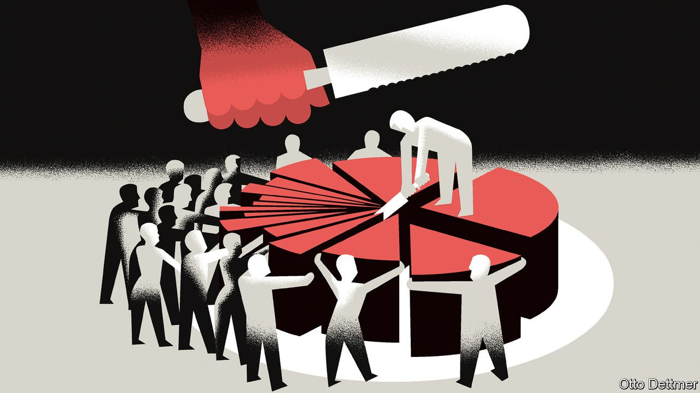

###### Free exchange

# Xi Jinping’s talk of “common prosperity” spooks the prosperous 

##### The idea might be motivating everything from China’s crackdown on tech tycoons to a putative property tax 

 

> Aug 28th 2021 

IN A SPEECH in 2016 Xi Jinping, China’s president, explored the roots of an idea that is now troubling the country’s tycoons and depressing the stockmarket—an idea that may be motivating China’s crackdown on private tutoring, its antitrust fines on internet firms, its new guidelines on the treatment of gig workers and its steps towards a property tax, as well as inspiring large charitable donations from some of the country’s most prominent enterprises. That idea is common prosperity.

Common prosperity, Mr Xi pointed out, has been an ideal of the Chinese people since ancient times. It was espoused by his predecessors as Communist Party leader. (Even Deng Xiaoping, who was famously happy to let some “get rich first”, insisted that they then help others to catch up.) The ideal appears not just in Marx but also in Confucius, Mr Xi said. He quoted a well known line from “The Analects”, which says something to the effect that a wise leader worries not about poverty but about inequality; not that his people are too few, but that they are too divided. (It is snappier in the original Chinese.)


The idea, then, is not new. But it is newly important. The term has appeared 65 times in Mr Xi’s speeches or meetings this year, according to Bloomberg. A recent example is the powerful Central Financial and Economic Affairs Commission, which sets and enforces the party line on the economy. It focused on the idea at its meeting on August 17th.

But what precisely does it mean? The party has clarified what it does not entail: it does not imply that everyone will end up enjoying equal prosperity. Entrepreneurs who create their own wealth, “work hard with integrity and have the guts to start their own businesses” should be encouraged. Nor will the egalitarian turn be abrupt. It should be pursued “step by step” in a “gradual” manner, the commission reiterated this month.

But the goal also rules out a continuation of the status quo. “We must not allow the gap between rich and poor to get wider,” Mr Xi insisted in January. People in the top fifth of Chinese households enjoy a disposable income more than ten times as high as people in the bottom fifth, according to official figures. Disposable incomes in cities are two and a half times as high as in the countryside. And the top 1% own 30.6% of household wealth, according to Credit Suisse, a bank (compared with 31.4% in America).

Unfortunately, defining what will count as common prosperity is complicated by the sheer volume and variety of aspirations and exhortations that often follow in the term’s trail, aspirations that could be laudable or lamentable depending on details that have yet to be formulated, let alone divulged.

Common prosperity will require a stronger safety-net for the unfortunate, better pensions, more equal access to public services, including education and health. It will result in an “olive-shaped” distribution of income that is fat in the middle but thin at the bottom and top. China has about 400m people living on incomes between 100,000 and 500,000 yuan (roughly $15,000-77,000) for a family of three or the equivalent. It wants to double that number to 800m people in about a decade, according to the Development Research Centre, a think-tank attached to China’s State Council. 

The party says it will increase the role of taxation in fighting inequality. It will adjust high incomes “reasonably”. But it has yet to quantify that reasonableness by specifying future tax rates or thresholds. Besides, the government overhauled personal taxes as recently as 2018, making it unlikely to have another go soon, according to Gabriel Wildau of Teneo, a risk-advisory firm. A crackdown on tax evasion and illicit income is more likely. This week the party’s corruption watchdog said it had instructed over 24,800 party cadres in the city of Hangzhou to undertake “self-examination” and confess to any illegal borrowing from local firms or other conflicts of interest.

Most egalitarian governments content themselves with tweaking taxes and transfers. But China’s reach is broader. It is also championing two other kinds of redistribution: “voluntary” donations by the rich (Tencent, an internet giant, ploughed $7.7bn into its social initiatives soon after the August 17th meeting) and what is sometimes called “pre-distribution”. This can entail altering the split of national income between wages and profits. A common prosperity “demonstration zone” in Zhejiang province, for example, includes a target to raise labour’s share of the province’s income from 47.8% (in 2017) to over 50%.

The labour share is not easy to measure let alone manipulate. It has declined steadily in many developed economies, thanks to deep forces like globalisation and technological change. But China’s wage-earners might benefit from policies like the government’s new guidelines on gig workers, which seek to improve their wages and bargaining position. Certainly, investors in the gig economy fear these policies will leave a smaller slice of the cake for them. The share price of Meituan, a food-delivery giant, has fallen by 18% since the guidelines were released. 

As with many of its signature initiatives, the party will not impose a common approach to common prosperity. “Local authorities will be encouraged to explore effective ways that suit local conditions,” it said on August 17th. Cities in Zhejiang are scrambling to add the label to various initiatives, from narrowing the gap between urban and rural areas to promoting the “spiritual” riches of the populace. Over time, the successful projects will be said to conform to Mr Xi’s vision; in reality, his vision will coalesce around them.

Just because common prosperity remains nebulous does not, however, mean it is vacuous. “Achieving common prosperity is not only an economic issue, but also a significant political issue,” Mr Xi said in January. The party hopes that reviving this ancient ideal will help strengthen the foundations of its rule. Confucius again got there first. “Where there is contentment,” the sage says, “there will be no upheavals.”

For more expert analysis of the biggest stories in economics, business and markets, , our weekly newsletter.

