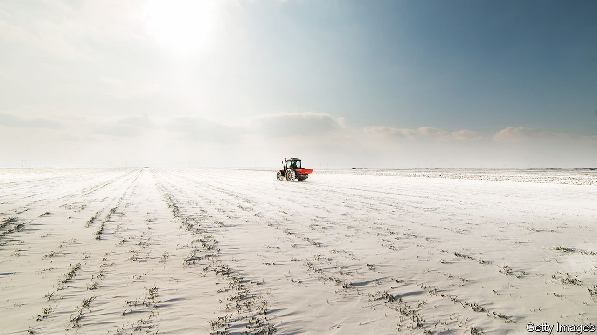
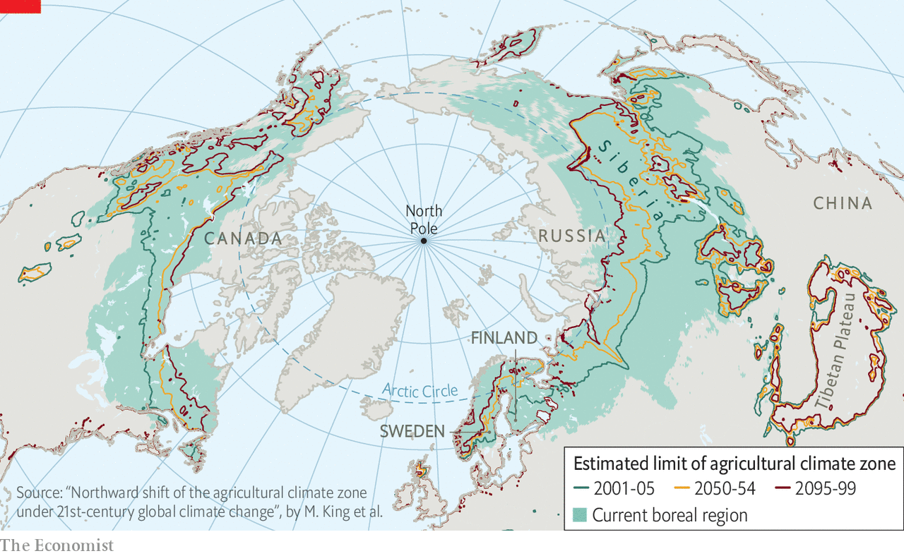

###### New frontiers

# Climate change will alter where many crops are grown 

##### That means gains for some people, but losses for more 

 

> Aug 28th 2021 

TOM EISENHAUER remembers driving through Manitoba, a province in central Canada, more than a decade ago. Surrounding his car were fields of cold-weather crops, such as wheat, peas and canola (rape). Dense staples such as maize (corn) and soya, which are more profitable, were few and far between. The view is very different now. More than 5,300 square kilometres have been sown with soya and around 1,500 with maize.

Mr Eisenhauer’s company, Bonnefield Financial, hopes to benefit from the ways that climate change is changing Canadian agriculture. The company buys fields and leases them to farmers, both in Manitoba and elsewhere in the country. It is betting that a warmer climate will steadily increase how much its assets are worth, by enabling farmers in the places where it is investing to grow more valuable crops than they have traditionally selected. It is far from the only business making such wagers. Climate change could make a cornucopia out of land that was once frigid and unproductive. It could also do great harm to regions that feed millions.


The amount of space used to produce food has been increasing for centuries. Since 1700 areas of cropland and pastureland have expanded fivefold. Most of that growth came before the middle of the 20th century. Starting in the 1960s, the widespread adoption of chemical fertilisers, the development of more productive varieties of grains and rice, along with improved access to irrigation, pesticides and machinery, enabled farmers to make much better use of the fields they already tilled. In recent decades, technologies such as genome editing and better data crunching have helped lift yields even higher.

The rise in global temperatures which began towards the end of the 20th century slowed increases in productivity, but it did not stop them. A recent study by researchers at Cornell University calculates that, since 1971, climate change resulting from human activity has slowed growth in agricultural productivity by about a fifth.

The “headwind” caused by climate change will only become stronger, says Ariel Ortiz-Bobea, one of the study’s authors. Their research found that the sensitivity of agricultural productivity increases as temperatures rise. In other words, each additional fraction of a degree is more detrimental to food production than the last. That is especially bad news for food producers in places, such as the tropics, that are already warm. Another study predicts that for every degree that global temperatures rise, mean maize yields will fall by 7.4%, wheat yields will fall by 6% and rice yields will fall by 3.2%. Those three crops supply around two-thirds of all the calories that humans consume.

In the coming decades there will be more mouths to feed. The Institute for Health Metrics and Evaluation, an American research group, guesses that the global population will rise from around 7.8bn to 9.7bn by 2064 (after which it will fall). Growing middle classes in many developing countries are demanding a wider variety of food, and more of it.

Hence the importance of the changes global warming brings to farming areas. By expanding the tropics, it will change rainfall patterns in the subtropics. By warming the poles especially fast, it is opening up high-latitude land as quickly. The regions to the north of America and China are warming at at least double the global average rate. As Mr Eisenhauer’s experience in Manitoba can attest, crops are already moving polewards in response.

A study by researchers at Colorado State University, published in Nature in 2020, found notable changes in the distribution of several rain-fed crops in the 40 years between 1973 and 2012, as farmers began to make different decisions about which crops were worth planting where. Maize production, for example, spread from America’s south-east to its upper-Midwest. Wheat has moved so substantially to the north, with the help of new irrigation methods, that it has outstripped the warming trend: the warmest places where it is grown today are cooler than the warmest places it grew in 1975.

Soyabeans account for 65% of all the protein fed to farm animals. The cultivation of these wonder-beans has moved both north and south, as new breeds and other advances have allowed it to expand in tropical regions. The areas in which rice is harvested in China have expanded northward since 1949. Wine grapes and fruit crops have also migrated north.

Mr Eisenhauer says investors are increasingly stumping up for Canadian land as a hedge against climate risks they face elsewhere. Martin Davies of Westchester, a big agricultural investment firm, says he is seeing similar trends in many parts of the world.

A moveable feast?

The bravest investors spy opportunity in lands that currently support no farming at all. For the moment only about one-third of the world’s boreal regions—a biome characterised by coniferous forests that covers vast tracts of land south of the Arctic Circle—boast temperatures warm enough to grow the hardiest cereals, such as oats and barley. This could expand to three-quarters by 2099, according to a study published in 2018 in Scientific Reports, a journal (see map). The share of boreal land that can support farming could increase from 8% to 41% in Sweden. It could increase from 51% to 83% in Finland.

 


Efforts to farm these areas will alarm people who value boreal forests for their own sake. And cutting down such forests and ploughing up the soils that lie beneath them will release carbon. But the climatic effects are not as simple as they might seem. Northern forests absorb more heat from the sun than open farmland does, because snow-covered farmland reflects light back into space (in forests the snow is underneath the trees and not so directly illuminated). The fact that felling boreal forests may not worsen climate change, though, says nothing about the degree to which it could affect biodiversity, ecosystem services or the lives of forest dwellers, particularly indigenous ones.

Some governments are already keen to capitalise on climate change. Russia’s has long talked of higher temperatures as a boon. President Vladimir Putin once boasted that they would enable Russians to spend less money on fur coats and grow more grain. In 2020 a “national action plan” on climate change outlined ways in which the country could “use the advantages” of it, including expanding farming. Since 2015 Russia has become the world’s largest producer of wheat, chiefly because of higher temperatures.

Russia’s government has started leasing thousands of square kilometres of land in the country’s far east to Chinese, South Korean and Japanese investors. Much of the land, which was once unproductive, is now used to grow soyabeans. Most are imported by China, helping the country reduce its reliance on imports from America. Sergey Levin, Russia’s deputy minister of agriculture, has predicted that soya exports from its far-eastern farmlands may reach $600m by 2024. That would be nearly five times what they were in 2017. The government of Newfoundland and Labrador, a province on the north-eastern tip of Canada, is also trying to promote the expansion of agriculture into lands covered by forests.

There is a way, in addition to higher temperatures, in which the changes humankind is making to the atmosphere could help such projects along. Carbon dioxide is not just a greenhouse gas; it is also the raw material for the photosynthesis through which plants grow and feed themselves. For most plants, other things being equal, more carbon dioxide means more growth. The build-up of carbon dioxide over the past century has led to a clearly measurable “global greening” as those plants which benefit most from higher carbon dioxide levels thrive. This effect can help boost crop yields. But it is not an unalloyed good. Bigger crops may not be more nutritious crops.

Moreover, climate change will alter patterns of rainfall. This will not necessarily benefit plans for more farming in northern climes. Many areas that are becoming mild enough to farm may end up lacking water, at least without intensive irrigation. Others may get too much. Crops are not the only organisms whose range expands as temperatures rise: pests and pathogens, which are often killed off by cold winters, spread too. Soil matters as well. The best quality stuff is most commonly found at lower latitudes, not far-northern ones.

Cold comfort

Some emerging farmland is near to established farming systems. But transforming remote regions of Siberia, to take one example—where much existing infrastructure is already sinking and breaking apart because of melting permafrost—will be slow and costly. Frontier farms will also have to attract and accommodate many more workers. They will have to rely increasingly on foreign migrants, an idea that voters in many rich countries do not much like.

All told, the northern expansion of farmland will only go some way towards mitigating the damage climate change may do to agriculture. The societies that will benefit from it are mostly already wealthy. Poor places, which rely much more heavily on income from exporting agricultural produce, will suffer.

A much wider range of adaptations will be needed if food is to remain as copious, varied and affordable as it is today. These will include efforts to help crops withstand warmer temperatures, for example through clever crop breeding, advances in irrigation and protection against severe weather. Rich and poor countries alike should also make it a priority to reduce the amount of food that is wasted (the UN’s Food and Agriculture Organisation guesses that more than one-third is squandered). The alternative will be a world that is hungrier and more unequal than it is at present—and than it might have been. ■

For more coverage of climate change, register for The Climate Issue, our fortnightly , or visit our 

