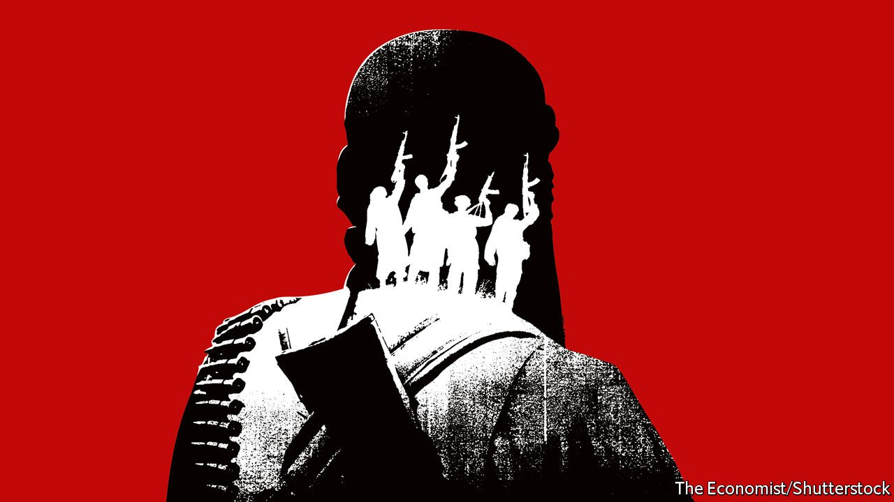

###### Following the Taliban

# After Afghanistan, where next for global jihad? 

##### The biggest danger is in poor, unstable states where insurgents already control territory 

 

> Aug 28th 2021 

IN YEMEN THEY set off fireworks; in Somalia they handed out sweets; in Syria they praised the Taliban for providing a “living example” of how to “bring down a criminal regime” through jihad. Around the world, . Through willpower, patience and cunning, a low-budget band of holy warriors has vanquished America and taken charge of a medium-size country. To Muslims who yearn to expel infidels and overthrow secular states, it was evidence that God approves. The ripple effects could be felt far and wide.

In the next few days President Joe Biden will have to sort out the mess he has created at Kabul airport, where . It is a dangerous moment for his presidency. In the longer term the world must deal with the boost to jihadism from America’s humiliation. The chief risk is not that terrorists will use Afghanistan as a base from which to strike the West, as they did on September 11th 2001. Such attacks are harder now, since rich countries have better security. Besides, the Taliban are unlikely to tolerate big training camps for global-minded terrorists, as they crave recognition and aid.


Granted, some feel a duty of hospitality to foreign Sunni jihadists, and some will aid their militant cousins in Pakistan, making that nuclear-armed state even less stable. But outside Afghanistan, the main ripple effects will be psychological. The Taliban’s triumph will fire up jihadists in other countries, and spur recruits to join them. Some who live in rich countries will be inspired to commit acts of terrorism there. It does not take many such attacks to sow a sense of fear or roil domestic politics.

Even worse will be the effect in poorer, weaker states, where jihadists aspire not merely to kill but to control territory, or at least prevent the government from doing so. In places like Pakistan, Yemen, Syria, Nigeria, Mali, Somalia and Mozambique, they already do. In several other parts of Asia, Africa and the Middle East, they threaten to. Many are asking: if our Afghan brothers can beat a superpower, surely we can beat our own wretched rulers?

Jihadists are not all the same. Many disagree about doctrine. Many hate and fight each other. Supporters of Islamic State deride the Taliban, absurdly, as American stooges. One of the first things the Taliban did in Kabul last week was to pull the leader of Islamic State in South Asia out of jail and kill him.

Most jihadist groups are motivated primarily by local grievances: a predatory government, an ethnic or sectarian divide, infidel intruders. Yet they also tap into a global narrative. On their phones they see daily evidence that the oppression they face at home is part of wider pattern of persecution of Muslims, from the gulag of Xinjiang to the hellscape of Gaza. When jihadists anywhere succeed, they feel pride—and a call to action.

Bad government creates an opening for jihadism. When a state is unjust, its citizens may imagine that one run by jihadists might be better. Even if they do not take up arms, they may quietly support those who do. Many rural Afghans decided that Taliban justice, though harsh, was quicker and less corrupt than government courts, and that Taliban checkpoints were less plunderous. This is one reason the Taliban’s final march to power met so little resistance. The other was psychological: they won because when America pulled out Afghans did not want to die fighting for a lost cause. Similar principles apply elsewhere. Jihadists in north-eastern Nigeria are hard to beat because locals detest the central government and army officers sell their own men’s weapons to the guerrillas and pocket the cash.

Once jihadists win power, however, they find that their ideology makes governing hard (see our ). Their desire to create a perfectly pious society, and ruthless intolerance of deviation from that ideal, make pragmatic compromise tricky. Islamic State’s rule over a big chunk of Iraq and Syria lasted only three years. Its habit of drowning people in cages alienated a potentially sympathetic Sunni population. So did its failure to foster economic activities other than looting and kidnapping. It scared outside powers and Shia Iraqis so much that they clubbed together to crush it.

The Taliban were also dreadful rulers when they last ran Afghanistan. Much depends on whether they have learned from their mistakes. If a group of jihadists could not only seize a country but also run it tolerably well, jihadists everywhere would see it as a beacon. Senior Taliban are at pains to seem pragmatic and insist they will respect human rights. But rocky times lie ahead. Taliban footsoldiers are already committing atrocities. Many urban Afghans, who have tasted the freedom to dress, work and study as they please, even if they are female, despise the new regime. Because reserves are frozen in America, it is short of cash. The Afghan economy has seized up; prices are soaring. The Taliban have yet to unveil good ideas for reviving it. Instead they bluster that skilled Afghans must not emigrate. Skilled Afghans may have other ideas.

One lesson of the Afghan fiasco is that what happens in far-off failing states matters not only to the people who live there, but also to the rest of the world. Calamity in Kabul today means bigger refugee flows, more jihadist attacks and a greater chance that other Islamist insurgencies will prevail. That could destabilise a large number of countries, endangering both locals and the foreigners who visit or do business there.

Another lesson is that a purely military approach to fighting jihadism does little to make the ground less fertile for it. The long-term solution is to build less awful, less exclusive states. If the old Afghan government had been less corrupt and less inept in dealing with tribal power-brokers, it might have proved more resilient. Likewise, if northern Mozambique, southern Thailand, Kashmir or the vast expanses of the Sahel were more benignly ruled, they might not be havens for jihadists.

Improving governance is hard, not least since many countries vulnerable to jihad are also racked by climate change. More frequent droughts add to discontent and stir conflicts over water and pasture. Donors can offer advice and cash, but ultimately it is up to locals to build institutions that work. Unless existing states provide basic services and something resembling justice, the jihadists’ siren song will always sound seductive. ■

