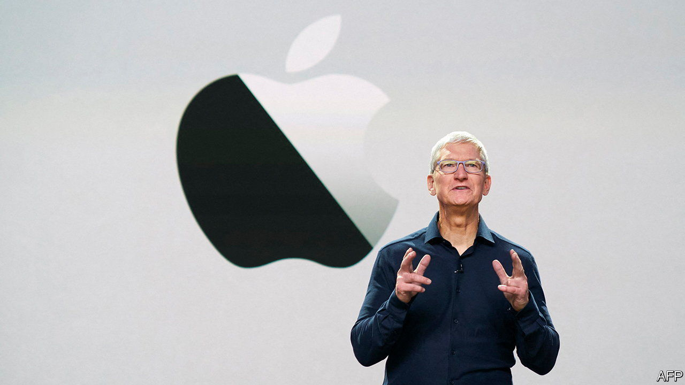
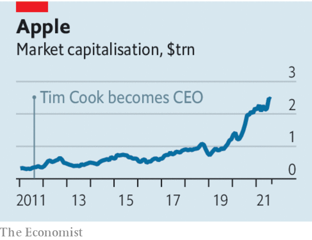

###### Apple’s next decade

# Apple exemplified an era of global capitalism that has passed 

##### Tim Cook has to adapt to a new age of tech and globalisation 

 

> Aug 28th 2021 

WHEN TALKING about Apple, it is hard to avoid superlatives. It is the world’s most valuable firm, with a market value of $2.5trn. Over 80% of that has been amassed during the tenure of . No other chief executive has created more absolute value for shareholders. As he celebrates his tenth anniversary at the helm this week, he can look back with satisfaction. Instead of trying to imitate Apple’s co-founder, he took Steve Jobs’s creation and made it better and bigger. Much of that success has come from maintaining Apple’s record of innovation and its brand. But Mr Cook has also made the most of an era of open, globalised capitalism that is fading away. He plans to stay in charge for five years or more. How he deals with the new environment will form the next epic chapter in Apple’s story.

Even by the standards of other tech giants, Apple is unusual. It is older (established in 1977); it mainly sells hardware; it is controlled by investors not founders; and it is more global, with a higher share of sales outside its home market than Alphabet, Amazon, Facebook, Microsoft, Alibaba or Tencent. Under Mr Cook’s supervision, it has exploited four trends. One is global supply chains: it has built an immense production network with China at the centre and components coming from around the world. This machine is being cranked up ahead of the launch of the new iPhone 13 next month, with unit sales of some 90m expected. As well as employing Chinese workers, Apple has made a killing from Chinese consumers, the second big trend. Its annual sales from China have roughly quintupled from a decade ago, to $60bn, more than those of any other Western firm.


Apple has also thrived in an era when governments were relaxed about firms with high market shares. While the handset sector used to be brutal (think of the rise and fall of BlackBerry), and is still very competitive for cheaper phones, at the high end Apple is ascendant, with a revenue market share of over 60% in America and a dominant position in operating systems there. Rather than compete with rival tech giants, it has been a beneficiary of a cartellish cosiness, receiving vast payments from Google in return for making it the iPhone’s search engine. The last trend is tax avoidance. Thanks in part to legal structures using tax havens, Apple has made average cash-income tax payments of just 17% of pre-tax profits over the past decade.

 


However, those four trends are becoming less favourable. Geopolitical tensions threaten global supply chains. President Xi Jinping’s authoritarian policies have dulled the attractions of relying on Chinese consumers for 18% of sales. His new slogan of “” may signal a desire to cut corporate profits. Western trustbusters are targeting tech, including those Google payments and Apple’s App Store, which Epic Games, the maker of “Fortnite”, accuses of levying excessive fees. And a deal this year brokered by the OECD may gradually force multinationals to pay more tax.

So what, exactly, is Mr Cook’s plan? One of his achievements has been to maintain Apple’s cult of secrecy. Wall Street survives on a diet of generous share buybacks and meagre information about the firm’s strategy. Still, some things are clear.

Apple will find ways to sidestep tax bills, but the rate it pays will probably rise. It will continue to shift towards being a subscriber-based firm with over 1bn users who enjoy an array of services (which already generate 21% of sales). Apple is still about beautiful design and flawless manufacturing, but it also wants to be a trusted intermediary in a toxic and unruly digital sphere, able to charge handsome fees. And it will continue to try to invent a new generation of hardware—iGlasses or iCars, say—that can supplement the iPhone as the gateway to Apple’s world.

Yet on the two thorniest problems Mr Cook has not made up his mind. On supply chains, although Apple has shifted the mix of its own long-term assets to America—the share has risen from 38% in 2012 to 70% now—key suppliers including TSMC, a chip firm, are lukewarm about putting production there. If the Sino-American rift deepens, or Apple’s relations with Beijing sour, Mr Cook will need to pivot away from China, with momentous consequences for its margins and for world trade.

Meanwhile heat from trustbusters and Apple’s shift into services may catalyse competition with other tech firms. Apple has skirmished with Facebook over privacy this year; it could yet push deeper into search, e-commerce or entertainment, breaking apart tech’s cosy club. The rest of Mr Cook’s tenure is unlikely to be as successful as the first decade was, but his decisions will be just as momentous. ■

 This piece has been amended to make clear that the reference to Apple's dominant position in operating systems refers to its position in America. 

