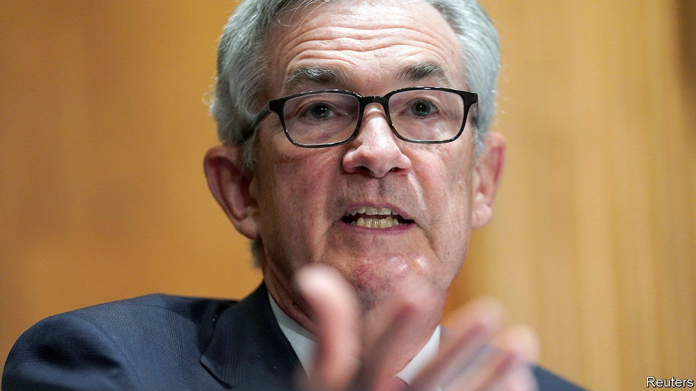

###### The Powell punt

# Despite his shortcomings, Jerome Powell should be reappointed Fed chairman 

##### It would be a bad time to cast any doubt on the Fed’s independence 

 

> Aug 28th 2021 

WHEN NOMINATING the chairman of the Federal Reserve, America’s president picks the person who wields the greatest immediate power over the global economy. Fed leadership brings with it control over American interest rates, responsibility for an $8.3trn balance-sheet and the obligation to regulate the world’s most important banks. A mistake in the Eccles building can throw millions out of work, roil global markets or unleash inflation. The Fed even props up offshore financial markets by offering foreign central banks a ready supply of dollars.

The fate of , the incumbent chairman whose term expires in February, lies in President Joe Biden’s hands. It is unclear how history will view Mr Powell’s first term. Before the pandemic, his loose monetary policy helped unemployment reach historic lows without provoking inflation. When the economy locked down in the spring of 2020, the Fed prevented a collapse of financial markets with enormous and swift interventions, some of which, such as the implicit underwriting of the corporate-bond market, were unprecedented. In August 2020 the central bank fine-tuned its 2% inflation target, which it had hitherto mostly undershot, by making it apply on average over the economic cycle, meaning that the Fed would have to compensate for its past misses.


Recently, though, Mr Powell’s hand has looked less steady. By the measure the Fed targets, inflation has surged to 4% on a year earlier, or 6.4% if you annualise quarter-to-quarter price increases. The central bank’s failure to foresee rising prices has made its promises that inflation will subside less reassuring. The Fed could yet be forced into an abrupt reversal of stimulus.

In addition, the new inflation target, though desirable in theory, remains vague and poorly understood in practice. And the central bank is persisting with $120bn per month of quantitative easing (QE), the buying of bonds with newly created money. Today’s QE is unlikely to benefit the economy directly, but it creates hidden financial risks for taxpayers, because it involves the Fed, which they underwrite, issuing short-term reserves to buy long-term bonds. If short-term rates rise, the interest bill the Fed must pay on those reserves will soar.

Despite this mixed record, Mr Biden should reappoint Mr Powell. That is partly because any replacement the White House is likely to consider would probably be even keener on prolonging QE, and may also be sceptical of the welcome tidy-up of bank regulations that Mr Powell has also presided over. (The leading such candidate is Lael Brainard, a Fed governor.) But the most important reason to keep Mr Powell in his job is that this would be a terrible moment to give the impression that the White House wants to influence the Fed.

In the short term, the danger is that high inflation proves stubbornly persistent. With Mr Powell in charge, that would look like an honest mistake, one that his record suggests he would try to correct quickly. In 2018 the Fed raised rates as the economy heated up; in June it signalled that it would respond to higher inflation with tighter monetary policy, a plan markets took to be credible. However, with a Biden appointee at the helm, chosen primarily for his or her fondness for stimulus, the Fed might look insufficiently independent and thus have to raise rates more—and thus slow the economy more—to convince investors that it was determined to contain inflation.

In the long term, the economic environment threatens central banks’ independence. As interest rates have fallen close to zero, they have been left short of ammunition. QE, central banks’ main alternative to cutting rates, is easily mistaken for the monetary financing of government deficits. Their armoury needs restocking and the division of responsibilities between central banks and government fiscal policy needs rethinking. Politicians and wonks must also co-operate to study central-bank digital currencies (CBDCS), which have the potential to transform how money and banking work. Decisions about CBDCs should be taken by elected leaders, but independent advice from technocrats will be crucial. A new appointment risks fuelling suspicions that all these reforms will politicise central banking.

Church and state

Mr Powell got his job four years ago because Donald Trump threw out a precedent, intact since the 1970s, that presidents should reappoint Fed bosses chosen by their predecessors, even those from opposing parties. Mr Biden would do well to reassert that principle, and thereby send the message that the executive branch respects the Fed’s independence. ■

For more coverage of Joe Biden’s presidency, visit our dedicated 

