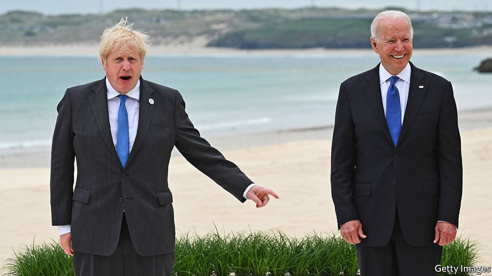

###### A rock in a hard place

# The mess in Afghanistan exposes Britain’s foolish security policy 

##### The time is long past for Britain to repair relations with its European neighbours 

 

> Aug 28th 2021 

DURING DEBATE in Parliament and in unattributed briefings, British MPs, ministers and officials have used language to describe America’s withdrawal from Afghanistan, and America’s leader, rarely heard from such mouths. The withdrawal was “shameful”, “dishonourable” and “catastrophic”. President Joe Biden was “gaga” and “doolally”. Tony Blair, the prime minister who sent British forces into Afghanistan at America’s behest in 2001, wrote an article calling the withdrawal “imbecilic”. Other reports, soon denied, claimed that the current prime minister, Boris Johnson, had referred to Mr Biden by the pejorative coined by his predecessor, Donald Trump: “Sleepy Joe”.

The “” between Britain and America has been through many a rough patch over the years—and Britain was hardly the only American ally to complain. However, today’s venting suggests the strain is as severe now as it has ever been. In part that reflects the chaos of the withdrawal, and America’s failure to keep its allies informed. It also hints at problems with British statecraft that are more serious than a transatlantic tiff. To solve them, Britain needs to repair a relationship that has become frayed because of its own neglect: the one with its European neighbours.


The withdrawal from Afghanistan was part of a shift in America’s plans to project its might towards a rising China. That means focusing on the Indo-Pacific region, where Britain, too, expects to be active—a recent review of foreign policy and security said as much. Even as politicians fulminated against Mr Biden, a British aircraft-carrier laden with American jets was sailing around Asia, soon perhaps to make the sort of “freedom of navigation” manoeuvre that American warships have used to counter Chinese influence.

But America’s focus also means asking Europeans to take more of the security burden in their own neighbourhood. One threat is Russian expansionism on Europe’s eastern flank. Others include civil wars in north Africa that bring refugees across the Mediterranean and a Middle East further destabilised by Afghanistan’s fall to the Taliban. These burdens are Britain’s, too.

After decades sheltering behind American might, Europeans will have to spend more on defence, as well as build up military capacity and improve planning and co-operation. But even as they take halting steps in that direction, Britain is holding itself aloof. A European Union strategy for improving military mobilisation across borders has signed up America, Canada and Norway—but Britain has not asked to join. As NATO’s European members start to discuss taking more initiative within the alliance on matters where America’s interests are not engaged, and the fall of Kabul revives calls for an EU army, Britain is silent.

This is foolish. Without Britain’s heft as a nuclear power, permanent member of the UN Security Council and relatively big spender on defence, European security will be weakened. It is also petty. Britain’s disengagement is driven by Brexiteers within government, including Mr Johnson, who bank on rows with Europe as sure vote-winners. But Conservative Party interests run counter to the national interest. Britain cannot be safe if Europe is imperilled, and a Europe-shaped hole in Britain’s foreign and defence policy will complicate negotiations with the EU on other issues.

For all that the Brexiteers see Britain’s future outside the EU as being closer to America, this endanger-thy-neighbour approach is not even to America’s liking. It wants its transatlantic allies to work together to defend their own interests, freeing it up to do more elsewhere. Reviving the special relationship will first require continental co-operation. ■

