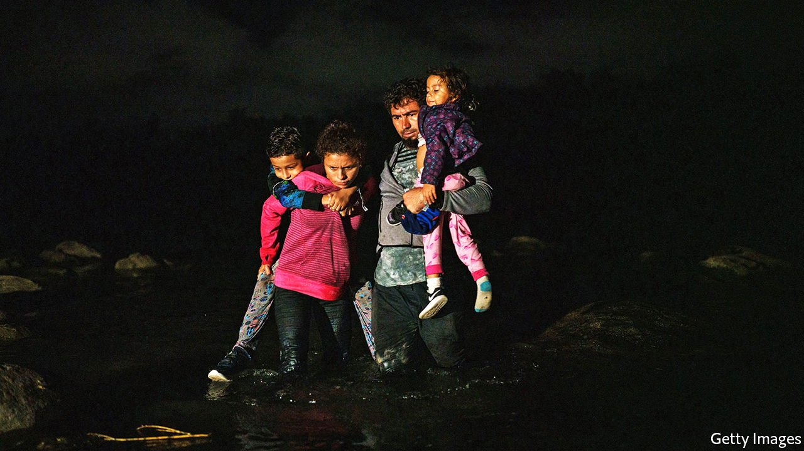
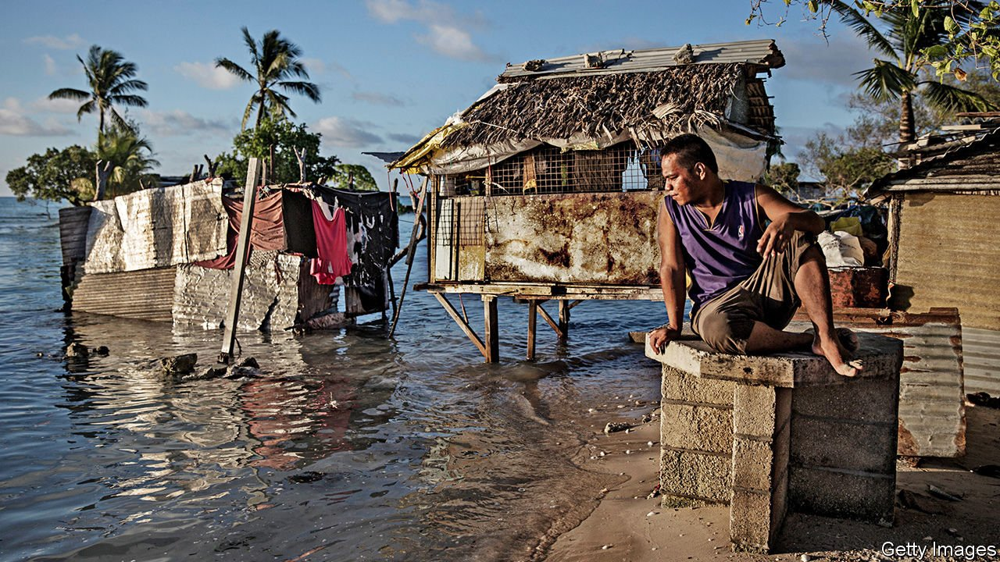

###### On refugees, Bolivia, Primrose Hill, Pacific island nations, Monty Python

# Letters to the editor 

##### A selection of correspondence 

 

> Aug 28th 2021 


Counting refugees

Your even-handed report on the 70th year of the global convention on refugees captured the complexity of an often contentious subject (“”, August 7th). However, I challenge the European commissioner’s assertion that in Europe, “the huge majority applying for asylum are not refugees”. The EU’s own statistics suggest otherwise.


It is indeed a fact that across Europe the majority of asylum claims are rejected on first instance. But legal processes are not complete until all appeals have been heard. In asylum processes, for many years the trend has been that a significant number of cases that are rejected are overturned when higher courts and other responsible bodies review the decisions. Appeals are a normal part of any legal process and must be taken into account when talking about a refugee’s protection status. Partly because of the convention’s limitations that you described, people fleeing conflict, for example, may be granted different types of protection, such as humanitarian protection or “subsidiary” protection under EU law, rather than “refugee” status, but most of them are still refugees in need of shelter.

It should also be noted that the use and misuse of inadmissibility rules means that some people receive a rejection without the merits of their case ever having been heard. This happens to many of the Syrians arriving in Greece from Turkey, who prima facie are refugees but receive rejections because of the terms of the EU-Turkey deal.

Yes, it is true that there are people arriving who do not need protection, but this is probably a minority. Recognising the true balance between those in need of protection and those who do not is a step towards more rational policy options, such as increasing legal migration routes for non-asylum cases so that people are not in the asylum “channel” (or the English Channel) when they have economic or family reasons for moving.

CATHERINE WOOLLARD

Director

European Council on Refugees and Exiles

Brussels

 


Two sides to Bolivia

There is no doubt that Evo Morales stepped over the line in trying to secure an unconstitutional fourth term as Bolivia’s president in the elections of 2019 (““, August 7th). But as well as the “pro-Morales mobs” that torched police stations, you should also have mentioned the abhorrent violence of opposition protesters. Among other heinous acts, they burned the Wiphala flag (a national symbol of Bolivia’s indigenous majority), torched the houses of two regional governors as well as that of Mr Morales’s sister, and dragged a mayoress through the streets barefoot, doused her in red paint and forcibly cut her hair.

WARREN QUINTON

Anyós, Andorra


Primrose Hill

Regarding “” (August 14th), when pubs and clubs were closed last year because of covid-19, Primrose Hill park in London became an all-night party venue. Fireworks were let off and sound systems blared a short distance away from blocks of flats and houses, preventing people from sleeping. Drug-dealers congregated on the perimeter, supplying the party-goers. Many residents reported feeling or being threatened.

Since the spring Primrose Hill has been closed from 10pm to 5am on Friday, Saturday and Sunday nights. This does not constitute an undue infringement of anyone's liberty. Residents have been able to sleep, a relief to almost everyone in the area, including those who live in nearby supported housing and council accommodation.

Your article ends by quoting two local campaigners who want to keep the park open all night. You could instead have spoken to any of the several hundred locals who think that a temporary closure at the weekends is a sensible solution. The quote from a local psychotherapist, which clearly implies that impacted residents are racist, is particularly troubling. In fact, the many hundreds of us who support temporary closure at the weekends, a group that includes all three local Labour councillors, are not motivated by racism or snobbery. They simply want a good night’s sleep and to feel safe in their neighbourhood.

LUCY COTTRELL

London

 


Relocating countries

In recent years Palau, like many other small island Pacific nations, has faced threats to its survival that can be traced to climate change: saltwater intrusion, hurricanes, coral-reef bleaching, and even crippling droughts (“”, August 7th). Palau’s civilisation, perhaps 3,000 years old, has enjoyed seemingly limitless seafood plus protection from the violent seas beyond by an ancient barrier reef (Palauans chuckled when their islands were chosen for a season of “Survivor”).

As well as attracting foreign aid and investment, there is another story to these countries’ responses. Many of them have banded together in a successful regime to govern their most valuable economic resource—tuna—collectively. They have also forced the issue of climate change as a threat to international peace onto the UN Security Council’s agenda. And they continue to argue a straightforward legal theory in the courts, based on classic nuisance principles, that polluting countries bear responsibility for the damage they cause to others.

PETER PROWS

Special adviser to Palau’s permanent mission to the UN, 2005-13

San Francisco

Reading about the prospect of Pacific islanders having to move their nations brought to mind the Sovereign Military Order of Malta. Recognised by 110 countries as a sovereign entity, it is located at Via Condotti 68 in Rome, where it has extraterritorial status. It has moved several times. Founded in Jerusalem in 1048, the Order subsequently relocated to Acre, Cyprus, Rhodes and Malta, which it ruled until 1798, when Malta was conquered by Napoleon. It subsequently relocated to various places in Italy before establishing its headquarters in Rome in 1834.

The Order’s sovereignty was made clear when, after the second world war, the number of transport aircraft that Italy could operate was limited by its peace treaty with the Allied countries. It transferred all aircraft in excess of that limit to the Order, though they were flown by Italian air-force personnel until they were returned to Italy in the 1950s.

MICHAEL TICKTIN

Roosevelt, New Jersey

 


They think it’s all over

I wonder what the level of popular support for the latest UN climate-change analysis will be, in a world where a disturbing number of voters need to be bribed with doughnuts to get a simple covid-19 vaccine (“, August 14th).

I recall a Monty Python sketch, when a stone-faced radio presenter played by John Cleese read the news. It went something like, “Good evening. This is the BBC reporting from London. It was announced today from the UN that the world has officially come to an end. And now, here are the football results.”

MIKE COLLING

Albany, Oregon

